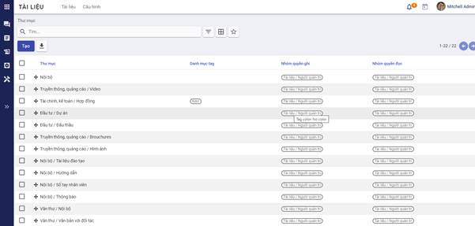
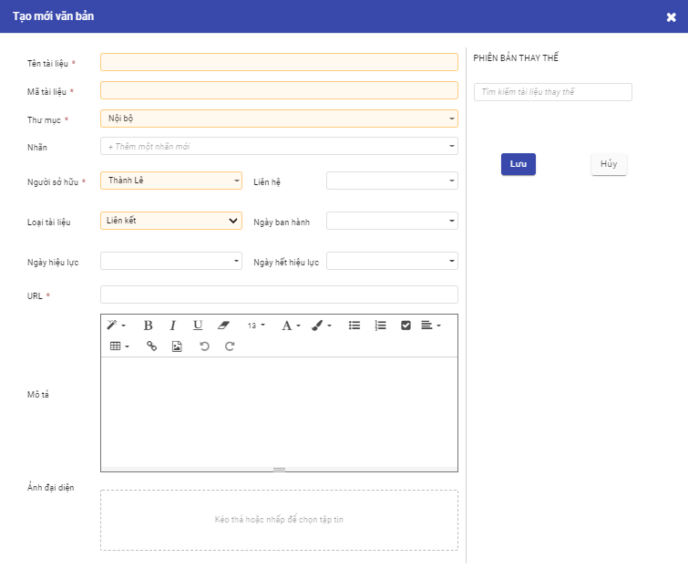
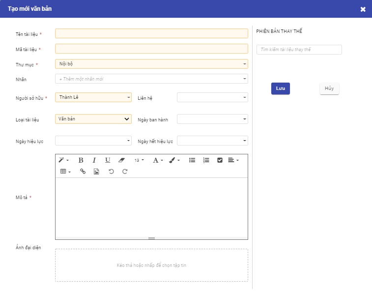
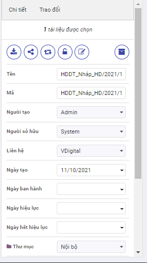
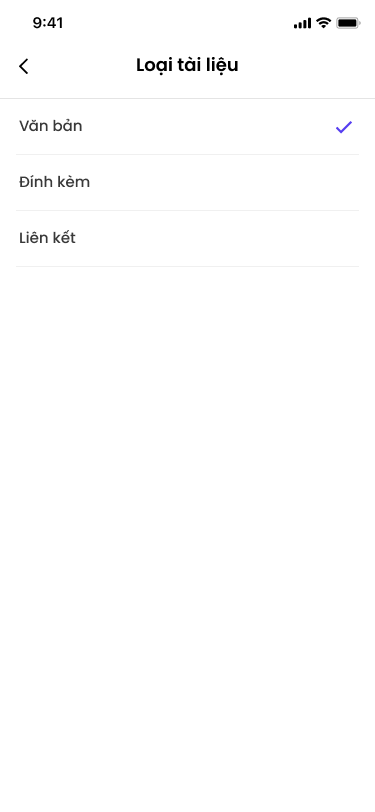
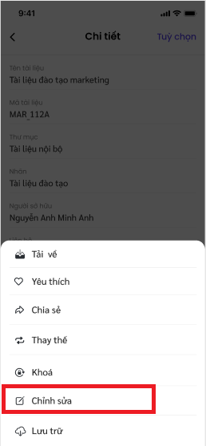
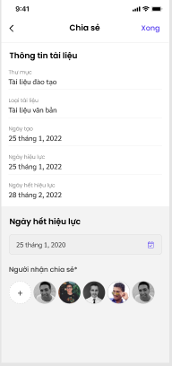

# **Tài liệu**
## **Giới thiệu về ứng dụng Tài liệu**

Ứng dụng Tài liệu trên hệ thống cung cấp công cụ cho phép lưu trữ và quản lý các văn bản, hồ sơ, tài liệu nội bộ của doanh nghiệp tập trung trực tuyến, phục vụ mục đích tìm kiếm, truy xuất và khai thác một cách nhanh chóng, dễ dàng hơn, mọi lúc, mọi nơi.  Tại đây, mọi người cũng có thể dễ dàng trao đổi, đưa ý kiến thảo luận và chia sẻ thông tin. 

Ứng dụng Tài liệu là công cụ cho phép: 

- Lưu trữ tài liệu theo các dạng văn bản, hình ảnh, video ...
- Tổ chức tài liệu khoa học cấp thư mục và gán nhãn cho tài liệu
- Tìm kiếm tài liệu nhanh chóng, dễ dàng theo nhiều tiêu chí hoặc theo nội dung tài liệu
- Phân quyền đọc/ ghi tài liệu để đảm bảo yếu tố bảo mật thông tin doanh nghiệp
- Chia sẻ tài liệu cho người khác khi cần thiết. 
- Bình luận, trao đổi về tài liệu 

  

Ứng dụng còn có phiên bản trên điện thoại thông minh với tên gọi **Quản lý tài liệu** giúp dễ dàng theo dõi các tài liệu cá nhân, tài liệu được chia sẻ một cách tiện lợi hơn.

## **Các thuật ngữ trong ứng dụng Tài liệu**

Trong quá trình lưu trữ, khai thác các tài liệu của đơn vị khi sử dụng ứng dụng Tài liệu, để tránh việc hiểu sai dẫn đến dùng sai, cần phải đồng nhất cách hiểu các thuật ngữ như sau: 

- **Thư mục**: Là một vùng lưu trữ các tài liệu hoặc thư mục con. 

- **Tài liệu**: Có thể gồm 1 tệp hoặc gồm nhiều tệp khác nhau được gộp chung lại. Tài liệu gồm tệp tài liệu và các tệp phụ lục, đính kèm. 

- **Tệp** : Các tệp với các định dạng khác nhau như .doc, .xlsx, .ppt, .zip, .rar, .txt, .png, .jpg, .mp4 … được lưu trữ trên thư mục lưu trữ.  
- **Nhãn**: Từ khóa dùng để gán nhãn cho các tài liệu giúp tìm kiếm, phân loại tài liệu tốt hơn. 

## **Thiết lập và khai báo dữ liệu ban đầu**

Việc thiết lập và khai báo ban đầu được thực hiện khi lần đầu cài đặt ứng dụng, giúp khởi tạo dữ liệu và bắt đầu cho việc sử dụng. 

### **Tạo và thiết lập phân quyền cho người dùng**

Để đăng nhập và sử dụng được ứng dụng Tài liệu, người dùng cần được cấp phân quyền cho ứng dụng. 

**Đối tượng thực hiện**: Quản trị viên

**Các bước thực hiện**:

1. Chọn **Thiết lập** > Chọn **Người dùng**

2. Kích **Tạo** để tạo mới người dùng hoặc chọn sửa thông tin một người dùng trên danh sách
3. Thiết lập quyền với ứng dụng Tài liệu:
   - Tại trường Tài liệu: chọn quyền tương ứng của người dùng đối với ứng dụng tài liệu. 
   - Với ứng dụng Tài liệu, cung cấp 4 mức độ quyền sử dụng như sau: 
     - Người dùng thường: có quyền xem/đọc các tài liệu thuộc thư mục được gán quyền.
     - Người dùng cấp 1: Với thư mục được gán quyền ghi, người dùng có thể tạo mới/ cập nhật tài liệu do chính mình tạo. 
     - Người d 'Giới thiệu về ứng dụng Ký số': 'digitalworkplace/esign/introduction.md'
            - 'Thiết lập và khai báo ban đầu': 'digitalworkplace/esign/initialization.md'
            - 'Ký số': 'digitalworkplace/esign/esign.md' ùng cấp 2: Với thư mục được gán quyền ghi, người dùng có thể tạo mới/ cập nhật tài liệu do chính mình tạo và cập nhật tài liệu của người khác. 
     - Người quản trị: có toàn quyền với tài liệu trong thư mục được gán quyền quản trị. 
4. Kích **Lưu** 

### Tạo thư mục lưu trữ 

Trước khi sử dụng hệ thống để lưu trữ, quản lý và khai thác tài liệu, đơn vị nên xây dựng quy hoạch cấu trúc thư mục lưu trữ  một cách khoa học và hiệu quả, đồng thời phân quyền sử dụng tài liệu thuộc thư mục cho người dùng.  

Ngay khi cài đặt ứng dụng Tài liệu, hệ thống có thiết lập mẫu sẵn có một số thư mục để đơn vị tham khảo. Trong trường hợp không muốn sử dụng các thiết lập mặc định của hệ thống, người dùng có thể xóa hoặc chỉnh sửa  hoặc bổ sung cho phù hợp. 

**Đối tượng thực hiện**: Quản trị viên

**Các bước thực hiện**:

1. Vào **Cấu hình** > Chọn **Thư mục** 

    

2. Kích **Tạo**

3. Nhập thông tin khai báo cho thư mục

   - Tên thư mục là bắt buộc nhập. 
   - Chọn thư mục cha nếu có 

4. Khai báo nhanh **nhãn** sử dụng trong thư mục

   - Tại tab Nhãn: kích nút **Thêm mới dòng**. 

     

   - Khai báo thông tin **nhãn** thuộc thư mục như danh mục nhãn, tên nhãn

   - Các nhãn được khai báo thành công ở đây đều được quản lý trong **Danh mục nhãn**

5. Phân quyền cho thư mục 

   

   - Tại tab Phân quyền: khai báo các nhóm người dùng có quyền đọc/ ghi với tài liệu thuộc thư mục
     - Quyền ghi: cho phép người dùng thuộc nhóm này có quyền tạo mới/ cập nhật với tài liệu trong thư mục
     - Quyền đọc: Người dùng thuộc nhóm này chỉ có quyền đọc/xem với tài liệu trong thư muc.  
     - Tích chọn **Chỉ cho phép với người sở hữu tài liệu**: khi muốn giới hạn chỉ đọc tài liệu của chính mình.

6. Sau khi nhập xong thông tin thư mục, kích **Lưu** 

### **Tạo và quản lý nhãn**

Cho phép tạo mới và quản lý các nhãn trên hệ thống dùng để phân loại và lọc tài liệu nhanh chóng. 

**Đối tượng thực hiện**: Quản trị viên

**Các bước thực hiện**:

1. Vào **Cấu hình** > Chọn **Nhãn**

   

   

   

2. Kích **Tạo**

   - Danh mục nhãn: dùng để nhóm các nhãn có liên quan. Một danh mục nhãn có thể có 1 hoặc nhiều nhãn. 

     ​	                                                	         

2. Click button **Lưu**

   Lưu thông tin Nhãn vừa tạo vào hệ thống và hiển thị nhãn vừa tạo ra danh sách nhãn

##  Tài liệu

### Tạo mới tài liệu 

Chức năng này cho phép người dùng tạo mới tài liệu trên ứng dụng. 

**Đối tượng thực hiện :** Người dùng được phân quyền

**Các bước thực hiện**

1. Vào **Tài liệu** > kích nút **Tạo**
2.  Khai báo thông tin tài liệu

​	***Lưu ý***

- **Tên và mã tài liệu** là bắt buộc phải nhập
- **Thư mục**: Chọn thư mục lưu trữ tài liệu từ danh sách thư mục mà người dùng có quyền ghi. 

- **Nhãn**: Chọn nhãn gắn với tài liệu từ danh sách các nhãn thuộc thư mục được chọn và thư mục cha (nếu có) của nó. 

- **Phiên bản thay thế**: Khi tài liệu được đẩy mới lên hệ thống để thay thế cho một hoặc nhiều tài liệu đã có trước đó.  Khi thay thế, tài liệu bị thay thế sẽ được cập nhật ngày hết hiệu lực chính là ngày trước ngày hiệu lực tài liệu mới. 

- **Loại tài liệu**: hệ thống hỗ trợ lưu trữ các loại tài liệu sau

  - **Đính kèm:** áp dụng với các tài liệu cần đính kèm tệp lên hệ thống.  Khi đó, người dùng bắt buộc phải đính kèm ít nhất 1 tệp tài liệu tại trường Tệp tài liệu. Hệ thống hỗ trợ đính kèm các tệp có định dạng doc, docx, xlsx, xls, ppt, pdf, định dạng ảnh, video, tệp nén raz, zip ... 

    

  - **Liên kết**: áp dụng với các tài liệu được lưu trữ là các liên kết. Khi chọn loại này, người dùng cần nhập liên kết tại trường URL. 

    

    

  - **Văn bản:** Nội dung cần lưu trữ dạng văn bản sẽ được người dùng nhập luôn tại trường Mô tả. 
  
    
    
    

3. Kích nút **Lưu** để lưu lại tài liệu trên hệ thống. 

### Tra cứu tài liệu

Khi có nhu cầu xem một tài liệu nào đó trên danh sách, người dùng có thể tìm nhanh được tài liệu đó bằng cách sử dụng chức năng tìm kiếm theo tiêu chí khác nhau như tên, mã ... 

**Đối tượng thực hiện :** Người dùng được phân quyền

**Các bước thực hiện**

1. Vào **Tài liệu** 

2.  Kích chọn hoặc không thư mục lưu trữ tại cây thư mục

3. Nhập nội dung tìm kiếm vào ô Tìm và thực hiện tìm kiếm

   

Hiển thị danh sách tài liệu thỏa mãn  tiêu chí tìm kiếm dưới dạng kanban hoặc danh sách. Các thông tin hiển thị gồm: 

- Mã _ Tên tài liệu
- Thư mục lưu trữ
- Nhãn nếu có
- Ngày tạo 
- Người tạo

***Lưu ý***: 

- Cây thư mục chỉ hiển thị các thư mục mà người dùng có quyền ghi/đọc
- Người dùng chỉ có thể tìm kiếm được các tài liệu có quyền đọc / ghi

  

###  Xem thông tin chi tiết tài liệu

Cho phép người dùng xem được thông tin chi tiết thuộc tính của tài liệu và xem trước nội dung tệp tin ngay trên hệ thống với một số định dạng như pdf, ảnh ...

**Đối tượng thực hiện**: Người dùng được phân quyền 

**Các bước thực hiện**

1. Vào **Tài liệu** > Tìm kiếm một tài liệu cần xem

2. Kích chọn tài liệu: hiển thị thông tin chi tiết tài liệu

   ​	

   ​	

   ​		***Lưu ý***:  

   - Hiển thị các thông tin chi tiết tài liệu tại khung màn hình bên phải. 

   - Danh sách các tệp tin và tệp phụ lục (nếu có). Tại vùng danh sách này, cho phép người dùng xem/ tải từng tệp. 

   - Lịch sử các phiên bản (nếu có): danh sách hiển thị sắp xếp theo phiên bản giảm dần. 

   - Các nút hoạt động thực hiện với tài liệu   
     - Tải tài liệu: cho phép tải tài liệu về máy cá nhân. 
     - Chia sẻ: hiển thị khi người dùng có quyền đọc/ghi với tài liệu
     - Thay thế: chức năng nâng phiên bản tài liệu, chỉ hiển thị khi người dùng có quyền ghi với tài liệu
     - Khóa/ mở khóa: chỉ hiển thị khi người dùng là người tạo tài liệu. 
     - Cập nhật: chỉ hiển thị khi  người dùng có quyền ghi với tài liệu và  đang mở khóa
     - Lưu trữ: Đưa tài liệu vào khu vực lưu trữ riêng, không thấy trên danh sách tài liệu. 
     
   - tab Trao đổi: hiển thị các lịch sử trao đổi, bình luận về tài liệu và cho phép người dùng bình luận về tài liệu. 

     

3. Kích vào vùng ảnh đại diện tài liệu để mở màn hình xem trước các tệp thuộc tài liệu hoặc mở liên kết cho phép. 

***Lưu ý***:

- Danh sách tệp của tài liệu hiển thị theo thứ tự các tệp và phụ lục
- Với định dạng hỗ trợ xem trước (pdf, doc, mp4, jpg, png, xls, xlsx, ppt, txt ...): hiển thị được nội dung tệp ngay trên hệ thống. 
- Với định dạng không hỗ trợ xem trước thì hiển thị thông báo lỗi.
- Kích nút **Tải xuống tài liệu** để tải toàn bộ các tệp của tài liệu về máy cá nhân. 

### Đánh dấu yêu thích tài liệu

Khi thấy tài liệu hay hoặc tài liệu cần lưu ý, người dùng có thể đánh dấu lại tài liệu để có thể nhanh chóng tìm thấy trong lần đọc sau.

**Đối tượng thực hiện**: người dùng được phân quyền 

**Các bước thực hiện**

1. Vào **Tài liệu** > tìm kiếm tài liệu

   

2. Tích dấu sao  để đánh dấu yêu thích/ bỏ yêu thích với tài liệu

   ***Lưu ý***

   - Tài liệu được đánh dấu yêu thích sẽ được xem nhanh bằng cách kích vào mục Tài liệu yêu thích 

     

### Nâng phiên bản tài liệu

Cho phép thay thế/ nâng cấp tài liệu bởi phiên bản mới khi phiên bản cũ đã hết hiệu lực hoặc cần thay thế. 

**Đối tượng thực hiện**: người dùng được phân quyền ghi

**Các bước thực hiện**

1. Vào **Tài liệu** > tìm kiếm tài liệu

2. Kích chọn tài liệu để mở màn hình xem thông tin chi tiết

   

3. Kích nút Thay thế : hiển thị màn hình nhập thông tin chi tài liệu mới

   ​	

4. Khai báo tài liệu mới và kích **Lưu**

   ***Lưu ý**

   - Tài liệu bị thay thế sẽ có ngày hết hiệu lực chính là ngày liền trước ngày bắt đầu hiệu lực cho tài liệu mới (nếu có thông tin ngày bắt đầu hiệu lực của tài liệu mới) hoặc ngày liền trước ngày hiện tại (nếu tài liệu mới không có thông tin ngày bắt đầu hiệu lực)

### Thay đổi thư mục chứa tài liệu

Cho phép người dùng di chuyển tài liệu từ thư mục này sang thư mục khác

**Đối tượng thực hiện**: người dùng được phân quyền ghi

**Các bước thực hiện**

1. Vào **Tài liệu** > tìm kiếm tài liệu

2. Tích chọn tài liệu để hiển thị màn hình xem chi tiết

3. Tại trường Thư mục: chọn lại thư mục chứa tài liệu

    

 Lưu ý: 

- Chỉ di chuyển được tài liệu sang thư mục mà người dùng có quyền ghi 

### Thêm hoặc bớt nhãn gán cho tài liệu

Cho phép người dùng thêm/ bớt nhãn gán cho tài liệu. 

**Đối tượng thực hiện**: người dùng được phân quyền

**Các bước thực hiện**

Để thêm/bớt nhãn gán cho tài liệu có 2 cách: 

**Cách 1:** 

1. Vào **Tài liệu** > tìm kiếm tài liệu
2. Tích chọn tài liệu để hiển thị màn hình xem chi tiết
3. Tại trường nhãn: 
   - Kích icon x tương ứng để xóa nhãn đã gán
   - Nhập hoặc chọn mới nhãn từ danh sách nhãn để gán nhãn mới 

**Cách 2:** 

1. Vào **Tài liệu** > tìm kiếm tài liệu

2. Tích chọn tài liệu để hiển thị màn hình xem chi tiết 

3. Kích nút Cập nhật  

4. Tại màn hình cập nhật, thay đổi thông tin nhãn gán cho tài liệu và kích **Lưu lại**

   

### Chia sẻ tài liệu

Chức năng này cho phép người dùng chia sẻ tài liệu cho người dùng khác. 

**Đối tượng thực hiện**: người dùng được phân quyền đọc/ghi

**Các bước thực hiện**

1. Vào **Tài liệu** > tìm kiếm và tích chọn 1 hoặc nhiều tài liệu muốn chia sẻ

2. Kích nút **Chia sẻ**  

3. Khai báo thông tin chia sẻ tài liệu

   - Người nhận: nhập danh sách người sẽ được chia sẻ tài liệu

   - Ngày hết hiệu lực: chọn thời gian sẽ hết hiệu lực chia sẻ tài liệu

   - Liên kết: hệ thống sinh ra một liên kết khi thực hiện chia sẻ tài liệu, cho phép người dùng sao chép và gửi liên kết tài liệu cho người khác. Tuy nhiên, chỉ người được chia sẻ mới có thể xem được tài liệu. 

     

4.  Kích **Chia sẻ**

   **Lưu ý**

   - Người dùng được chia sẻ tài liệu nhận được thông báo từ hệ thống
   - Danh sách tài liệu được chia sẻ với người dùng được lọc nhanh bằng cách kích vào mục **Tài liệu được chia sẻ** 
   - Quyền của người dùng với tài liệu căn cứ theo quyền với thư mục chứa tài liệu được chia sẻ. 
     - Nếu với thư mục chứa, người dùng không được phân quyền đọc/ghi: mặc định với tài liệu được chia sẻ có quyền đọc
     - Nếu thư mục chứa, người dùng có quyền ghi: thì với tài liệu được chia sẻ cũng có quyền ghi

### Bình luận, trao đổi tài liệu

Cho phép người dùng có thể đưa ra các bình luận, đánh giá về nội dung tài liệu

**Đối tượng thực hiện**: người dùng được phân quyền đọc/ghi

**Các bước thực hiện**

1. Vào **Tài liệu** > tìm kiếm tài liệu
2. Tích chọn tài liệu để hiển thị màn hình xem chi tiết
3. kích chọn tab **Trao đổi** > mục **Gửi tin**

- Người dùng nhập nội dung ý kiến của cá nhân về tài liệu 
- Xem được các bình luận của người khác về tài liệu 
- Người dùng có thể đính kèm thêm các tệp tài liệu khác để tham khảo bằng cách kích vào nút **Thêm tệp đính kèm**

### Quản lý các chia sẻ của người dùng

Cho phép người dùng quản lý, theo dõi các chia sẻ mình đã thực hiện. 

**Đối tượng thực hiện**: người dùng 

**Các bước thực hiện**

1. Vào **Cấu hình** >  chọn **Chia sẻ và email**

   Hiển thị toàn bộ các liên kết được người dùng chia sẻ và trạng thái hiện tại còn hiệu lực hay hết hiệu lực. 

   

2. kích chọn 1 bản ghi chia sẻ trên danh sách để xem chi tiết thông tin chia sẻ và sao chép lại liên kết

   ​	

### Thông báo cho người nhận tài liệu chia sẻ

Chức năng này cho phép người dùng xem thông báo khi được chia sẻ tài liệu

**Các bước thực hiện**

1. Kích icon Thông báo -> hiển thị danh sách các thông       

                

- Hệ thống sẽ hiển thị: Tên chức năng, nội dung chia sẻ

## Quản lý tài liệu trên điện thoại

Chức năng **Quản lý tài liệu** hỗ trợ người dùng có thể tạo và dễ dàng xem các tài liệu được chia sẻ từ người dùng khác ngay trên ứng dụng điện thoại vESS. Giúp doanh nghiệp, cá nhân lưu trữ tài liệu trong suốt quá trình phát triển doanh nghiệp.

### Quy trình

### Các luồng chính
  * Thêm mới tài liệu. Chi tiết nghiệp vụ tại <u>[tai đây](#them-moi-tai-lieu)</u>
  * Xem chi tiết tài liệu. Chi tiết nghiệp vụ tại <u>[tai đây](#xem-chi-tiet-tai-lieu)</u>
  * Chỉnh sửa tài liệu. Chi tiết nghiệp vụ tại <u>[tai đây](#chinh-sua-tai-lieu)</u>
  * Chia sẻ tài liệu. Chi tiết nghiệp vụ tại <u>[tai đây](#chia-se-tai-lieu)</u>
  * Thay thế tài liệu. Chi tiết nghiệp vụ tại <u>[tai đây](#Thay-the-tai-lieu)</u>
  * Khóa/mở khóa tài liệu. Chi tiết nghiệp vụ <u>[tai đây](#khoa-mo-khoa-tai-lieu)</u>
  * Yêu thích/bỏ yêu thích tài liệu. Chi tiết nghiệp vụ tại <u>[tai đây](#yeu-thic-bo-yeu-thich-tai-lieu)</u>
  * Lưu trữ tài liệu. Chi tiết nghiệp vụ tại <u>[tai đây](#luu-tru-tai-lieu)</u>

### Xem danh sách tài liệu

Người dùng thực hiện xem tài liệu

**Đối tượng thực hiện:** Người dùng có quyền sử dụng phân hệ **Tài liệu**

1. Người dùng truy cập vào ứng dụng vESS, chọn phân hệ **Tài liệu**. Lúc này giao diện đang hiển thị tại trang **Home**

2. Người dùng chọn loại danh sách tài liệu muốn xem tại bảng danh sách.

*Ghi chú: Người dùng muốn xem tất cả danh sách tài liệu gần đây, chọn   giao diện sẽ hiển thị **Danh sách tài liệu gần đây.*** 

### Xem danh sách thư mục

Người dùng thực hiện xem các thư mục mà mình đã tạo hoặc có quyền truy cập. 

**Đối tượng thực hiện:** Người dùng có quyền sử dụng phân hệ **Tài liệu**. Người dùng có quyền truy cập thư mục. 

1. Người dùng truy cập vào ứng dụng, chọn phân hệ **Tài liệu.**

2. Người dùng truy cập trang **Thư mục**

3. Hệ thống hiển thị các thư mục mà người dùng được cấp quyền xem/truy cập. 

#### Sắp xếp hiển thị tài liệu

Người dùng sắp xếp cách hiển các thư mục, tài liệu để dễ dàng xem thông tài liệu. 

**Đối tượng thực hiện:** Người dùng có quyền sử dụng phân hệ **Tài liệu**. Người dùng có quyền truy cập thư mục. 

1.  Người dùng truy cập vào ứng dụng, chọn phân hệ **Tài liệu** -> **Danh sách thư mục con của thư mục cha**

2. Tại danh sách tương ứng, Người dùng chọn 

3. Người dùng chọn loại sắp xếp mà mình mong muốn
- Theo ngày tạo
- Theo tên
- Theo loại tài liệu

#### Tìm kiếm tài liệu

Người dùng thực hiện tìm kiếm tài liệu theo tên hoặc mã tài liệu. 

**Đối tượng thực hiện:** Người dùng có quyền sử dụng phân hệ **Tài liệu** 

1. Người dùng chọn vào ô tìm kiếm để mở giao diện tìm kiếm 

2. Người dùng nhập từ khoá tìm kiếm theo tên tài liệu hoặc mã tài liệu

3. Người dùng chọn  **OK**  để thực hiện việc tìm kiếm. Sau khi hệ thống hiển thị danh sách tài liệu liên quan đến từ khoá, người dùng chọn vào tên tài liệu cần tìm để đến màn hình xem chi tiết.

 *Để xóa ký tự đã nhập, người dùng chọn **(X)*** 

*Để đóng giao diện tìm kiếm, người dùng chọn **(Huỷ)***

#### Xem danh sách thư mục con của thư mục cha

 Người dùng xem danh sách các thư mục con, tài liệu thuộc thư mục cha

 **Đối tượng thực hiện:** Người dùng có quyền sử dụng phân hệ **Tài liệu**. Người dùng có quyền truy cập thư mục. 

1. Người dùng truy cập vào ứng dụng, chọn phân hệ **Tài liệu.**

2. Người dùng truy cập trang **Thư mục**

3. Tại danh sách thư mục, người dùng chọn thư mục mà mình muốn xem.

4. Giao diện hiển thị danh sách các thư mục con, tài liệu con của thư mục cha

### Thêm mới tài liệu 

#### Thêm mới tài liệu đính kèm
Người dùng tạo mới tài liệu loại đính kèm

**Đối tượng thực hiện:** Người dùng có quyền sử dụng phân hệ **Tài liệu**. 

1. Người dùng chọn   tại màn hình trang chủ **Tài liệu**

2. Khi ứng dụng mở ra giao diện thêm mới, tại vùng **Thông tin khác** chọn loại T**ài liệu đính kèm** 

3.  Nhập thông tin tên tài liệu (bắt buộc)

4.  Nhập thông tin mã tài liệu (bắt buộc)

5. Chọn thư mục chứa tài liệu (bắt buộc)

6.  Chọn nhãn dán cho tài liệu (nếu có)

7. Chọn Người sở hữu tài liệu, nếu không mặc định sẽ là người dùng đang tạo tài liệu

8.  Chọn Liên hệ

9. Chọn Ngày ban hành, Ngày hiệu lực và Ngày hết hiệu lực

10.  Nhập mô tả cho tài liệu nếu có

11. Tải ảnh đại diện cho tài liệu nếu có

12. Tải tệp đính kèm (bắt buộc)

13. Tải tệp phụ lục nếu có

14. Người dùng chọn Thêm để lưu lại thông tin tài liệu vừa tạo

#### Thêm mới tài liệu văn bản

Người dùng thêm mới tài liệu loại văn bản

**Đối tượng thực hiện:** Người dùng có quyền sử dụng phân hệ **Tài liệu**. Người dùng có quyền truy cập thư mục. 

1. NSD chọn  tại màn hình trang chủ *Tài liệu*

2.  Khi ứng dụng mở ra giao diện thêm mới, tại vùng **Thông tin khác** chọn loại **Tài liệu văn bản** 

3.  Nhập thông tin tên tài liệu (bắt buộc)

4. Nhập thông tin mã tài liệu (bắt buộc)

5. Chọn thư mục chứa tài liệu (bắt buộc)

6. Chọn nhãn dán cho tài liệu (nếu có)

7.  Chọn Người sở hữu tài liệu, nếu không mặc định sẽ là người dùng đang tạo tài liệu

8. Chọn Liên hệ

9. Chọn Ngày ban hành, Ngày hiệu lực và Ngày hết hiệu lực

10.  Nhập mô tả cho tài liệu (bắt buộc)

11. Tải ảnh đại diện cho tài liệu (nếu có)

12. Người dùng chọn **Thêm** để lưu lại thông tin tài liệu vừa tạo

#### Thêm mới tài liệu liên kết

Người dùng thêm mới tài liệu loại liên kết

**Đối tượng thực hiện:** Người dùng có quyền sử dụng phân hệ **Tài liệu**. Người dùng có quyền truy cập thư mục. 

1. Người dùng chọn  tại màn hình trang chủ **Tài liệu**

2. Khi ứng dụng mở ra giao diện thêm mới, tại vùng **Thông tin khác** chọn loại **Tài liệu liên kết** 

3.  Nhập thông tin tên tài liệu (bắt buộc)

4. Nhập thông tin mã tài liệu (bắt buộc)

5. Chọn thư mục chứa tài liệu (bắt buộc)

6. Chọn nhãn dán cho tài liệu (nếu có)

7. Chọn Người sở hữu tài liệu, nếu không mặc định sẽ là người dùng đang tạo tài liệu

8. Chọn Liên hệ

9. Chọn Ngày ban hành, Ngày hiệu lực và Ngày hết hiệu lực

10. Nhập URL cần đúng định dạng

11. Nhập mô tả cho tài liệu nếu có

12. Tải ảnh đại diện cho tài liệu (nếu có)

13. Người dùng chọn **Thêm** để lưu lại thông tin tài liệu vừa tạo

### Xem chi tiết tài liệu

Người dùng xem chi tiết tài liệu

**Đối tượng thực hiện:** Người dùng có quyền sử dụng phân hệ **Tài liệu**. Người dùng có quyền truy cập thư mục. 

1. Người dùng truy cập danh sách tài liệu/ danh sách thư mục/ danh sách tài liệu con của thư mục cha

2. Người dùng chọn tại vùng tài liệu muốn xem chi tiết.

### Chỉnh sửa tài liệu
Người dùng chỉnh sửa các nội dung của tài liệu 

**Đối tượng thực hiện:** Người dùng có quyền sử dụng phân hệ **Tài liệu**. Người dùng có quyền sửa tài liệu 

1. Người dùng truy cập danh sách tài liệu, danh sách thư mục- tài liệu con của thư mục cha

2. Người dùng chọn tại vùng tài liệu để xem chi tiết

3. Tại chi tiết tài liệu, người dùng chọn **“Tùy chọn”** 

4. Tại giao diện hiển thị, Người dùng chọn  để thực hiện chỉnh sửa tài liệu 

5. Tại giao diện chỉnh sửa tài liệu, người dùng thay đổi thông tin rồi chọn **“Lưu”** để lưu thông tin chỉnh sửa. Để hủy quá trình sửa thông tin tài liệu, người dùng chọn  

### Chia sẻ tài liệu

Người dùng chia sẻ tài liệu cho người dùng khác. 

**Đối tượng thực hiện:** Người dùng có quyền sử dụng phân hệ **Tài liệu**. Người dùng có quyền chia sẻ tài liệu

1. Người dùng truy cập danh sách tài liệu, danh sách thư mục- tài liệu con của thư mục cha

2. Người dùng chọn tại vùng tài liệu muốn chia sẻ để hiển thị chi tiết tài liệu

3. Tại chi tiết tài liệu, người dùng chọn **“Tùy chọn”** 

4. Tại giao diện hiển thị, người dùng chọn  

5. Tại giao diện chia sẻ tài liệu, người dùng chọn ngày hết hiệu lực chia sẻ và chọn người nhận chia sẻ. Sau đó chọn  **“Xong”** để lưu lại quá trình chia sẻ tài liệu. Để hủy quá trình chia sẻ  tài liệu, người dùng chọn  

### Thay thế tài liệu

Người dùng thay thế tài liệu cho một tài liệu đã tạo trước đó, tài liệu sắp hết hiệu lực hoặc tài liệu cần thay thế phiên bản cao hơn. 

**Đối tượng thực hiện:** Người dùng có quyền sử dụng phân hệ **Tài liệu**. Áp dụng thay thế cho loại tài liệu là **Văn bản** và **Tệp đính kèm**

1. Người dùng truy cập danh sách tài liệu, danh sách thư mục- tài liệu con của thư mục cha

2. Người dùng chọn tại một vùng của tài liệu cần thay thế để hiển thị giao diện xem chi tiết

3. Tại chi tiết tài liệu, người dùng chọn **“Tùy chọn”** 

4. Tại giao diện tùy chọn, người dùng chọn  để thực hiện **Thay thế tài liệu** 

5. Tại giao diện thay thế tài liệu, người dùng nhập thông tin của tài liệu mới, sau đó chọn **“Lưu”** để lưu lại quá trình thay thế tài liệu. Để hủy quá trình thay thế tài liệu, người dùng chọn  

### Mở/Khóa tài liệu

Người dùng thực hiện thao tác khóa/mở khóa tài liệu

**Đối tượng thực hiện:** Người dùng có quyền sử dụng phân hệ **Tài liệu**. Người dùng có quyền mở/khóa tài liệu

1. Người dùng truy cập danh sách tài liệu, danh sách thư mục- tài liệu con của thư mục cha

2. Người dùng chọn tại vùng tài liệu muốn khóa/mở khóa để hiển thị chi tiết tài liệu

3. Tại chi tiết tài liệu, người dùng chọn **“Tùy chọn”** (tương tự các thao tác trên)

4.  Tại giao diện  tùy chọn, người dùng  để thực hiện Khóa tài liệu.

*Nếu tài liệu đang ở trạng thái đang khóa và người dùng muốn mở khóa tài liệu thì NSD chọn  để mở khóa tài liêu.*

### Yêu thích/Bỏ yêu thích tài liệu

Người dùng thực hiện thao tác yêu thích/bỏ yêu thích tài liệu. 

**Đối tượng thực hiện:** Người dùng có quyền sử dụng phân hệ **Tài liệu**.

1. Người dùng truy cập danh sách tài liệu, danh sách thư mục- tài liệu con của thư mục cha

2. Người dùng chọn tại vùng tài liệu để hiển thị chi tiết tài liệu 

3. Tại chi tiết tài liệu, người dùng chọn **“Tùy chọn”** (tương tự các thao tác trên)

4. Người dùng chọn  để thực hiện yêu thích tài liệu.

*Nếu tài liệu đang ở trạng thái yêu thích và người dùng muốn bỏ yêu thích tài liệu thì người dùng chọn   để bỏ yêu thích.* 

### Lưu trữ tài liệu

Người dùng thực hiện thao tác lưu trữ tài liệu. 

**Đối tượng thực hiện:** Người dùng có quyền sử dụng phân hệ **Tài liệu**.

1.  Người dùng truy cập danh sách tài liệu, danh sách thư mục- tài liệu con của thư mục cha

2.  NSD chọn tại vùng tài liệu để hiển thị giao diện chi tiết tài liệu

3. Tại chi tiết tài liệu, người dùng chọn **“Tùy chọn”** (tương tự các thao tác trên)

4. Tại giao diện tùy chọn, người dùng chọn  để thực hiện lưu trũ tài liệu. Lúc này tài liệu sẽ được chuyển sang **Danh sách tài liệu lưu trữ**
Để hủy lưu trữ tài liệu, xem chi tiết tại  <u>[tai đây](#Danh-sach-tai-lieu-luu-tru)</u>

#### Danh sách tài liệu lưu trữ

Người dùng xem được danh sách các tài liệu đã được đánh dấu lưu trữ trước đó và các tài liệu đã hết hiệu lực được tự động chuyển vào danh sách này. 

**Đối tượng thực hiện:** Người dùng có quyền sử dụng phân hệ **Tài liệu**.

1. Người dùng truy cập vào ứng dụng , phân hệ **Tài liệu**

2. Người dùng chọn trang **"Thư mục"**

3. Người dùng có thể thực hiện tìm kiếm tài liệu theo tên/mã tài liệu tại ô tìm kiếm 

4. Người dùng chọn vào vùng thông tin tên tài liệu để mở xem chi tiết thông tin tài liệu. 

*Để hủy lưu trữ tài liệu, Tại giao diện chi tiết tài liệu lưu trữ, NSD chọn **"Tùy chọn"**. Lúc này tại giao diện hiển thị, người dùng chọn  để hủy lưu trữ tài liệu*

