# ỨNG DỤNG KÝ SỐ

## Giới thiệu ứng dụng ký số
Ứng dụng Ký số cung cấp dịch vụ ký điện tử với công nghệ chữ ký số giúp việc ký kết văn bản giấy tờ nhanh chóng, kịp thời mà vẫn đảm bảo các yếu tố xác thực, bảo mật. Lưu trữ trực tuyến giúp cho quá trình tìm kiếm, truy xuất các văn bản ký kết một cách nhanh chóng, dễ dàng hơn.

Ứng dụng Ký số là công cụ hỗ trợ cho phép: 

- Tạo và trình ký cùng lúc một hoặc nhiều văn bản trực tuyến nhanh chóng, dễ dàng. Hỗ trợ trình ký với các định dạng văn bản pdf, doc, excel, ppt. 

- Ký điện tử  với USB token ngay khi được trình ký. Ảnh chân ký tương ứng của người ký sẽ được thêm vào vị trí cần thiết 

- Tích hợp với Ứng dụng Tài liệu sẽ hiệu quả trong lưu trữ quản lý văn bản sau ký và ban hành. 

- Thông báo tới người liên quan khi có sự thay đổi trạng thái văn bản trình ký nhằm đảm bảo tiến độ công việc

-  Ngoài ra, ứng dụng cung cấp nhiều tiện ích khác như: đọc văn bản trực tiếp trên ứng dụng, đổi lại người ký khi cần thiết, chuyển yêu cầu ký nháy cho văn bản ...

### Mô tả nghiệp vụ

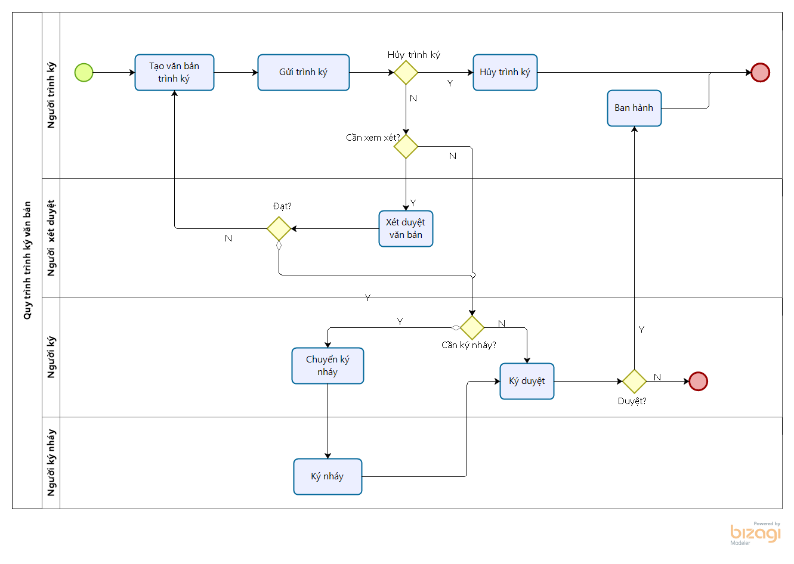

**Mô tả nghiệp vụ**

Quá trình trình ký văn bản sẽ thực hiện theo quy trình sau:

1.  Người trình ký tạo văn bản trên ứng dụng ký số và trình ký tới danh sách người ký.
2.  Người trình ký có thể hủy luồng trình ký khi văn bản đang trình ký nhưng chưa có ai ký duyệt
3.  Trường hợp văn bản gửi tới cần phải xét duyệt trước ký, người xét duyệt cần xét duyệt văn bản trước. 
4.  Người ký gửi yêu cầu ký nháy tới người khác trước khi ký duyệt 
5.  Người được yêu cầu ký nháy thực hiện ký nháy hoặc từ chối ký nháy  
6. Người ký thực hiện ký duyệt hoặc từ chối ký văn bản.
7.  Văn bản sau ký duyệt được ban hành và lưu trữ văn bản. 

## Thiết lập và khai báo dữ liệu ban đầu

Việc thiết lập và khai báo ban đầu được thực hiện khi lần đầu cài đặt ứng dụng, giúp khởi tạo dữ liệu và bắt đầu cho việc thực hiện các nghiệp vụ ký số. 

### **Tải plugin chứng thư số để sử dụng usb-token** 

Để USB token để ký số, người dùng cần phải tải plugin [tại đây](https://drive.google.com/file/d/1AhSJmYcurxkwipzxEM4T4HcHi5yKH80Q/view) về máy để chạy mỗi khi thực hiện ký. Trước khi thực hiện ký số với usb token, cần phải chạy tệp plugin này. 

### **Cấu hình cho công ty sử dụng cloudCA** 

Để sử dụng được dịch vụ CloudCA để ký số, công ty cần thiết lập các thông số kết nối được cung cấp khi đăng ký dịch vụ CloudCA. 

 **Đối tượng thực hiện: Quản trị hệ thống (Admin)**

**Các bước thực hiện:** 

1. Vào **Thiết lập** >  **Người dùng và công ty** > **Công ty**: Hệ thống sẽ hiển thị danh sách công ty, người dùng kích chọn công ty cần cấu hình

2. Tại màn hình Thông tin chi tiết của công ty, chọn tab **Esign cloudCA**

3. Khai báo các thông tin cấu hình như đã được cung cấp khi đăng ký dịch vụ CloudCA 

   * Khai báo thông tin **API Key** là **API Key**

   * Khai báo thông tin **API Secret** là **API Secret** 	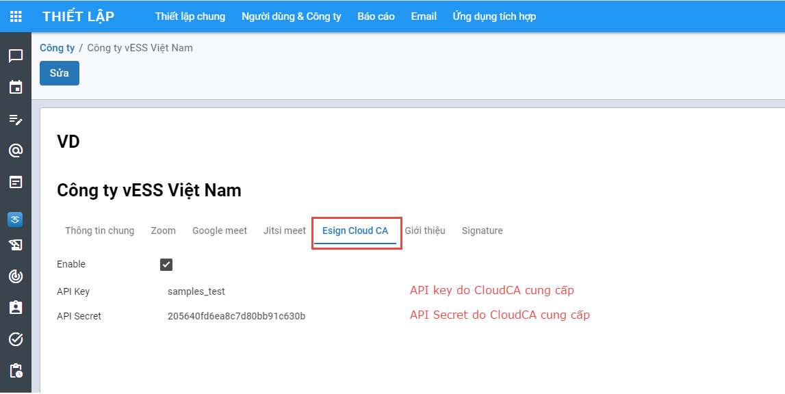

     

### Loại văn bản trình ký

Cho phép khai báo và quản lý thông tin về các loại văn bản  trên hệ thống, các quy tắc tự sinh số văn bản khi được ban hành. 

**Đối tượng thực hiện: Quản trị hệ thống (Admin)**

**Các bước thực hiện:** 

1. Vào **Cấu hình** > chọn **Loại tài liệu trình ký**

​	

- Hiển thị danh sách các loại văn bản trình ký được khai báo trên hệ thống.
- Thông tin hiển thị: Tên, Mã văn bản

2.  Để khai báo loại văn bản mới, người dùng kích nút **Tạo**. Trên màn hình tạo mới, khai báo các thông tin chi tiết của **Loại văn bản trình ký**

- Nhập Tên loại văn bản trình ký

- Nhập Quy tắc đánh mã: Nhập quy tắc sẽ đánh số văn bản để hệ thống tự sinh số văn bản khi được ban hành tự động. Quy tắc sinh mã có sử dụng các tham số được định nghĩa ở danh sách tham số cấu hình ở bên dưới theo cấu trúc khai báo {tên tham số}. 

  Ví dụ: Một tờ trình có số văn bản khi ban hành được hệ thống tự sinh theo quy tắc sinh mã: **TT/{năm}/{số thứ tự}** , khi khai báo sẽ thực hiện như sau: 

     - Nhập vào trường Quy tắc đánh mã: **TT/{năm}/{số thứ tự}**, trong đó **năm** và **số thứ tự** là các tham số tự sinh cần khai báo ở phần danh sách tham số cấu hình bên dưới. 

     - Tại phần Tham số cấu hình, kích nút **Thêm tham số** để cấu hình cho từng tham số

       -  Trường Tên: nhập tên tham số phải duy nhất trong danh sách tham số

       - Kiểu: chọn kiểu dữ liệu tương ứng với tham số, ví dụ **số thứ tự** thì chọn kiểu số. Hệ thống đang hỗ trợ một số kiểu như số, ngày, tháng, năm, văn bản.   
       - Giá trị khởi tạo:  Nhập giá trị khởi tạo để bắt đầu tính quy tắc,  ví dụ số thứ tự với giá trị khởi tạo là 1 thì khi sinh số văn bản sẽ tính từ 1 và tăng dần lên.

       - Ô tích / bỏ tích **Cho phép cập nhật**: nếu được tích chọn thì khi ban hành văn bản người dùng có thể thay đổi giá trị ứng với tham số này.  

         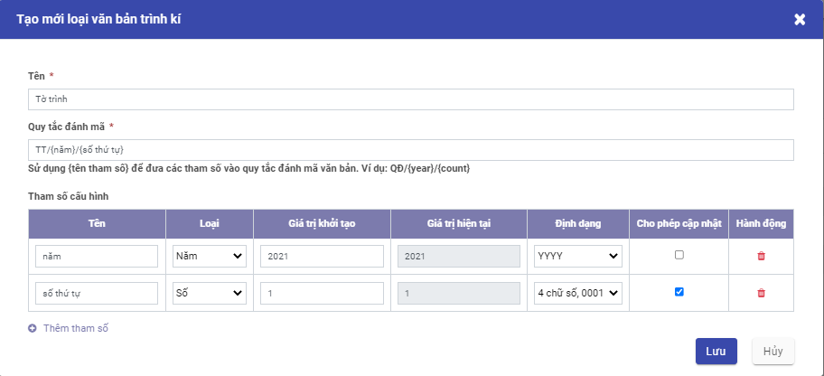

### Vai trò ký

Cho phép khai báo và quản lý thông tin về các vai trò khi ký của người dùng  trên ứng dụng. 

**Đối tượng thực hiện: Quản trị hệ thống (Admin)**

**Các bước thực hiện:** 

1.  Người dùng chọn **Cấu hình** >Kích chọn **Vai trò kí**

- Hiển thị danh sách các vai trò ký được khai báo trên hệ thống.
- Thông tin hiển thị: Tên vai trò và lựa chọn Có người xem xét 

2. Click **Tạo** để khai báo các thông tin vai trò ngay trên danh sách: 

- Tên: nhập tên vai trò
- Tích chọn Có người xem xét:  
  - Tích tùy chọn này với các vai trò cần phải qua người văn thư, thư ký xét duyệt trước khi gửi tới người ký 
  - Không tích với các trường hợp không cần qua bộ phần xét duyệt trước.

3. Kích**Lưu**

### Tài khoản ký

Cho phép khai báo và quản lý thông tin về các tài khoản được thực hiện ký  trên hệ thống.

**Đối tượng thực hiện: **

·     **Người quản trị hệ thống:** khai báo các tài khoản ký cho người dùng

·     **Người dùng: ** Chỉ xem thông tin tài khoản của mình và có quyền chỉnh sửa ảnh chân ký và thông tin ký CA 

**Các bước thực hiện:** 

1. Chọn **Cấu hình** > Kích**Tài khoản kí**

- Hiển thị danh sách các tài khoản ký đã khai báo trên hệ thống.
- Các thông tin hiển thị: Tên tài khoản, email, số điện thoại, có ký số, vai trò...

2. Để khai báo tài khoản ký mới, kích nút **Tạo**:

   ​	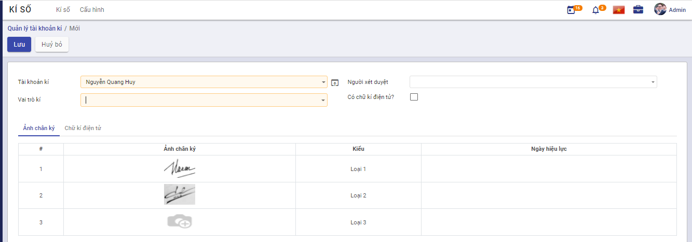

- Nhập **Tài khoản kí**: Nhập @ tìm kiếm và chọn người dùng để tạo tài khoản kí. Mỗi người dùng tồn tại duy nhất trong danh sách tài khoản kí. 

  **Chú ý**: Điều kiện để cấu hình tài khoản ký cho một người là người đó phải có tài khoản sử dụng trên hệ thống. Trường hợp chưa có tài khoản thì cần liên hệ quản trị được tạo người dùng trước. 

- Chọn **vai trò**: Mỗi người dùng có thể có một hoặc kiêm nhiệm nhiều vai trò. 

- Chọn **Người xem xét**: với vai trò yêu cầu có người xem xét thì bắt buộc phải cấu hình người xem xét từ danh sách người dùng. 

- **Có ký điện tử?**: Nếu tích chọn thì người dùng có thể sử dụng chữ ký số, ngược lại thì chỉ ký duyệt thông thường. 

- Tab **Ảnh chân ký**: Người dùng tải lên hệ thống ảnh chữ ký mộc dùng cho cá nhân để thêm vào văn bản sau khi ký duyệt (nếu yêu cầu). Mỗi tài khoản ký có thể cấu hình tối đa 3 loại chữ ký.  Kích thước ảnh chân ký phải thỏa mãn tỷ lệ 3:2, chiều rộng ảnh thuộc khoảng 200 px - 279px . Ngày hiệu lực mặc định là ngày tải ảnh chân ký tương ứng lên hệ thống. 

- Tab **Ký số CloudCA**: cấu hình mã định danh người dùng được cung cấp bởi bên dịch vụ CloudCA. 

  

- Tab **Chữ ký điện tử**: Cấu hình chứng thư số để xác thực khi người dùng ký duyệt các văn bản. Chứng thư số cần phải được cấu hình trước khi thực hiện ký số để xác thực người ký. 

  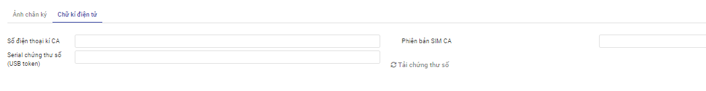

  Để lấy serial chứng thư số cần thực hiện các bước sau: 

  - Bước 1: Tải plugin ký số [tại đây](https://drive.google.com/file/d/1AhSJmYcurxkwipzxEM4T4HcHi5yKH80Q/view?usp=sharing) về máy tính cá nhân và kích chạy tệp vừa tải về
  - Bước 2: Cắm usb token chứa chứng thư số vào máy tính 
  - Bước 3: kích nút **Tải chứng thư số**  -> lựa chọn chứng thư số còn hiệu lực. 
  
  Để sử dụng simCA ký văn bản, cần cấu hình số điện thoại ký CA và phiên bản SimCA đã đăng ký dịch vụ. 
  
  3. Click **Lưu**

### Lưu mẫu trình ký văn bản

Chức năng cho phép mỗi người dùng tạo và quản lý những mẫu trình ký thường xuyên sử dụng. 

**Các bước để tạo mẫu trình ký**

Có 2 cách để tạo mẫu trình ký

**<u>Cách 1</u>:** 

1. Vào **Cấu hình** > chọn **Mẫu tài khoản kí**

- Hiển thị danh sách tất cả mẫu tài khoản kí đã tạo trong hệ thống
- Các chức năng có trong màn hình danh sách bao gồm: Tạo mới, chỉnh sửa, xóa, xuất danh sách mẫu tài khoản kí
- Nhập thông tin muốn tìm kiếm vào thanh tìm kiếm

2. Click **Tạo** > Khai báo thông tin tạo mới mẫu tài khoản kí

- Nhập tên mẫu danh sách ký

- Chọn phạm vi 

- Nhập tên và chọn Tài khoản kí

3. Click **Lưu**

4. Thực hiện yêu cầu tạo mới Mẫu kí: Kiểm tra thông tin dữ liệu trên màn hình và tùy chính thông tin Tạo mới

**<u>Cách 2</u>:**  Tạo mẫu trình ký nhanh trong khi tạo văn bản trình ký 

## Quản lý văn bản trình ký

### Tạo mới văn bản trình kí 

Khi người dùng cần thực hiện trình ký văn bản tới danh sách người ký. 

**Đối tượng thực hiện :** Người dùng

**Các bước thực hiện:** 

1. Vào **Quản lý văn bản trình kí**

 

 

2. Click **Tạo**,  khai báo các thông tin của văn bản:

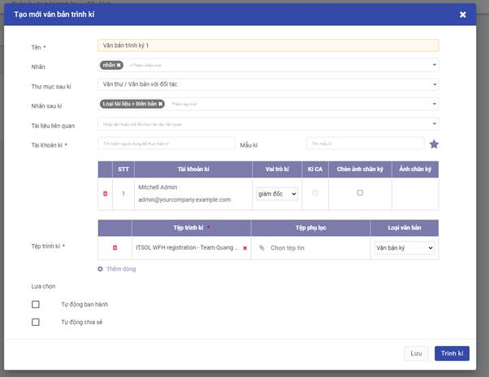

- Nhập Tên văn bản trình kí, gắn nhãn. 
- Trường hợp có cài đặt ứng dụng Tài liệu, hiển thị và cho phép nhập thông tin:
  - Thư mục sau kí: Chọn thư mục lưu trữ văn bản sau khi được ban hành bên ứng dụng Tài liệu
  - Chọn nhãn sau kí của Thư mục sau kí vừa chọn 
- Tài liệu liên quan: Chọn tài liệu được lưu trữ bên ứng dụng tài liệu
- Chọn danh sách người kí:  Có thể tạo mới danh sách hoặc chọn từ mẫu danh sách người ký đã lưu trước đó. 
  - Thứ tự hiển thị trên danh sách là thứ tự sẽ trình ký. 
  - Mỗi tài khoản chỉ tồn tại duy nhất trên danh sách. 
  - Ký CA: khi tích chọn thì khi người ký tương ứng vào ký sẽ cần sử dụng usb token ký có xác thực chứng thư số tồn tại hoặc ký qua CloudCA (nếu có đăng ký sử dụng dịch vụ và đã thiết lập các cấu hình cần thiết). 
  -  Hiển thị ảnh ký: cho phép lựa chọn ảnh chân ký sẽ hiển thị trong văn bản trình ký. 
- Danh sách tệp trình ký: 
  - Có thể trình đồng thời một hoặc nhiều bộ văn bản trình ký, mỗi bộ gồm một tệp ký chính và tệp phụ lục (nếu có). 
  - Tệp trình ký được hỗ trợ các định dạng: pdf, doc, excel, ppt, ảnh. Chỉ với tệp có định dạng pdf thì mới có thể tự động chèn thêm ảnh chân ký sau khi ký số. 
  - Loại văn bản: Chọn loại tài liệu tương ứng 
- Các tùy chọn: 
  - Tùy chọn Ban hành tự động: chỉ có thể ban hành tự động khi trình ký 1 tệp trình ký chính. Khi trình ký từ 2 tệp ký chính thì bắt buộc phải được ban hành thủ công. 
  - Tùy chọn tự động chuyển văn bản: Khi người trình ký muốn sau khi văn bản được ký duyệt và ban hành lưu trữ bên ứng dụng tài liệu sẽ được tự động chia sẻ cho người khác có thể xem được. Tùy chọn này chỉ được sử dụng khi có tích hợp với ứng dụng Tài liệu. 

3. Click nút **Lưu**: văn bản trình ký ở trạng thái Mới tạo, chưa được trình tới người ký.
4. click nút **Trình ký**: Tạo mới văn bản và thực hiện trình ký luôn. Trạng thái văn bản trình ký sẽ hiển thị "Chờ ký duyệt". Theo thứ tự trình ký sẽ gửi thông báo yêu cầu ký duyệt tới người đầu tiên trong danh sách trình ký. 

### Tìm kiếm và lọc văn bản trình ký

Cho phép người dùng tìm kiếm và lọc văn bản trình ký theo các tiêu chí khác nhau. 

**Đối tượng thực hiện :** Người dùng 

**Các bước thực hiện:** 

1. Vào **Quản lý văn bản trình ký** : Nhập tiêu chí tìm kiếm 

- Hiển thị danh sách các Văn bản trình mà người tạo hoặc người ký hoặc người xét duyệt hoặc người ký nháy là người dùng và thỏa mãn tiêu chí tìm kiếm. 
- Thông tin văn bản hiển thị: Tên văn bản, trạng thái, danh sách người ký chính và trậng thái ký, người tạo, ngày trình ký. 
  2. Để lọc những văn bản đến lượt cần người dùng ký duyệt: chọn **Chờ ký duyệt** 
  3. Để lọc những văn bản đến lượt cần người dùng xét duyệt: chọn **Chờ xét duyệt** 
  4. Để lọc những văn bản đến lượt cần người dùng ký nháy: chọn **Chờ ký nháy** 
  5. Để lọc những văn bản đến lượt cần người dùng ban hành: chọn **Chờ ban hành** 
  6. Để lọc những văn bản do người dùng tạo và trình ký : chọn  **Tài liệu của tôi**

### Hủy luồng trình ký

Khi người trình ký văn bản mong muốn dừng lại việc ký văn bản đã trình thì sẽ thực hiện hủy luồng trình ký. 

**Điều kiện thực hiện**: Văn bản đã được trình ký nhưng chưa có người nào thực hiện ký/ xét duyệt văn bản. 

**Đối tượng thực hiện :** Người trình ký 

**Các bước thực hiện:** 

1. Vào **Quản lý văn bản trình ký** > tìm kiếm văn bản cần hủy luồng trình ký -> vào xem chi tiết văn bản

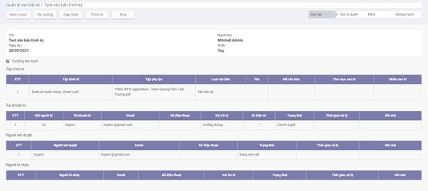

2. Kích nút **Hủy trình ký** -> Xác nhận đồng ý Hủy luồng ký. Văn bản được chuyển sang trạng thái Đã hủy

### Xét duyệt văn bản

Khi văn bản trình ký tới người ký được cấu hình người xét duyệt thì trước khi trình đến người ký chính cần phải qua người xét duyệt đánh giá văn bản. Khi nhận được thông báo yêu cầu xét duyệt văn bản, người dùng thực hiện xem xét và đánh giá duyệt hoặc từ chối duyệt văn bản. 

**Đối tượng thực hiện :** Người xét duyệt

**Các bước thực hiện:** 

1. Vào **Quản lý văn bản trình ký** > tìm kiếm văn bản -> vào xem chi tiết văn bản

2.  Kích nút **Xét duyệt** hoặc **Từ chối** 

   - Nút Xét duyệt: khi đồng ý duyệt văn bản để trình lên người ký chính. Sau khi xét duyệt đạt gửi thông báo tới người ký chính để yêu cầu ký duyệt văn bản. 

   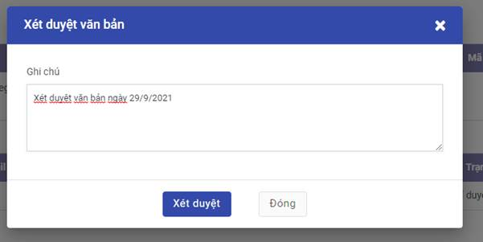

- Nút Từ chối: khi văn bản không đạt vì lý do nào đó, người xét duyệt nhập lý do từ chối và từ chối xét duyệt văn bản. Khi đó, văn bản chuyển trạng thái sang "Từ chối duyệt" và gửi thông báo lại cho người trình ký. 

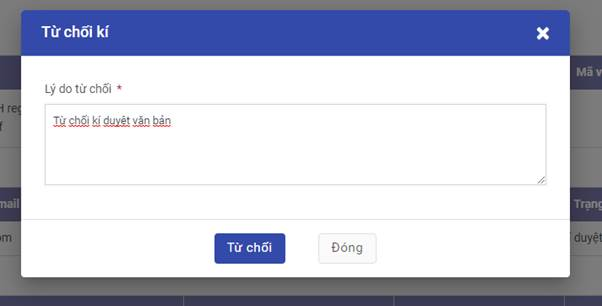

### Ký duyệt văn bản trên web

Khi nhận được thông báo yêu cầu ký duyệt văn bản, người dùng thực hiện xem xét và ký duyệt hoặc từ chối ký duyệt văn bản. 

**Đối tượng thực hiện :** Người ký

**Các bước thực hiện:** 

1. Vào **Quản lý văn bản trình ký** > tìm kiếm văn bản -> vào xem chi tiết văn bản
2.  Kích nút **Ký duyệt** hoặc **Từ chối**

- Trường hợp không yêu cầu phải ký số: Người dùng có thể chọn ký duyệt thông thường hoặc ký điện tử khi sử dụng ký số

- Trường hợp yêu cầu phải ký số: Màn hình ký duyệt văn bản chỉ hiển thị nút “Kí điện tử”. 

  Để thực hiện ký với usb token: 

  - Bước 1: Tải plugin ký số [tại đây](https://drive.google.com/file/d/1AhSJmYcurxkwipzxEM4T4HcHi5yKH80Q/view?usp=sharing) về máy tính cá nhân (nếu chưa có) và kích chạy tệp vừa tải về. Nếu đã có plugin thì chạy luôn tệp plugin đã có. 
  - Bước 2: Cắm usb token chứa chứng thư số vào máy tính 
  - Bước 3: kích nút "**Ký điện tử**" -> Lựa chọn chứng thư số còn hiệu lực và đã đăng ký với tài khoản để thực hiện ký. 

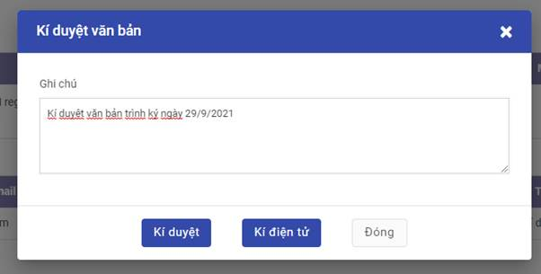

### Ký duyệt văn bản sử dụng CloudCA

**Tiền điều kiện :** Người ký đã cài đặt ứng dụng My sign để xác thực ký CloudCA trên điện thoại và đăng nhập tài khoản ký cloudCA được cung cấp thành công

Khi nhận được thông báo yêu cầu ký duyệt văn bản, người dùng thực hiện xem xét và ký duyệt hoặc từ chối ký duyệt văn bản. 

**Các bước thực hiện:** 

1. Vào **Quản lý văn bản trình ký** > tìm kiếm văn bản -> vào xem chi tiết văn bản 

2. Kích nút **Ký duyệt**: hiển thị màn hình ký duyệt văn bản

3.  Kích nút **Ký CloudCA**

   

4. Trên ứng dụng **My sign**: kích nút xác nhận ký 

   

### Chuyển ký nháy

Người ký duyệt văn bản có thể chuyển ký nháy tới một hoặc nhiều người khác khi có nhu cầu cần ký nháy trước khi ký duyệt. 

**Đối tượng thực hiện :** Người ký duyệt văn bản trình ký

**Các bước thực hiện:** 

1. Vào **Quản lý văn bản trình ký** > tìm kiếm văn bản -> vào xem chi tiết văn bản
2. Kích nút **Chuyển ký nháy**
3. Nhập thông tin chuyển ký nháy

   Có thể chọn chuyển cho một hoặc nhiều tài khoản ký mà không nằm trong danh sách ký chính, danh sách ký nháy đã có hoặc xét duyệt văn bản. 

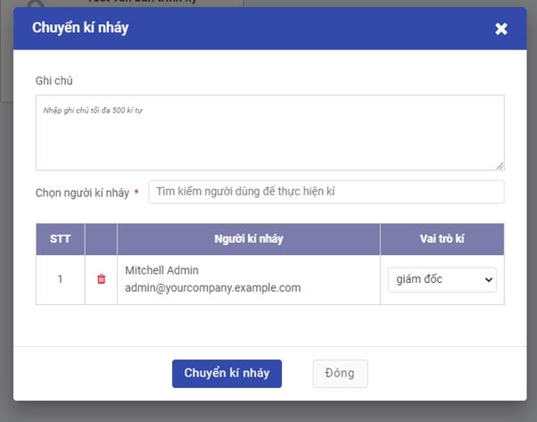

3. Kích nút **Chuyển kí nháy**

   Thực hiện yêu cầu chuyển kí nháy thành công. Người được chuyển ký nháy sẽ nhận được thông báo yêu cầu vào ký nháy cho văn bản. 

### Thay đổi người ký

Trong quá trình trình ký văn bản mà có nhu cầu thay đổi người ký khác, người trình ký sẽ thực hiện chức năng đổi người ký. 

**Điều kiện thực hiện :**  Người cần đổi chưa thực hiện ký duyệt văn bản.

**Đối tượng thực hiện :** Người trình ký 

**Các bước thực hiện:**

1. Vào **Quản lý văn bản trình ký** > tìm kiếm văn bản -> vào xem chi tiết văn bản
2. Tại danh sách người ký: kích nút Đổi người ký
3. Khai báo thông tin tài liệu:

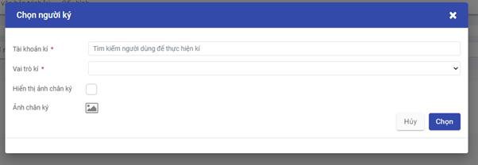

- Chọn người ký sẽ thay thế: người ký này chưa tồn tại trong đanh sách ký duyệt hoặc danh sách ký nháy của văn bản. 

- Chọn hiển thị ảnh chân ký 

3. Click **Chọn**: Thực hiện thay đổi người ký thành công. Nếu đến lượt người đó ký thì sẽ chuyển trình ký tới người vừa được đổi. 

### Đọc nội dung văn bản trình ký

Người dùng có thể đọc nội dung văn bản trình ký trực tiếp trên hệ thống với một số định dạng như pdf, ảnh.

**Đối tượng thực hiện :** Người trình ký, người xem xét, người ký nháy, người ký

**Các bước thực hiện:** 

1. Vào **Quản lý văn bản trình ký** > tìm kiếm văn bản -> vào xem chi tiết văn bản
2. Kích nút  **Xem trước** : mở màn hình đọc văn bản 

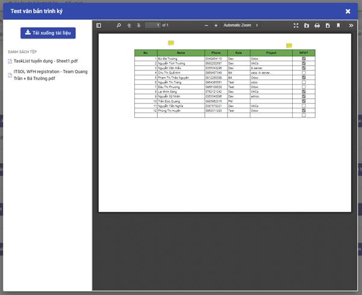

### Ban hành văn bản

Cho phép người dùng ban hành thủ công văn bản đã ký duyệt: cấp số văn bản và lưu trữ văn bản tại đúng thư mục bên ứng dụng Tài liệu (nếu có). 

**Đối tượng thực hiện :** Người ký ban hành, người trình ký 

**Các bước thực hiện:** 

1. Vào **Quản lý văn bản trình ký** > tìm kiếm văn bản -> vào xem chi tiết văn bản có trạng thái đã ký duyệt
2. Kích nút **Ban hành** : vào màn hình Ban hành văn bản

3. Kích nút    mở màn hình nhập các thông tin ban hành với từng tệp trình ký
4. Nhập thông tin ban hành: 

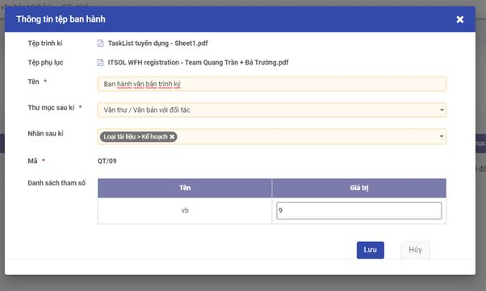

Lưu ý: 

- Thư mục sau ký và nhãn sau ký:  chỉ hiển thị khi có tích hợp với ứng dụng Tài liệu 
- Mã văn bản: được sinh mặc định theo đúng quy tắc đã được thiết lập cho loại văn bản trước đó.
- Danh sách tham số:  danh sách các tham số dùng thiết lập mã văn bản và giá trị tương ứng. Trường hợp mã được thiết lập cho phép người ban hành có thể tự nhập thì có thể thay đổi giá trị tham số. 

3. Sau khi nhập đầy đủ thông tin ban hành cho tất cả các tệp trình ký của văn bản, kích nút Ban hành. 

   Văn bản được ban hành thành công, chuyển trạng thái hiển thị "Đã ban hành". 

   Tại phân hệ Tài liệu, văn bản được lưu trữ và gắn nhãn đúng. 

   Người trình ký sẽ nhận được thông báo đã ban hành văn bản thành công. 

### Thông báo

Các thông báo trong quá trình ký văn bản đều hiển thị trong mục thông báo của ứng dụng. 

**Các bước thực hiện:**

1. Người dùng kích vào nút thông báo (hình quả chuông)

2. Từ danh sách các thông báo hiển thị, kích vào 1 thông báo quan tâm thuộc phần ký số

   sẽ vào được màn hình chi tiết của văn bản trình ký tương ứng. 
