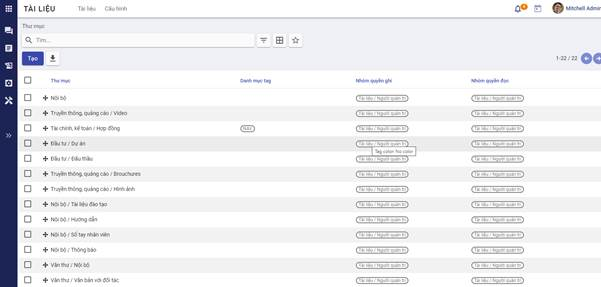
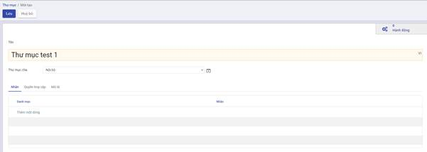

# Thiết lập và khai báo dữ liệu ban đầu

### Thiết lập các thông tin ban đầu

Việc thiết lập và khai báo ban đầu được thực hiện khi lần đầu cài đặt ứng dụng, giúp khởi tạo dữ liệu và bắt đầu cho việc sử dụng. 

#### Tạo và thiết lập phân quyền cho người dùng

Để đăng nhập và sử dụng được ứng dụng Tài liệu, người dùng cần được cấp phân quyền cho ứng dụng. 

**Đối tượng thực hiện**: Quản trị viên

**Các bước thực hiện**:

1. Chọn **Thiết lập** > Chọn **Người dùng**

2. Kích **Tạo** để tạo mới người dùng hoặc chọn sửa thông tin một người dùng trên danh sách
3. Thiết lập quyền với ứng dụng Tài liệu:
   - Tại trường Tài liệu: chọn quyền tương ứng của người dùng đối với ứng dụng tài liệu. 
   - Với ứng dụng Tài liệu, cung cấp 4 mức độ quyền sử dụng như sau: 
     - Người dùng thường: có quyền xem/đọc các tài liệu thuộc thư mục được gán quyền.
     - Người dùng cấp 1: Với thư mục được gán quyền ghi, người dùng có thể tạo mới/ cập nhật tài liệu do chính mình tạo. 
     - Người dùng cấp 2: Với thư mục được gán quyền ghi, người dùng có thể tạo mới/ cập nhật tài liệu do chính mình tạo và cập nhật tài liệu của người khác. 
     - Người quản trị: có toàn quyền với tài liệu trong thư mục được gán quyền quản trị. 
4. Kích **Lưu** 

#### Tạo thư mục lưu trữ 

Trước khi sử dụng hệ thống để lưu trữ, quản lý và khai thác tài liệu, đơn vị nên xây dựng quy hoạch cấu trúc thư mục lưu trữ  một cách khoa học và hiệu quả, đồng thời phân quyền sử dụng tài liệu thuộc thư mục cho người dùng.  

Ngay khi cài đặt ứng dụng Tài liệu, hệ thống có thiết lập mẫu sẵn có một số thư mục để đơn vị tham khảo. Trong trường hợp không muốn sử dụng các thiết lập mặc định của hệ thống, người dùng có thể xóa hoặc chỉnh sửa  hoặc bổ sung cho phù hợp. 

**Đối tượng thực hiện**: Quản trị viên

**Các bước thực hiện**:

1. Vào **Cấu hình** > Chọn **Thư mục** 

    

2. Kích **Tạo**

3. Nhập thông tin khai báo cho thư mục

   - Tên thư mục là bắt buộc nhập. 
   - Chọn thư mục cha nếu có: 

4. Khai báo nhanh **nhãn** sử dụng trong thư mục

   - Tại tab Nhãn: kích nút **Thêm mới dòng**. 
   -  Khai báo thông tin **nhãn** thuộc thư mục như danh mục nhãn, tên nhãn
   - Các nhãn được khai báo thành công ở đây đều được quản lý trong **Danh mục nhãn**

5. Phân quyền cho thư mục 

   - Tại tab Phân quyền: khai báo các nhóm người dùng có quyền đọc/ ghi với tài liệu thuộc thư mục
     - Quyền ghi: cho phép người dùng thuộc nhóm này có quyền tạo mới/ cập nhật với tài liệu trong thư mục
     - Quyền đọc: Người dùng thuộc nhóm này chỉ có quyền đọc/xem với tài liệu trong thư muc.  

6. Sau khi nhập xong thông tin thư mục, kích **Lưu** 

#### Tạo và quản lý nhãn 

Cho phép tạo mới và quản lý các nhãn trên hệ thống dùng để phân loại và lọc tài liệu nhanh chóng. 

**Đối tượng thực hiện**: Quản trị viên

**Các bước thực hiện**:

1. Vào **Cấu hình** > Chọn **Nhãn**

   

   

   

2. Kích **Tạo**

   - Danh mục nhãn: dùng để nhóm các nhãn có liên quan. Một danh mục nhãn có thể có 1 hoặc nhiều nhãn. 

     ​	                                                	         

2. Click button **Lưu**

   Lưu thông tin Nhãn vừa tạo vào hệ thống và hiển thị nhãn vừa tạo ra danh sách nhãn

 

