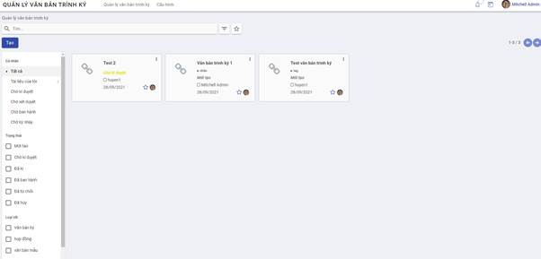
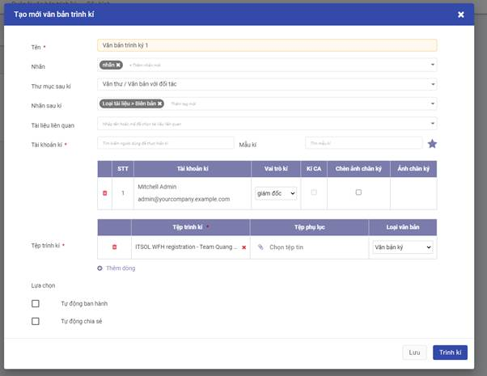
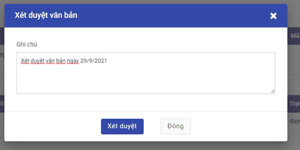
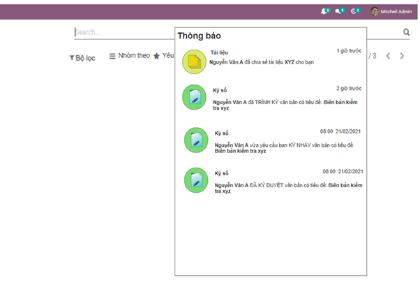

## Quản lý văn bản trình ký

### Tạo mới văn bản trình kí 

Khi người dùng cần thực hiện trình ký văn bản tới danh sách người ký. 

**Đối tượng thực hiện :** Người dùng

**Các bước thực hiện:** 

1. Vào **Quản lý văn bản trình kí**

 

 

2. Click **Tạo**,  khai báo các thông tin của văn bản:

- Nhập Tên văn bản trình kí, gắn nhãn. 
- Trường hợp có cài đặt ứng dụng Tài liệu, hiển thị và cho phép nhập thông tin:
  - Thư mục sau kí: thư mục lưu trữ văn bản sau khi được ban hành
  - Chọn nhãn sau kí của Thư mục sau kí vừa chọn
- Chọn danh sách người kí:  Có thể tạo mới danh sách hoặc chọn từ mẫu danh sách người ký đã lưu trước đó. 
  - Thứ tự hiển thị trên danh sách là thứ tự sẽ trình ký. 
  - Mỗi tài khoản chỉ tồn tại duy nhất trên danh sách. 
  - Ký CA: khi tích chọn thì khi người ký tương ứng vào ký sẽ cần sử dụng usb token ký và có xác thực chứng thư số tồn tại. 
  -  Hiển thị ảnh ký: cho phép lựa chọn ảnh chân ký sẽ hiển thị trong văn bản trình ký. 
- Danh sách tệp trình ký: 
  - Có thể trình đồng thời một hoặc nhiều bộ văn bản trình ký. Mỗi bộ gồm một tệp ký chính và tệp phụ lục (nếu có). 
  - Tệp trình ký được hỗ trợ các định dạng: pdf, doc, excel, ppt, ảnh. Chỉ với tệp có định dạng pdf thì mới có thể tự động chèn thêm ảnh chân ký sau khi ký số. 
  - Loại văn bản: 
- Các tùy chọn: 
  - Tùy chọn Ban hành tự động: chỉ có thể ban hành tự động khi trình ký 1 tệp trình ký chính. Khi trình ký từ 2 tệp ký chính thì bắt buộc phải được ban hành thủ công. 
  - Tùy chọn tự động chuyển văn bản: Khi người trình ký muốn sau khi văn bản được ký duyệt và ban hành sẽ được tự động chia sẻ cho người khác có thể đọc. Tùy chọn này chỉ được sử dụng khi có tích hợp với ứng dụng Tài liệu. 

3. Click nút **Lưu**: văn bản trình ký ở trạng thái Mới tạo, chưa được trình tới người ký.
4. click nút **Trình ký**: Tạo mới văn bản và thực hiện trình ký luôn. Trạng thái văn bản trình ký sẽ hiển thị "Chờ ký duyệt". Theo thứ tự trình ký sẽ gửi thông báo yêu cầu ký duyệt tới người đầu tiên trong danh sách trình ký.

### Tìm kiếm và lọc văn bản trình ký

Cho phép người dùng tìm kiếm và lọc văn bản trình ký theo các tiêu chí khác nhau. 

**Đối tượng thực hiện :** Người dùng 

**Các bước thực hiện:** 

1. Vào **Quản lý văn bản trình ký** : Nhập tiêu chí tìm kiếm 

- Hiển thị danh sách các Văn bản trình mà người tạo hoặc người ký hoặc người xét duyệt hoặc người ký nháy là người dùng và thỏa mãn tiêu chí tìm kiếm. 
- Thông tin văn bản hiển thị: Tên văn bản, trạng thái, danh sách người ký chính và trậng thái ký, người tạo, ngày trình ký. 
  2. Để lọc những văn bản đến lượt cần người dùng ký duyệt: chọn **Chờ ký duyệt** 
  3. Để lọc những văn bản đến lượt cần người dùng xét duyệt: chọn **Chờ xét duyệt** 
  4. Để lọc những văn bản đến lượt cần người dùng ký nháy: chọn **Chờ ký nháy** 
  5. Để lọc những văn bản đến lượt cần người dùng ban hành: chọn **Chờ ban hành** 
  6. Để lọc những văn bản do người dùng tạo và trình ký : chọn  **Tài liệu của tôi**

### Hủy luồng trình ký

Khi người trình ký văn bản mong muốn dừng lại việc ký văn bản đã trình thì sẽ thực hiện hủy luồng trình ký. 

**Điều kiện thực hiện**: Văn bản đã được trình ký nhưng chưa có người nào thực hiện ký/ xét duyệt văn bản. 

**Đối tượng thực hiện :** Người trình ký 

**Các bước thực hiện:** 

1. Vào **Quản lý văn bản trình ký** > tìm kiếm văn bản cần hủy luồng trình ký -> vào xem chi tiết văn bản

2. Kích nút **Hủy trình ký** -> Xác nhận đồng ý Hủy luồng ký. Văn bản được chuyển sang trạng thái Đã hủy

### Xét duyệt văn bản

Khi văn bản trình ký tới người ký được cấu hình người xét duyệt thì trước khi trình đến người ký chính cần phải qua người xét duyệt đánh giá văn bản. Khi nhận được thông báo yêu cầu xét duyệt văn bản, người dùng thực hiện xem xét và đánh giá duyệt hoặc từ chối duyệt văn bản. 

**Đối tượng thực hiện :** Người xét duyệt

**Các bước thực hiện:** 

1. Vào **Quản lý văn bản trình ký** > tìm kiếm văn bản -> vào xem chi tiết văn bản

2.  Kích nút **Xét duyệt** hoặc **Từ chối** 

   - Nút Xét duyệt: khi đồng ý duyệt văn bản để trình lên người ký chính. Sau khi xét duyệt đạt gửi thông báo tới người ký chính để yêu cầu ký duyệt văn bản. 

   

- Nút Từ chối: khi văn bản không đạt vì lý do nào đó, người xét duyệt nhập lý do từ chối và từ chối xét duyệt văn bản. Khi đó, văn bản chuyển trạng thái sang "Từ chối duyệt" và gửi thông báo lại cho người trình ký. 

### Ký duyệt văn bản

Khi nhận được thông báo yêu cầu ký duyệt văn bản, người dùng thực hiện xem xét và ký duyệt hoặc từ chối ký duyệt văn bản. 

**Đối tượng thực hiện :** Người ký

**Các bước thực hiện:** 

1. Vào **Quản lý văn bản trình ký** > tìm kiếm văn bản -> vào xem chi tiết văn bản
2.  Kích nút **Ký duyệt** hoặc **Từ chối**

- Trường hợp không yêu cầu phải ký CA: Người dùng có thể chọn ký duyệt thông thường hoặc ký điện tử khi sử dụng ký cA. 
- Trường hợp yêu cầu phải ký CA: Màn hình ký duyệt văn bản chỉ hiển thị nút “Kí điện tử”. Người ký sử dụng USB token đã đăng ký để ký duyệt văn bản. 

### Chuyển ký nháy

Người ký duyệt văn bản có thể chuyển ký nháy tới một hoặc nhiều người khác khi có nhu cầu cần ký nháy trước khi ký duyệt. 

**Đối tượng thực hiện :** Người ký duyệt văn bản trình ký

**Các bước thực hiện:** 

1. Vào **Quản lý văn bản trình ký** > tìm kiếm văn bản -> vào xem chi tiết văn bản
2. Kích nút **Chuyển ký nháy**
3. Nhập thông tin chuyển ký nháy

   Có thể chọn chuyển cho một hoặc nhiều tài khoản ký mà không nằm trong danh sách ký chính, danh sách ký nháy đã có hoặc xét duyệt văn bản. 

3. Kích nút **Chuyển kí nháy**

   Thực hiện yêu cầu chuyển kí nháy thành công. Người được chuyển ký nháy sẽ nhận được thông báo yêu cầu vào ký nháy cho văn bản. 

### Thay đổi người ký

Trong quá trình trình ký văn bản mà có nhu cầu thay đổi người ký khác, người trình ký sẽ thực hiện chức năng đổi người ký. 

**Điều kiện thực hiện :**  Người cần đổi chưa thực hiện ký duyệt văn bản.

**Đối tượng thực hiện :** Người trình ký 

**Các bước thực hiện:**

1. Vào **Quản lý văn bản trình ký** > tìm kiếm văn bản -> vào xem chi tiết văn bản
2. Tại danh sách người ký: kích nút Đổi người ký
3. Khai báo thông tin tài liệu:

- Chọn người ký sẽ thay thế: người ký này chưa tồn tại trong đanh sách ký duyệt hoặc danh sách ký nháy của văn bản. 

- Chọn hiển thị ảnh chân ký 

3. Click **Chọn**: Thực hiện thay đổi người ký thành công. Nếu đến lượt người đó ký thì sẽ chuyển trình ký tới người vừa được đổi. 

#### Đọc nội dung văn bản trình ký

Người dùng có thể đọc nội dung văn bản trình ký trực tiếp trên hệ thống với một số định dạng như pdf, ảnh.

**Đối tượng thực hiện :** Người trình ký, người xem xét, người ký nháy, người ký

**Các bước thực hiện:** 

1. Vào **Quản lý văn bản trình ký** > tìm kiếm văn bản -> vào xem chi tiết văn bản
2. Kích nút  **Xem trước** : mở màn hình đọc văn bản 

### Ban hành văn bản

Cho phép người dùng ban hành thủ công văn bản đã ký duyệt: cấp số văn bản và lưu trữ văn bản tại đúng thư mục bên ứng dụng Tài liệu (nếu có). 

**Đối tượng thực hiện :** Người ký ban hành, người trình ký 

**Các bước thực hiện:** 

1. Vào **Quản lý văn bản trình ký** > tìm kiếm văn bản -> vào xem chi tiết văn bản có trạng thái đã ký duyệt
2. Kích nút **Ban hành** : vào màn hình Ban hành văn bản

3. Kích nút   mở màn hình nhập các thông tin ban hành với từng tệp trình ký
4. Nhập thông tin ban hành: 

Lưu ý: 

- Thư mục sau ký và nhãn sau ký:  chỉ hiển thị khi có tích hợp với ứng dụng Tài liệu 
- Mã văn bản: được sinh mặc định theo đúng quy tắc đã được thiết lập cho loại văn bản trước đó.
- Danh sách tham số:  danh sách các tham số dùng thiết lập mã văn bản và giá trị tương ứng. Trường hợp mã được thiết lập cho phép người ban hành có thể tự nhập thì có thể thay đổi giá trị tham số. 

3. Sau khi nhập đầy đủ thông tin ban hành cho tất cả các tệp trình ký của văn bản, kích nút Ban hành. 

   Văn bản được ban hành thành công, chuyển trạng thái hiển thị "Đã ban hành". 

   Tại phân hệ Tài liệu, văn bản được lưu trữ và gắn nhãn đúng. 

   Người trình ký sẽ nhận được thông báo đã ban hành văn bản thành công. 

### Thông báo

Các thông báo trong quá trình ký văn bản đều hiển thị trong mục thông báo của ứng dụng. 

**Các bước thực hiện:**

1. Người dùng kích vào nút thông báo (hình quả chuông)

2. Từ danh sách các thông báo hiển thị, kích vào 1 thông báo quan tâm thuộc phần ký số

   sẽ vào được màn hình chi tiết của văn bản trình ký tương ứng. 
