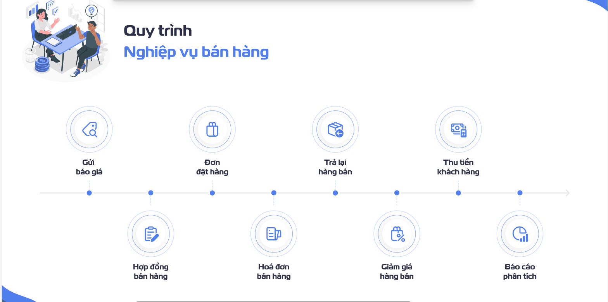
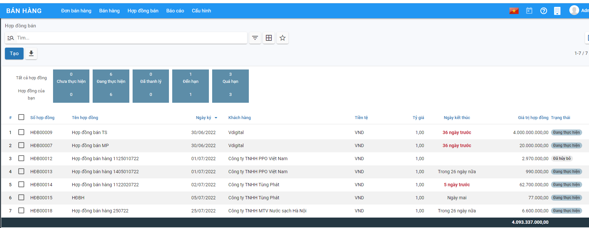
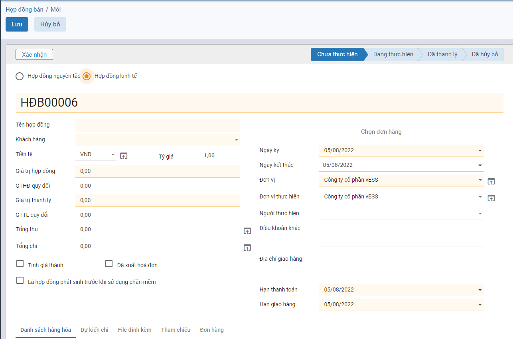
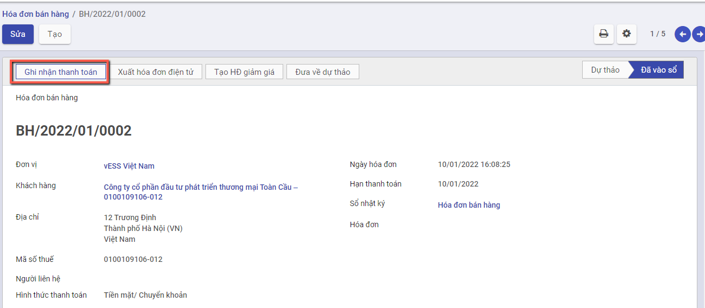
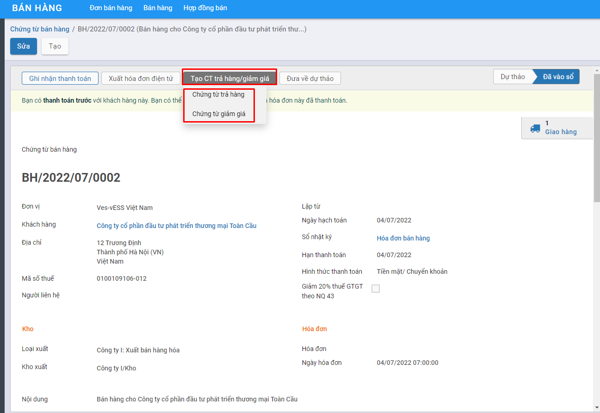

# *Quy trình nghiệp vụ*

## **Quy trình nghiệp vụ**

Quy trình bán hàng là một loạt các bước cần thực hiện để thúc đẩy hoạt động bán hàng tại doanh nghiệp.Việc xây dựng quy trình bán hàng trên hệ thống sẽ giúp nhân viên kinh doanh, quản lý bán hàng và ban lãnh đạo doanh nghiệp xác định được các cơ hội bán hàng và tỷ lệ thành công của các cơ hội đó từ đó xác định được các chiến lược kinh doanh phù hợp để đạt được doanh thu lớn nhất. Quy trình sẽ bao gồm các chức năng: Từ yêu cầu báo giá đến đơn bán hàng, hóa đơn bán hàng, hóa đơn giảm giá/trả hàng

Khi phát sinh nghiệp vụ bán hàng hóa, dịch vụ, thông thường sẽ phát sinh các hoạt động sau:

- Nhân viên bán hàng có thể thực hiện tiếp thị, chào bán sản phẩm cho các khách hàng có nhu cầu

- Khách hàng gọi điện hoặc gửi email có nhu cầu mua hàng đến công ty và đề nghị công ty báo giá hàng. Nhân viên bán hàng căn cứ vào yêu cầu khách hàng gửi báo giá cho khách hàng

- Sau khi khách hàng gọi điện hoặc gửi mail yêu cầu giao hàng cho khách hàng thì nhân viên bán hàng thực hiện làm các thủ tục bán hàng (xuất hóa đơn bán hàng hoặc lập hợp đồng bán hàng...)
- Kế toán kho lập Phiếu xuất kho, sau đó chuyển Kế toán trưởng và Giám đốc ký duyệt
- Căn cứ vào Phiếu xuất kho, Thủ kho xuất kho hàng hoá và ghi Sổ kho
- Nhân viên kinh doanh nhận hàng , bàn giao cho khách hàng, thu tiền của khách hàng, gửi hóa đơn GTGT cho khách hàng
- Sau khi bán hàng xong cho khách hàng, kế toán  ghi nhận doanh số bán hàng
- Nếu khách hàng thanh toán bằng tiền mặt cho nhân viên bán hàng thì nhân viên bán hàng sẽ nhận tiền và mang về nhập quỹ, nếu thanh toán bằng tiền gửi thì khách hàng sẽ chuyển khoản vào tài khoản của công ty.

## **Các luồng quy trình**

·     Lập yêu cầu báo giá gửi khách hàng. Chi tiết nghiệp vụ **[tại đây](#Lập yêu cầu báo giá)**

·     Lập đơn bán hàng gửi khách hàng. Chi tiết nghiệp vụ **[tại đây](#Lập đơn bán hàng)**

·     Lập hợp đồng bán hàng. Chi tiết nghiệp vụ [**tại đây**](#Hợp đồng bán hàng)

·     Lập hóa đơn bán hàng gửi khách hàng, ghi nhận thanh toán. Chi tiết nghiệp vụ **[tại đây](*Hóa đơn bán hàng*)**

·     Lập hóa đơn giảm giá/trả hàng gửi khách hàng. Chi tiết nghiệp vụ **[tại đây](Tạo hóa đơn giảm giá/trả hàng)**

## *Yêu cầu báo giá*

### Mô tả nghiệp vụ

**Nghiệp vụ**

Nhân viên kinh doanh tìm kiếm khách hàng thông qua khách hàng tiềm năng, khách hàng cũ, đối tác, nhà phân phối

Nhân viên kinh doanh sẽ tiếp thị, giới thiệu sản phẩm dịch vụ để chào hàng

Đối với những khách hàng có nhu cầu mua sản phẩm/dịch vụ, nhân viên kinh doanh sẽ tiến hành:

- Lập báo giá
- Gửi báo giá cho khách hàng

**Hướng dẫn trên phần mềm**

Phần mềm hỗ trợ nhân viên kinh doanh lập và gửi báo giá cho nhân viên kinh doanh theo các bước sau:

Bước 1: Lập báo giá. Chi tiết nghiệp vụ [tại đây](#Lập báo giá)

Bước 2: Gửi báo giá cho khách hàng. Chi tiết nghiệp vụ [tại đây](#Thực hiện gửi báo giá cho khách hàng)

**Xem video hướng dẫn**

*[Xây dựng video hướng dẫn trên phần mềm, gồm đủ các luồng chức năng được mô tả bên dưới]*

### Hướng dẫn trên phần mềm

Nhân viên kinh doanh tiến hành lập báo giá sản phẩm/dịch vụ cho khách hàng có nhu cầu

Đối tượng thực hiện: Nhân viên kinh doanh

Bước 1: Vào phân hệ **Bán hàng**, Chọn **Đơn bán hàng**, chọn **Báo giá** (Hoặc thực hiện **Tìm kiếm** trực tiếp chức năng trên ô tìm kiếm chung của hệ thống)

Bước 2: Khai báo các thông tin chi tiết trên báo giá

·     Chọn thông tin khách hàng

·     Chọn tiền tệ giao dịch trong Đơn hàng

·     Khai báo thông tin về Ngày báo giá, hiệu lực đến

·     Khai báo thông tin về Sản phẩm/dịch vụ : 

​			Chọn các sản phẩm yêu cầu báo giá cho khách hàng

​			Nhập thông tin Số lượng, Đơn giá, Chiết khấu và mức Thuế đối với từng Sản phẩm

​			Khi thực hiện Thêm ghi chú --> Thông tin nội dung sẽ được in trên file gửi khách hàng

Bước 3: Nhấn **Lưu**

#### **Thực hiện gửi báo giá cho khách hàng**

Bước 1: Sau khi đã có tài liệu báo giá để gửi khách hàng, Thực hiện **In** yêu cầu báo giá: kiểm tra thông tin dữ liệu trên mẫu yêu cầu báo giá và tùy chỉnh thông tin Mẫu yêu cầu

Bước 2: Thực hiện **Gửi qua Email** đến nhà cung cấp sau khi hoàn thành  báo giá, có thể tùy chỉnh thông tin mẫu gửi báo giá theo yêu cầu

#### Xác nhận đơn bán hàng

Khi có nhu cầu mua sản phẩm, khách hàng sẽ liên hệ với nhân viên bán hàng để đặt hàng. Nhân viên bán hàng thực hiện lập đơn hàng dựa trên báo giá đã gửi

Bước 1: Vào phân hệ **Bán hàng**, trên danh sách **Báo giá**, tìm thông tin các báo giá đã gửi cho khách hàng 

Bước 2: Nhấn nút **Xác nhận**

**<u>Lưu ý:</u>**

Báo giá được thực hiện Xác nhận đơn hàng: Sẽ không được hiển thị trên Danh sách Báo giá

#### Sinh chứng từ giao hàng

Sau khi thực hiện Xác nhận đơn hàng, chương trình tự động sinh ra một yêu cầu giao hàng gửi tới kế toán kho/thủ kho (Phân hệ Quản lý kho/Phiếu xuất kho) Nhân viên có thể theo dõi tình trạng giao hàng của sản phẩm trên phiếu xuất kho đã sinh ra

## *Hợp đồng bán hàng*

### Mô tả nghiệp vụ

Đối với trường hợp bán hàng có giá trị lớn, sau khi tiếp nhận được yêu cầu mua hàng của khách hàng, nhân viên kinh doan tiến hành lập hợp đồng bán hàng  theo đơn hàng, theo dõi thanh toán và thanh lý hợp đồng

### Hướng dẫn trên phần mềm

Đối tượng thực hiện: Nhân viên kinh doanh

Bước 1: Vào phân hệ **Bán hàng**,  chọn chức năng **Hợp đồng bán** (Hoặc thực hiện **Tìm kiếm** trực tiếp chức năng trên ô tìm kiếm chung của hệ thống)

Danh sách hợp đồng sẽ hiển thị các hợp đồng bán đã được khách hàng phản hồi có nhu cầu mua sản phẩm và xác nhận tạo đơn bán hàng

Bước 2: Thực hiện **Tạo mới** hợp đồng, Trên giao diện, nhập đủ các thông tin:Tên hợp đồng, khách hàng, ngày ký, giá trị hợp đồng,giá trị thanh lý, hạn giao hàng,hạn thanh toán, chọn đơn bán hàng

Nhấn **Lưu** để lưu lại thông tin hợp đồng

## *Lập đơn bán hàng*

### Mô tả nghiệp vụ

Đơn bán hàng được thực hiện sau luồng Gửi báo giá cho khách hàng được hoàn thành

Khi có nhu cầu mua sản phẩm, khách hàng sẽ liên hệ với nhân viên kinh doanh để đặt hàng. Khi đó nhân viên kinh doanh sẽ tiếp nhận yêu cầu của khách hàng, thực hiện tạo đơn bán hàng. Tại đơn bán hàng, nhân viên có thể theo dõi hàng xuất kho và tình trạng xuất hóa đơn cho khách hàng

**Xem video hướng dẫn**

<iframe
    width="920"
    height="450"
    frameborder="0"
    allow="autoplay; encrypted-media; clipboard-write; gyroscope; picture-in-picture "
    allowfullscreen
    title="Lập đơn bán hàng" 
    src="https://www.youtube.com/embed/R__U1GqGegg"
></iframe>

### Hướng dẫn trên phần mềm

#### Lập đơn bán hàng

Đối tượng thực hiện: Nhân viên kinh doanh

Bước 1: Vào phân hệ **Bán hàng**, Chọn nhóm **Đơn bán hàng** , chọn chức năng **Đơn bán hàng** (Hoặc thực hiện **Tìm kiếm** trực tiếp chức năng trên ô tìm kiếm chung của hệ thống)

Danh sách đơn bán hàng sẽ hiển thị các báo giá đã được khách hàng phản hồi có nhu cầu mua sản phẩm và xác nhận tạo đơn bán hàng

Bước 2: Thực hiện chọn Đơn bán hàng cần thực hiện. Tại Đơn bán hàng: 
- Nhân viên phụ trách có thể thực hiện sửa thông tin về Ngày đặt hàng hay Thông tin về sản phẩm
- Mục Điều khoản thanh toán: Nếu có thỏa thuận về điều kiện thanh toán với nhà cung cấp thực hiện chọn thông tin Điều khoản đã được khai báo trên Danh mục **Điều khoản thanh toán** . Trường hợp đã thiết lập điều khoản thanh toán cho từng khách hàng tại danh mục **Khách hàng** thì chương trình sẽ tự động hiển thị sẵn thông tin này theo nhà cung cấp được chọn

#### Theo dõi giao hàng

Sau khi có đơn hàng, sản phẩm sẽ được giao cho khách hàng. Nhân viên kế toán kho thực hiện xác nhận số lượng sản phẩm bàn giao theo đơn hàng 

Nhân viên kinh doanh có thể theo dõi tình trạng giao hàng của sản phẩm qua phiếu xuất kho đã được tạo khi xác nhận đơn hàng

Bước 1: Chọn **Giao hàng**, thực hiện nhập số lượng hàng đã hoàn thành giao cho khách hàng 

- Nếu Số lượng xuất kho đủ theo Số lượng của Đơn bánhàng: Thực hiện nhấn **Xác nhận** để xác nhận toàn bộ Đơn hàng

- Nếu Số lượng xuất kho Chưa đủ theo Số lượng của Đơn bán hàng: Thực hiện nhập số lượng theo thực tế.

  

Bước 2: Nhấn **Xác nhận** để hoàn thành xuất hàng giao cho khách hàng

## *Hóa đơn bán hàng*

### Mô tả nghiệp vụ

Sau khi ký được hợp đồng bán hàng với khách hàng và thực hiện giao hàng thành công, kế toán thực hiện kiểm tra dữ liệu và lập hóa đơn bán hàng, đồng thời thực hiện và theo dõi việc thanh toán của hóa đơn

Sau khi kế toán phê duyệt và cấp hóa đơn, nhân viên kinh doanh sẽ nhận lấy hóa đơn từ phòng kế toán và gửi cho khách hàng

### Hướng dẫn trên phần mềm

#### Lập hóa đơn bán hàng từ đơn bán hàng

**Xem video hướng dẫn**

<iframe
    width="920"
    height="450"
    frameborder="0"
    allow="autoplay; encrypted-media; clipboard-write; gyroscope; picture-in-picture "
    allowfullscreen
    title="Lập hóa đơn bán hàng từ đơn bán hàng" 
    src="https://www.youtube.com/embed/p-VOJ1ilMms"
></iframe>

Đối tượng thực hiện: Nhân viên kế toán

Bước 1: Vào phân hệ **Bán hàng**, Chọn **Đơn bán hàng** đã hoàn thành Giaohàng cho khách hàng và Nhấn **Tạo hóa đơn**

Bước 2: Trên màn hình **Tạo Hóa đơn**, kế toán thực hiện chọn loại hóa đơn thanh toán dựa trên số tiền khách hành thanh toán

- Hóa đơn thông thường: Hệ thống tạo 1 hóa đơn với số lượng, số tiền tương ứng với đơn bán hàng
- Tiền đặt cọc (Theo phần trăm): Hệ thống tạo 1 hóa đơn với số tiền thanh toán theo tỷ lệ phần trăm với số tiền bên đơn bán hàng
- Tiền đặt cọc (Số tiền cố định): Hệ thống tạo 1 hóa đơn với số tiền thanh toán bằng số tiền đã nhập sẵn trên giao diện

Chọn **Tạo & xem hóa đơn** hoặc **Tạo hóa đơn** để thực hiện sinh hóa đơn theo yêu cầu

Bước 3: Trên thông tin **Hóa đơn bán hàng** vừa được tạo , Nhân viên kế toán thực hiện nhập các dữ liệu về:

- Chọn thông tin Loại bán hàng phù hợp với từng nghiệp vụ bán hàng

- Hóa đơn: Ngày hóa đơn, Mẫu số, Ký hiệu hóa đơn và Số hóa đơn

- Chọn và nhập thông tin về Thuế và Chiết khấu tương ứng của Đơn hàng

  

Bước 4: Thông tin dữ liệu hạch toán:

- Căn cứ thông tin Thuế đầu ra đã lựa chọn cùng với thông tin Chiết khấu, Đơn giá, Số lượng của Đơn hàng, hệ thống thực hiện mặc định thông tin các bút toán tương ứng

Bước 5: Nhân viên Kế toán thực hiện nhấn **Xác nhận** 

#### Lập hóa đơn bán hàng không từ đơn bán hàng

Đối tượng thực hiện: Nhân viên kế toán

**Xem video hướng dẫn**

<iframe
    width="920"
    height="450"
    frameborder="0"
    allow="autoplay; encrypted-media; clipboard-write; gyroscope; picture-in-picture "
    allowfullscreen
    title="Lập hóa đơn bán hàng không từ đơn bán hàng" 
    src="https://www.youtube.com/embed/Sa1cBRDhPsc"
></iframe>

Bước 1: Vào phân hệ **Bán hàng**, Chọn **Hóa đơn** , chọn **Hóa đơn bán hàng** (Hoặc thực hiện **Tìm kiếm** trực tiếp chức năng trên ô tìm kiếm chung của hệ thống)

Bước 2: Trên thông tin Hóa đơn bán hàng, Nhân viên kế toán thực hiện nhập các dữ liệu về:

- Chọn thông tin Loại bán hàng phù hợp với từng nghiệp vụ bán hàng
- Hóa đơn: Loại bán hàng, khách hàng, Ngày hóa đơn, Mẫu số, Ký hiệu hóa đơn ,Số hóa đơn, hạn thanh toán
- Chọn và nhập thông tin về sản phẩm, số lượng, giá thành bán,Thuế và Chiết khấu của sản phẩm cần lập hóa đơn

Bước 3: Nhân viên Kế toán thực hiện nhấn **Lưu** . Hệ thống lưu thông tin chi tiết hóa đơn đã nhập và tự động sinh ra các chi tiết bút toán phát sinh

Thông tin dữ liệu bút toán phát sinh:

- Căn cứ thông tin Thuế  đã lựa chọn cùng với thông tin Chiết khấu, Đơn giá, Số lượng đã nhập bên chi tiết hóa đơn, hệ thống thực hiện mặc định thông tin các bút toán tương ứng

Bước 4: Nhân viên Kế toán thực hiện nhấn **Xác nhận** để hoàn thành xuất hóa đơn bán hàng

#### Ghi nhận thanh toán

**Xem video hướng dẫn**

<iframe
    width="920"
    height="450"
    frameborder="0"
    allow="autoplay; encrypted-media; clipboard-write; gyroscope; picture-in-picture "
    allowfullscreen
    title="Ghi nhận thanh toán" 
    src="https://www.youtube.com/embed/wYLdUMfWHVQ"
></iframe>

Kế toán thực hiện ghi nhận và theo dõi việc thanh toán của hóa đơn sau khi xác nhận xuất hóa đơn thành công

Đối tượng thực hiện: Nhân viên kế toán

Bước 1: Vào phân hệ **Bán hàng**, chọn **Hóa đơn**, chọn **Hóa đơn bán hàng**. Trên danh sách hóa đơn bán hàng, kế toán tìm tới các hóa đơn đã được ghi sổ

Bước 2: Nhấn nút **Ghi nhận thanh toán**. Kế toán nhập và sửa thông tin Tài khoản ngân hàng người nhận, khách hàng, ngày hóa đơn, số tiền khách hàng đã trả

Hệ thống sinh phiếu thu tiền  để thu tiền khách hàng đã thực hiện trả

#### Tạo hóa đơn giảm giá/trả hàng

Khi phát sinh nghiệp vụ giảm giá hàng bán hoặc trả lại hàng đã bán, thông thường sẽ có các hoạt động sau:

Nếu phát hiện hàng mua về không đúng quy cách, phẩm chất theo hợp đồng đã ký, khách hàng thoả thuận với doanh nghiệp trả lại hàng đã mua.

Cách 1: Kế toán bán hàng lập hóa đơn giảm giá hàng bán để giao cho khách hàng và ghi sổ kế toán.

Cách 2: Kế toán bán hàng chuyển đổi hóa đơn bán hàng thành khoản hoàn tiền/công nợ giảm

Đối tượng thực hiện: Nhân viên kế toán

**Xem video hướng dẫn**

<iframe
    width="920"
    height="450"
    frameborder="0"
    allow="autoplay; encrypted-media; clipboard-write; gyroscope; picture-in-picture "
    allowfullscreen
    title="Tạo hóa đơn giảm giá" 
    src="https://www.youtube.com/embed/tQqF296qgGQ"
></iframe>

##### Tạo hóa đơn giảm giá

Bước 1: Vào phân hệ **Bán hàng**, chọn **Hóa đơn**, chọn **Hóa đơn bán hàng**. Trên danh sách hóa đơn bán hàng, kế toán tìm tới các hóa đơn đã được ghi sổ, nhấn chọn **Tạo HĐ giảm giá**

Bước 2: Chọn phương thức phát sinh giảm phù hợp với yêu cầu, nhập Lý do tạo hóa đơn, Nhấn **Đảo ngược**

Hệ thống tự sinh hóa đơn giảm giá với thông tin tương ứng với hóa đơn bán hàng. 

Trên hóa đơn giảm giá được sinh ra, kế toán khai báo  các thông tin trên chứng từ giảm giá hàng bán như: số lượng hàng được giảm, giá trị giảm

Nhấn xác nhận để ghi sổ thông tin hóa đơn. Kế toán sẽ **xuất hóa đơn** để gửi lại cho khách hàng và **ghi nhận lại thanh toán**

##### Chuyển đổi thành khoản hoàn tiền/công nợ giảm

Bước 1: Vào phân hệ **Bán hàng**, chọn **Hóa đơn**, chọn **Hóa đơn bán hàng**. Trên danh sách hóa đơn bán hàng, kế toán tìm tới hóa đơn có nhu cầu hoàn hàng, nhấn chọn tiện ích/chuyển đổi thành khoản hoàn tiền/công nợ giảm

Hệ thống chuyển đổi từ hóa đơn bán hàng thành hóa đơn giảm giá/trả hàng, các thông tin được giữ nguyên

