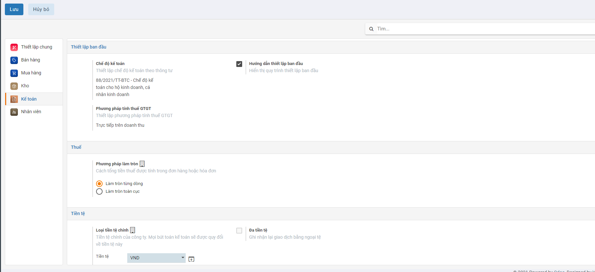
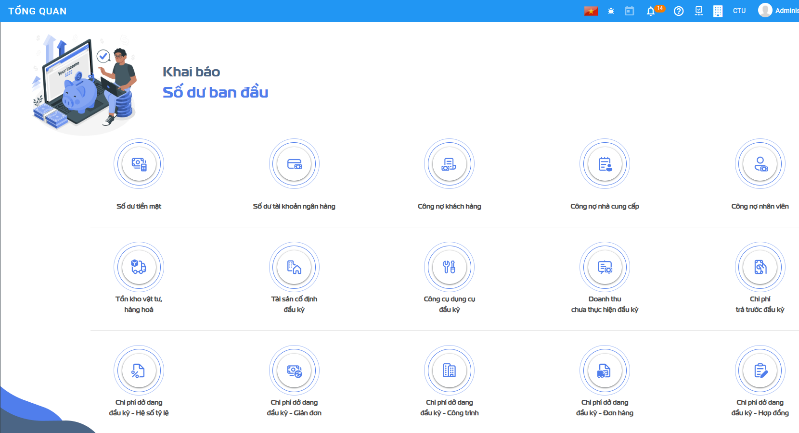
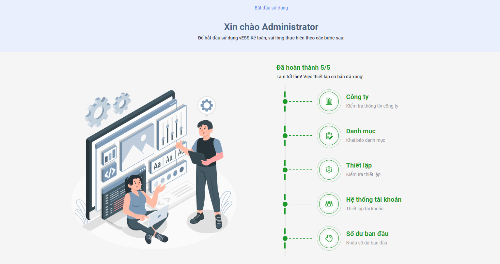

# **Thiết lập và khai báo ban đầu**

Việc thiết lập và khai báo ban đầu được thực hiện khi lần đầu cài đặt hệ thống, giúp khởi tạo dữ liệu và bắt đầu cho việc thực hiện các nghiệp vụ kế toán

Việc thiết lập ban đầu được thực hiện ngay tại thời điểm cài đặt xong Phân hệ kế toán: Đây là điều kiện cần có và bắt buộc để bắt đầu thực hiện các nghiệp vụ trên phân hệ Kế toán

Vào biểu tượng bắt đầu sử dụng tại góc phải để mở thiết lập ban đầu 

Hệ thống mở ra thông tin thiết lập cơ bản ban đầu bao gồm Công ty, khai báo danh mục, thiết lập, hệ thống tài khoản, khai báo số dư

Các thông tin khai báo gồm 5 mục:

### **Thông tin công ty**

Khai báo dữ liệu về Công ty với đầy đủ thông tin về Tên, Địa chỉ, MST, email liên hệ, Trang web. 

### **Khai báo danh mục**

Hiển thị các danh mục cơ bản để người dùng có thể khai báo thông tin trước khi bắt đầu thực hiện nghiệp vụ kế toán

Việc khai báo này có thể thực hiện tại bất kỳ thời điểm nào: trước khi tiến hành Nhập hay ngay tại Thời điểm đang nhập Chứng từ

Để phục vụ cho việc cập nhập số dư ban đầu của dữ liệu kế toán, Người dùng nên khai báo trước một số một số Danh mục về Đối tượng, Nhân viên, Hàng hóa, Nhà cung cấp...

### **Thiết lập**

Hiển thị Chế độ kế toán đã chọn và khai báo bổ sung thêm thông tin mặc định áp dụng cho phần hành kế toán liên quan đến thuế

### **Hệ thống tài khoản**

Hiển thị thông tin Hệ thống tài khoản theo Thông tư đã lựa chọn, có thể Chỉnh sửa, thay đổi để phù hợp với chế độ kế toán tại Doanh nghiệp

### **Nhập số dư ban đầu**

Người dùng nhập các thông tin số dư ban đầu cho các chức năng cụ thể

Sau khi khai báo thành công, người dùng bắt đầu vào sử dụng chức năng của hệ thống

