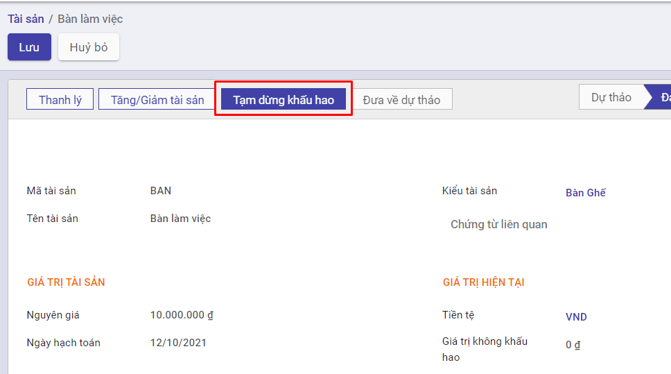
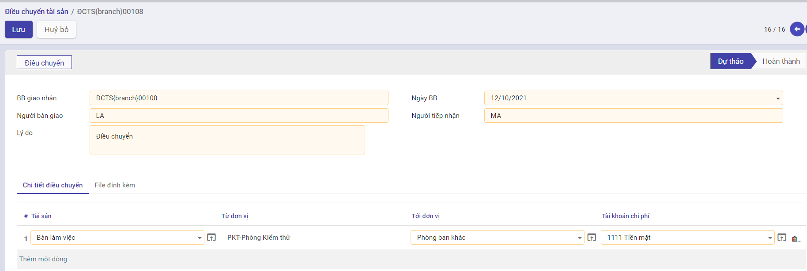
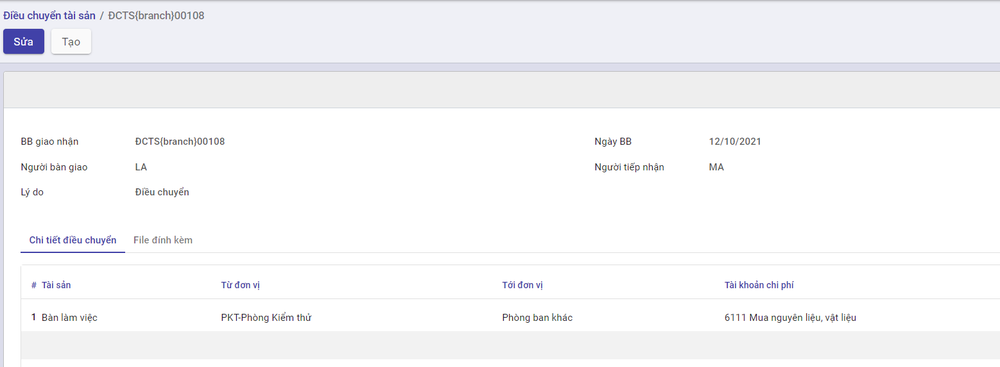
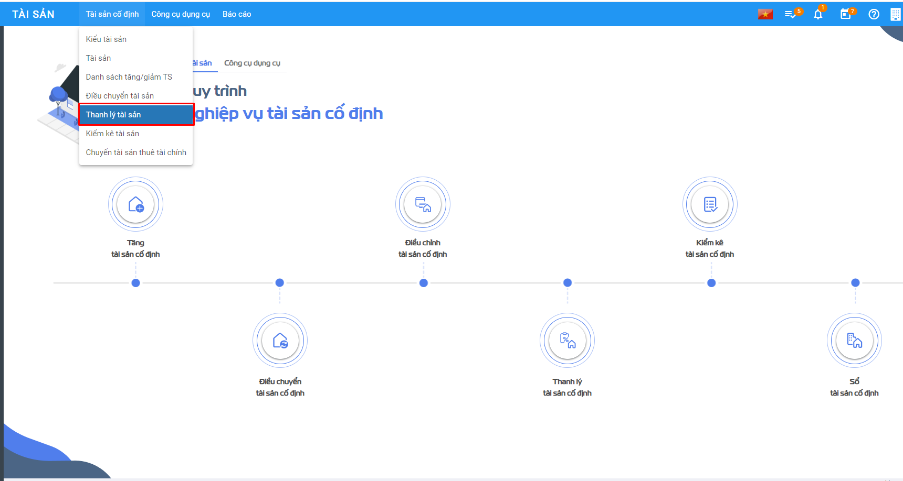
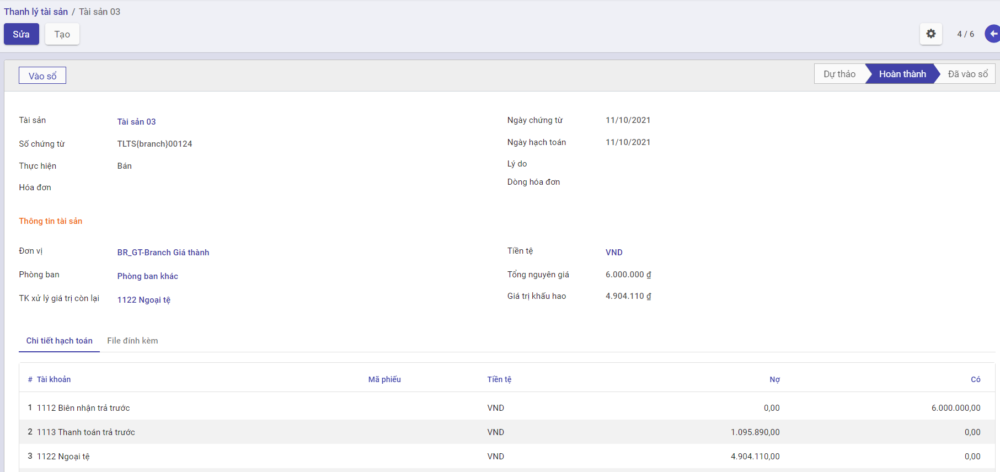
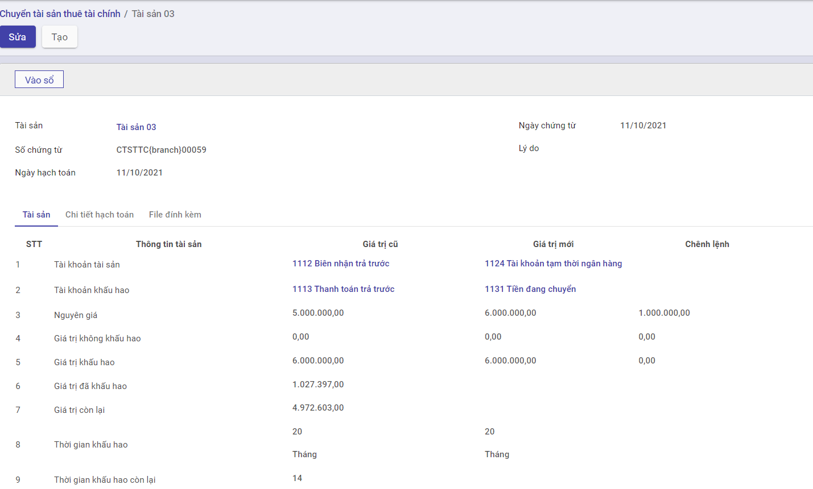

# Quy trình nghiệp vụ

Quản lý toàn bộ thông tin Tài sản cố định của Doanh nghiệp, đến từng bộ phận quản lý sử dụng. Tình hình biến động của Tài sản: Tăng; Giảm; Điều chuyển và Thanh lý tài sản.

Hệ thống tự động tính Khấu hao ước tính theo Phương pháp đường thẳng và Giảm dần có điều chỉnh; Kế toán theo dõi được toàn bộ thông tin về Số tiền Khấu hao tháng; Số tiền Khấu hao lũy kế và Số tiền khấu hao còn lại của từng Tài sản

**Quy trình**

**Các luồng quy trình**

· Quản lý thông tin các Kiểu tài sản **[tại đây](##Kiểu tài sản)**

· Khấu hao Tài sản, Điều chỉnh tăng/giảm, Tạm dừng và Tiếp tục Khấu hao Tài sản theo PP Đường thẳng và PP Giảm dần  **[tại đây](##Tài sản)**

·  Điều chuyển tài sản **[tại đây](##Điều chuyển Tài sản giữa các phòng ban)**

·  Thanh lý tài sản **[tại đây](##Thanh lý tài sản)**

·  Chuyển tài sản thuê tài chính **[tại đây](##Chuyển Tài sản thuê tài chính thành TSCĐ)**

·  Kiểm kê tài sản **[tại đây](##Kiểm kê Tài sản)**

## **Kiểu tài sản**

**Mục đích**

Quản lý thông tin các Kiểu tài sản theo thực tế tại Doanh nghiệp

**Các bước thực hiện**

**Bước 1:** Vào phân hệ **Kế toán Tài sản** -> Chọn chức năng **Danh mục** -> Chọn **Nhóm tài sản** 

**Bước 2:** Nhấn nút **Tạo** -> Hệ thống hiển thị bản ghi Kiểu tài sản mới

**Bước 3:** Nhập các thông tin gồm:

- Phương pháp khấu hao
  - Phương pháp khấu hao: Phương pháp khấu hao sẽ ảnh hưởng tới kết quả tính khấu hao của Tài sản
  - Thời gian khấu hao: Nhập thời gian khấu hao mong muốn theo tháng hoặc năm
  - Theo ngày mua: Hệ thống thực hiện tính khấu hao theo ngày mua hay không khi tính Khấu hao Tài sản

- Đơn vị quản lý Tài sản

- Các đầu tài khoản tại mục Thông tin kế toán -> Phục vụ cho việc ghi nhận bút toán khấu hao

  

**Bước 4**: Thực hiện **Lưu** bản ghi

## **Tài sản**

**Mô tả nghiệp vụ**

Quản lý thông tin Tài sản trên hệ thống bao gồm: Giá trị tài sản và các thông tin liên quan đến khấu hao tài sản, Điều chỉnh tăng/giảm, Tạm dừng hoặc Tiếp tục khấu hao 

**Luồng chức năng chính**

·     Tăng Tài sản cố định. Chi tiết nghiệp vụ **[tại đây](#Tăng tài sản cố định)**

·     Quản lý thông tin Khấu hao. Chi tiết nghiệp vụ **[tại đây](###Quản lý thông tin Khấu hao)**

·     Điều chỉnh Tăng Giá trị/Thời gian khấu hao của Tài sản. Chi tiết nghiệp vụ **[tại đây](###Điều chỉnh Tăng giá trị/thời gian khấu hao của Tài sản)**

·     Điều chỉnh Giảm Giá trị/Thời gian khấu hao của Tài sản. Chi tiết nghiệp vụ **[tại đây](###Điều chỉnh Giảm giá trị/thời gian khấu hao của Tài sản)**

·     Tạm dừng khấu hao Tài sản. Chi tiết nghiệp vụ **[tại đây](###Tạm dừng khấu hao Tài sản)**

·     Tiếp tục khấu hao Tài sản. Chi tiết nghiệp vụ **[tại đây](###Tiếp tục khấu hao Tài sản)**

### **Tăng tài sản cố định**

**Mô tả:**

- Khi Doanh nghiệp ghi nhận phát sinh Tài sản do: mua sắm mới; do đầu tư xây dựng cơ bản hoàn thành; do thuê ..., kế toán thực hiện ghi nhận thông tin Tài sản lên hệ thống để quản lý.
- Tài sản được đánh mã và thực hiện khai báo, quản lý về nguyên giá tài sản, giá trị thanh lý có thể thu hồi, thời gian khấu hao, giá trị còn lại của tài sản, hao mòn lũy kế

**Đối tượng thực hiện :** Nhân viên kế toán

**Các bước thực hiện**:

**Bước 1:** Vào phân hệ **Kế toán Tài sản** -> Chọn **Tài sản** -> Chọn **Tài sản** -> Nhấn nút **Tạo**

**Bước 2:** Thực hiện khai báo thông tin tại tab thông tin chung và các tab khác

+ Thông tin tài sản -> Sau khi chọn Kiểu tài sản -> Hệ thống tự động điền thông tin vào mục Phương pháp khấu hao và Thông tin kế toán

+ Giá trị của tài sản ( Giá trị có thể được nhập tay hoặc chọn từ Chứng từ liên quan. Nếu được chọn từ Chứng từ liên quan, giá trị tài sản không được sửa )

+ Giá trị không khấu hao -> Giá trị này sẽ được trừ đi khi thực hiện Khấu hao tài sản

+ Nhập thông tin giá trị khấu hao, thời gian khấu hao đầu kỳ ( Nếu tài sản đã được sử dụng ngoài phần mềm )

+ Nhập thông tin đối tượng được phân bổ tại tab Thiết lập phân bổ -> Hệ thống ghi nhận bút toán khấu hao cho từng đối tượng tương ứng với đầu tài khoản chi phí và tỷ lệ phân bổ đã khai báo

  

+ Trường hợp người dùng chọn các chứng từ liên quan tới việc khấu hao Tài sản -> Chi tiết chứng từ được ghi nhận tại tab Nguồn gốc hình thành. Tài khoản của chứng từ sẽ ghi nhận thành Tài khoản khấu hao

  

**Bước 3:** Nhấn nút Tính phân bổ để tính khấu hao cho Tài sản -> Giá trị khấu hao của tài sản sẽ được ghi nhận tại tab Khấu hao ước tính

### **Quản lý thông tin Khấu hao**

**Thông tin khấu hao**

Kết quả khấu hao sẽ được trả về tại tab **Khấu hao ước tính**. Kết quả phụ thuộc vào các yếu tố dưới đây:

- [x] Người dùng có chọn *Tính khấu hao theo ngày thực tế hay không*
- [x] *Tài sản mới* hay *Tài sản đã được sử dụng*
- [x] Có tick *Theo ngày mua hay không*
- [x] Phương pháp khấu hao là Đường thẳng hay Giảm dần

+ Nếu không tính theo ngày thực tế -> Hệ thống thực hiện tính khấu hao 1 tháng = 30 ngày, ngược lại sẽ tính theo ngày thực tế của tháng
+ Bản ghi khấu hao Tài sản có tick *Theo ngày mua* -> Giá trị khấu hao sẽ được tính từ ngày theo ngày mua
+ Bản ghi khấu hao Tài sản không tick *Theo ngày mua* -> Giá trị khấu hao sẽ được tính từ *Ngày hạch toán*
+ Trường hợp là *Tài sản đã được sử dụng* trước khi khai báo trên phần mềm-> Hệ thống thực hiện trừ Nguyên giá với Giá trị đã khấu hao (mục Thông tin khấu hao đầu kỳ) và Giá trị không khấu hao( nếu có ) để tính ra giá trị khấu hao, Số ngày tính khấu hao =Số ngày khấu hao - Số ngày đã được khấu hao bên ngoài

Sau khi thực hiện **Tính khấu hao** -> Hệ thống tính toán và hiển thị kết quả tại **Tab Khấu hao ước tính** gồm các thông tin: Ngày khấu hao, Giá trị khấu hao, Giá trị khấu hao lũy kế và Giá trị còn lại theo công thức của  PP Đường thẳng hoặc PP Giảm dần

#### Khấu hao theo Phương pháp Đường thẳng:

+ Căn cứ vào Tổng số ngày khấu hao, Giá trị khấu hao và Tính khấu hao theo ngày thực tế hay không -> Hệ thống thực hiện tính ra giá trị khấu hao cho 1 ngày
+ Từ giá trị khấu hao 1 ngày -> Tính ra giá trị khấu hao cho 1 tháng hoặc 1 năm

#### **Khấu hao theo Phương pháp Giảm dần:**

+ Căn cứ vào Tổng số ngày khấu hao, Giá trị khấu hao và Hệ số giảm dần -> Hệ thống thực hiện tính khấu hao năm
+ Từ giá trị khấu hao năm tính được sẽ tính ra giá trị khấu hao theo một tháng
+ Sau đó sẽ tính ra giá trị khấu hao theo một ngày ( giá trị khấu hao 1 ngày phụ thuộc vào người dùng chọn Tính khấu hao theo ngày thực tế hay không)
+ Đối với giá trị khấu hao từ năm thứ 2 sẽ tính dựa vào Giá trị đã khấu hao của năm thứ nhất và Hệ số giảm dần
+ Tại thời điểm **Tổng khấu hao giảm dần** của năm *nhỏ hơn* **Tổng khấu hao đường thẳng** của năm -> Hệ thống sẽ thực hiện tính khấu hao theo Phương pháp đường thẳng 

=> Khi người dùng nhấn nút **Xác nhận**, bút toán sẽ được ghi nhận tương ứng với các đầu tài khoản đã nhập tại tab thông tin chung. Bên cạnh đó dữ liệu được hạch toán sẽ tác động đến giá trị tiền tại Tab Thông tin chung như sau:

- Bút toán ghi nhận theo từng kỳ khấu hao
  - Ghi có Tài khoản chi phí tại Tab Thiết lập phân bổ
  - Ghi nợ Tài khoản Khấu hao

+ Giá trị tiền tại Tab Thông tin chung
  - Giá trị khấu hao= ( Giá trị gốc - Giá trị không khấu hao)của cả Tài sản gốc và các tài sản con điều chỉnh
  + Giá trị sổ sách = Giá trị gốc của tài sản gốc và các tài sản con điều chỉnh - Giá trị đã khấu hao (Được xác định ở những bản ghi khấu hao đã hạch toán + giá trị đã khấu hao đầu kỳ)

### **Điều chỉnh Tăng giá trị/thời gian khấu hao của Tài sản**

**Mô tả:**

Khi có nhu cầu Tăng giá trị/thời gian khấu hao của Tài sản cố định, Doanh nghiệp thực nhập các số liệu mong muốn để thay đổi về Giá trị của tài sản và Thời gian Khấu hao. Hệ thống sẽ tính toán và cập nhật lại vào các chứng từ liên quan

**Đối tượng thực hiện :** Nhân viên kế toán

**Các bước thực hiện:**

**Bước 1:** Vào chức năng **Kế toán tài sản** -> Chọn **Tài sản** -> Chọn bản ghi Tài sản muốn *Tăng* -> Click button**Tăng/giảm tài sản** 

**Bước 2:** Người dùng nhập dữ liệu liên quan đến Lý do điều chỉnh , giá trị khấu hao và các tài khoản ghi nhận bút toán( nếu có sự thay đổi) trên màn hình Tăng/giảm Tài sản

+ Nếu muốn tăng giá trị khấu hao -> Người dùng thực hiện nhập *Giá trị khấu hao* tại mục *Thông tin điều chỉnh* > *Giá trị khấu hao* tại mục *Thông tin tài sản hiện tại*
+ Nếu muốn tăng thời gian khấu hao -> Người dùng thực hiện nhập *Thời gian khấu hao* tại mục *Thông tin điều chỉnh* > *Thời gian khấu hao* tại mục *Thông tin tài sản hiện tại* 

**Bước 3**: Nhấn nút *Điều chỉnh*

=> Sau khi nhấn nút Điều chỉnh

- Hệ thống kiểm tra nếu ngày điều chỉnh nằm trong kỳ khấu hao đã được hạch toán -> Hiển thị popup thông báo ' Không điều chỉnh vào kỳ đã hạch toán', và thoát khỏi màn hình Điều chỉnh tài sản
- Đối với bản ghi điều chỉnh thỏa mãn điều kiện sẽ ghi nhận giá trị Tăng tài sản vào trường Tổng tăng tại tab Thông tin chung và tác động đến sự thay đổi của *Tab* *Khấu hao ước tính* và *Sinh bút toán ghi nhận Tăng* *giá trị tài sản tương ứng* như sau:
  - Tab Khấu hao ước tính

     - Giá trị khấu hao được tính lại từ ngày điều chỉnh trên popup Tăng/giảm tài sản
     - Các bút toán khấu hao trước đó vẫn được giữ nguyên theo giá trị chưa ghi nhận Tăng
  - Bút toán ghi nhận Tăng giá trị tài sản
    - Ghi nợ Tài khoản đối ứng
    - Ghi có Tài khoản tăng tổng tài sản

### **Điều chỉnh Giảm giá trị/thời gian khấu hao của Tài sản**

**Mô tả:**

Khi có nhu cầu Giảm giá trị/thời gian khấu hao của Tài sản cố định, Doanh nghiệp thực nhập các số liệu mong muốn để thay đổi về Giá trị của tài sản và Thời gian Khấu hao. Hệ thống sẽ tính toán và cập nhật lại vào các chứng từ liên quan

**Đối tượng thực hiện :** Nhân viên kế toán

**Các thao tác thực hiện**:

**Bước 1:** Vào chức năng **Kế toán tài sản** -> Chọn **Tài sản** -> Chọn bản ghi Tài sản muốn *Giảm* -> Click button**Tăng/giảm tài sản**

**Bước 2:** Người dùng nhập dữ liệu liên quan đến Lý do điều chỉnh , giá trị khấu hao và các tài khoản ghi nhận bút toán( nếu có sự thay đổi) trên màn hình Tăng/giảm Tài sản

+ Nếu muốn giảm giá trị khấu hao -> Người dùng thực hiện nhập *Giá trị khấu hao* tại mục *Thông tin điều chỉnh* < *Giá trị khấu hao* tại mục *Thông tin tài sản hiện tại*
+ Nếu muốn giảm thời gian khấu hao -> Người dùng thực hiện nhập *Thời gian khấu hao* tại mục *Thông tin điều chỉnh* < *Thời gian khấu hao* tại mục *Thông tin tài sản hiện tại* 

**Bước 3**: Nhấn nút **Điều chỉnh**

- Hệ thống kiểm tra nếu ngày điều chỉnh nằm trong kỳ khấu hao đã được hạch toán -> Hiển thị popup thông báo ' Không điều chỉnh vào kỳ đã hạch toán', và thoát khỏi màn hình Điều chỉnh tài sản
- Đối với bản ghi điều chỉnh thỏa mãn điều kiện sẽ làm thay đổi giá trị nguyên giá của Tài sản( = Nguyên giá của TS gốc- giá trị giảm ) và tác động đến sự thay đổi của *Tab* *Khấu hao ước tính* và *Sinh bút toán ghi nhận Tăng* *giá trị tài sản tương ứng* như sau:
  - Tab Khấu hao ước tính

    - Giá trị khấu hao được tính lại từ ngày điều chỉnh trên popup Tăng/giảm tài sản
    - Các bút toán khấu hao trước đó vẫn được giữ nguyên theo giá trị chưa ghi nhận Giảm
  - Bút toán ghi nhận Giảm giá trị tài sản
    - Ghi nợ Tài khoản Tăng tổng tài sản
    - Ghi có Tài khoản đối ứng

### **Tạm dừng khấu hao Tài sản**

**Mô tả:**

- Khi tài sản không còn nhu cầu theo dõi quản lý, Kế toán thực hiện Tạm dừng khấu hao tài sản đó trên phần mềm
- Hệ thống thực hiện ghi nhận và xử lý các dữ liệu liên quan trước và sau thời điểm Tạm dừng khấu hao

**Đối tượng thực hiện :** Nhân viên kế toán

**Các bước thực hiện:**

**Bước 1:** Vào chức năng **Kế toán tài sản** -> Chọn **Tài sản** -> Chọn bản ghi tài sản muốn *Tạm dừng khấu hao* ( Bản ghi ở trạng thái Đang chạy)

**Bước 2:** Nhấn vào *Tạm dừng khấu hao*

**Bước 3:** Nhập thông tin ngày tạm dừng

**Bước 4:** Nhấn nút *Tạm dừng*. Sau khi thực hiện Tạm dừng khấu hao, hệ thống giữ nguyên các bút toán đã được ghi nhận trước thời điểm tạm dừng. Các bút toán ghi nhận sau thời gian này sẽ bị xóa khỏi Tab Khấu hao ước tính

### **Tiếp tục khấu hao Tài sản**

**Mô tả:**

Trường hợp doanh nghiệp muốn tiếp tục Khấu hao tài sản đã được tạm ngừng. Hệ thống sẽ thực hiện ghi nhận các thay đổi và cập nhật thay đổi đó tới các Tab thông tin liên quan

**Đối tượng thực hiện :** Nhân viên kế toán

**Các bước thực hiện:**

**Bước 1:** Vào chức năng **Kế toán tài sản** -> Chọn **Tài sản** -> Chọn bản ghi tài sản muốn *Tiếp tục khấu hao* ( Bản ghi ở trạng thái Tạm dừng)

**Bước 2:** Click button *Tiếp tục khấu hao*

**Bước 3:** Nhập thông tin liên quan đến giá trị, thời gian tại Thông tin điều chỉnh và các đầu tài khoản để ghi nhận sự thay đổi tại Kế toán tài sản

**Bước 4:** Nhấn nút  *Điều chỉnh* . Sau đó, Tài sản sẽ được tiếp tục tính khấu hao kể từ Ngày điều chỉnh với giá trị khấu hao và thời gian khấu hao tại mục Thông tin điều chỉnh

## **Điều chuyển Tài sản**

**Mô tả:**

- Khi phát sinh nhu cầu điều chuyển TSCĐ giữa các phòng ban, bộ phận trong doanh nghiệp, Kế toán hoặc hoặc bộ phận có TSCĐ bị điều chuyển sẽ lập biên bản giao nhận TSCĐ.
- Căn cứ vào lệnh điều chuyển và biên bản giao nhận TSCĐ, kế toán ghi vào sổ TSCĐ

**Luồng chức năng:**

·     Điều chuyển tài sản giữa các phòng ban. Chi tiết nghiệp vụ **[tại đây](###Điều chuyển Tài sản giữa các phòng ban)**

·     Quản lý các chứng từ điều chuyển. Chi tiết nghiệp vụ **[tại đây](###Quản lý các chứng từ điều chuyển)**

### **Điều chuyển Tài sản giữa các phòng ban**

**Đối tượng thực hiện :** Nhân viên kế toán

**Các bước thực hiện:**

**Bước 1:** Vào chức năng **Kế toán tài sản** -> Chọn **Tài sản** -> Chọn **Điều chuyển tài sản**-> Chọn **Tạo**

**Bước 2:** Người dùng nhập thông tin Người bàn giao, Người tiếp nhận và Ngày bàn giao

+ Tại tab Chi tiết điều chuyển, chọn Tài sản muốn điều chuyển và thông tin liên quan đến đơn vị điều chuyển và đơn vị tiếp nhận

**Bước 4:** Chọn nút *Điều chuyển*

+ Sau khi thực hiện điều chuyển, Tài sản sẽ thuộc quyền sở hữu của đơn vị tiếp nhận điều chuyển
+ Đơn vị được điều chuyển tài sản và thông tin Tài khoản chi phí sẽ được tự động cập nhật vào trường Phòng ban và Tài khoản chi phí của bản ghi Khấu hao Tài sản. Các bút toán cũng sẽ ghi nhận lại tài khoản chi phí theo đơn vị được tiếp nhận TSCĐ

### Quản lý các chứng từ điều chuyển

**Mô tả:**

- Khi phát sinh nhu cầu điều chuyển TSCĐ giữa các phòng ban, bộ phận trong doanh nghiệp, Kế toán hoặc hoặc bộ phận có TSCĐ bị điều chuyển sẽ lập biên bản giao nhận TSCĐ.
- Căn cứ vào lệnh điều chuyển và biên bản giao nhận TSCĐ, kế toán ghi vào sổ TSCĐ
- Thông tin các chứng từ điều chuyển được quản lý tập trung

**Đối tượng thực hiện :** Nhân viên kế toán

**Bước 1:** Vào chức năng **Kế toán tài sản** -> Chọn **Tài sản** -> Chọn **Điều chuyển tài sản**

**Bước 2:** Người dùng có thể chọn xem bản ghi điều chuyển bất kỳ trên màn hình danh sách các Tài sản đã điều chuyển hoặc tìm kiếm bản ghi theo Ngày bàn biên bản, Người bàn giao,...

**Bước 3:** Sau khi chọn bản ghi điều chuyển, người dùng có thể xem chi tiết thông tin liên quan như Người bàn giao, người tiếp nhận, biên bản giao nhận tại tab thông tin chung và chi tiết tài sản cũng như đơn vị điều chuyển, đơn vị tiếp nhận tại tab Chi tiết điều chuyển

## **Thanh lý tài sản**

### Thanh lý tài sản

**Mô tả:**

- Khi doanh nghiệp có nhu cầu bán tài sản do hết khấu hao hoặc không có nhu cầu sử dụng, kế toán thực hiện thanh lý tài sản. 
- Căn cứ vào chứng từ liên quan kế toán ghi nhận vào sổ TSCĐ

**Đối tượng thực hiện :** Nhân viên kế toán

**Các bước thực hiện:**

**Bước 1:** Có 2 cách để truy cập vào chức năng Thanh lý

+ Cách 1: Vào chức năng **Kế toán tài sản** -> Chọn **Tài sản** -> Chọn **Tài sản** -> Chọn tài sản muốn thanh lý -> Nhấn nút **Thanh lý**

+ Cách 2: Vào chức năng **Kế toán tài sản** -> Chọn **Tài sản** -> Chọn **Thanh lý tài sản** -> Nhấn nút **Tạo**

  

**Bước 2:** Tại màn hình thanh lý, người dùng thực hiện các thao tác:

+ Chọn Tài sản muốn thanh lý
+ Chọn ngày chứng từ và hạch toán ghi nhận hành động thanh lý 
+ Chọn tài khoản xử lý giá trị còn lại 

**Bước 3:** Nhấn nút *Xác nhận*

+ Tài sản được quản lý tại danh mục Thanh lý
+ Bản ghi Tài sản sẽ ở trạng thái Đóng
+ Các bút toán ghi nhận khấu hao từ sau ngày hạch toán sẽ bị xóa khỏi Tab Khấu hao ước tính

### Quản lý các chứng từ Thanh lý

**Mô tả:**

- Hệ thống tập hợp các Tài sản đã được Thanh lý, giúp doanh nghiệp dễ dàng theo dõi và quản lý hiện trạng Tài sản cho đến thời điểm hiện tại

**Đối tượng thực hiện :** Nhân viên kế toán

**Các bước thực hiện:**

**Bước 1:** Vào chức năng **Kế toán Tài sản** -> Chọn **Tài sản** -> Chọn **Thanh lý tài sản**

**Bước 2:** Người dùng có thể chọn xem Tài sản thanh lý bất kỳ trên màn hình danh sách các Tài sản đã được thanh lý hoặc tìm kiếm Tài sản thanh lý theo Mã tài sản, Tên tài sản, ...

**Bước 3**: Sau khi chọn bản ghi, thông tin Tài sản sẽ được hiển thị tại tab Thông tin chung và các bút toán ghi nhận tại tab Chi tiết hạch toán

+ *Tab Chi tiết hạch toán*
  - Ghi có Tài khoản Tài sản -> Giá trị ghi nhận bằng nguyên giá của Tài sản sau điều chỉnh tăng/giảm (1)
  - Ghi nợ Tài khoản Khấu hao -> Tổng giá trị đã khấu hao Tài sản tính đến thời điểm thanh lý ( cả bút toán ở trạng thái Nháp và Đã hạch toán) (2)
  - Ghi nợ Tài khoản Xử lý giá trị còn lại -> Giá trị ghi nhận bằng= (1)-(2)

## **Chuyển Tài sản thuê tài chính thành TSCĐ**

**Mô tả nghiệp vụ**

Khi phát sinh nghiệp vụ chuyển TSCĐ thuê tài chính thành TSCĐ chủ sở hữu, thông thường phát sinh các hoạt động sau đây:

- Bên cho thuê và bên thuê thành lập hội đồng đánh giá lại tài sản thuê tài chính.
- Hội đồng đánh giá lại tài sản thuê tài chính thực hiện đánh giá lại TSCĐ.
- Bên cho thuê chuyển giao quyền sở hữu tài sản cho bên thuê, 2 bên ký vào quyết định chuyển tài sản thuộc sở hữu của bên cho thuê cho bên thuê, thanh lý hợp đồng thuê, xuất hoá đơn, và bên cho thuê bàn giao hồ sơ tài liệu có liên quan đến tài sản cho bên thuê.
- Kế toán ghi sổ kế toán, ghi chép vào thẻ tài sản cố định và sổ theo dõi tài sản cố định.

**Luồng chức năng chính**

·     Chuyển Tài sản thuê tài chính thành TSCĐ. Chi tiết nghiệp vụ **[tại đây](###Chuyển Tài sản thuê tài chính thành TSCĐ)**

·     Quản lý các chứng từ Chuyển tài sản thuê tài chính. Chi tiết nghiệp vụ **[tại đây](###Quản lý các chứng từ Chuyển Tài sản thuê tài chính)**

### **Chuyển Tài sản thuê tài chính thành TSCĐ**

**Mô tả:**

- Căn cứ vào các hồ sơ liên quan trong quá trình chuyển quyền Tài sản sở hữu, kế toán ghi nhận vào sổ theo dõi TSCĐ

**Đối tượng thực hiện :** Nhân viên kế toán

**Các bước thực hiện:**

**Bước 1:** Vào chức năng **Kế toán tài sản** -> Chọn **Tài sản** -> Chọn **Chuyển tài sản thuê tài chính** -> Nhấn nút Tạo

**Bước 2**: Người dùng thực hiện các thao tác:

+ Chọn tài sản muốn chuyển đổi -> Hệ thống tự động điền thông tin liên quan đến khấu hao của Tài sản vào mục Giá trị cũ
+ Nhập ngày ghi nhận chứng từ và ngày hạch toán
+ Nhập các thông tin ghi nhận chuyển đổi mới: Tài khoản tài sản, Tài khoản khấu hao, Nguyên giá, Giá trị đã khấu hao, Thời gian khấu hao
+ Chọn tài khoản đối ứng

**Bước 3:** Nhấn nút  *Xác nhận* 

=> Các bút toán ghi nhận việc Chuyển Tài sản thuê tài chính được hiển thị tại *Tab Chi tiết hạch toán*

- Bút toán 1: Bút toán chuyển tài khoản nguyên giá của Tài sản
  - Ghi có Tài khoản Tài sản (giá trị cũ)
  - Ghi nợ Tài khoản Tài sản (giá trị mới)

+ Bút toán 2: Chuyển tài khoản khấu hao của Tài sản
  - Ghi nợ Tài khoản khấu hao (cũ)
  - Ghi có Tài khoản khấu hao (mới)

+ Bút toán 3 ( Xảy ra khi Nguyên giá của Giá trị mới > Nguyên giá của Giá trị cũ) Giá trị bút toán= Nguyên giá( Giá trị mới) - Nguyên giá( Giá trị cũ)
  - Ghi nợ Tài khoản Tài sản (cũ)
  - Ghi có Tài khoản Đối ứng 

### **Quản lý các chứng từ Chuyển Tài sản thuê tài chính**

**Mô tả:**

- Căn cứ vào các hồ sơ liên quan trong quá trình chuyển quyền Tài sản sở hữu, kế toán ghi nhận vào sổ theo dõi TSCĐ
- Thông tin chứng từ Chuyển tài sản được Quản lý tập trung

**Đối tượng thực hiện :** Nhân viên kế toán

**Các bước thực hiện:**

**Bước 1:** Vào chức năng **Kế toán tài sản** -> Chọn **Tài sản** -> Chọn **Chuyển tài sản thuê tài chính**

**Bước 2:** Người dùng chọn xem bất kỳ bản ghi chuyển đổi nào trên màn hình danh sách. Hoặc tìm kiếm nhanh dựa vào số chứng từ, ngày hạch toán, mã tài sản,..

## **Kiểm kê Tài sản**

### **Mô tả nghiệp vụ**

- Hàng kỳ Doanh nghiệp thực hiện kiểm kê tài sản theo số ghi nhận trên hệ thống và số thực tế kiểm kê
- Kết thúc kiểm kê thu lại biên bản kiểm kê và tổng hợp kết quả. So sánh số liệu kiểm kê trên bảng tổng hợp kết quả kiểm kê với số liệu trên sổ sách kế toán
- Dựa trên báo cáo kết quả kiểm kê, giám đốc phê duyệt các điều chỉnh do có sự khác biệt giữa số liệu sổ sách và kết quả kiểm kê.
- Căn cứ vào quyết định xử lý, kế toán TSCĐ thực hiện ghi sổ TSCĐ.

### Kiểm kê tài sản

**Đối tượng thực hiện :** Nhân viên kế toán

**Các bước thực hiện:**

**Bước 1:** Vào chức năng **Kế toán tài sản** -> Chọn **Nghiệp vụ khác** -> Chọn **Kiểm kê tài sản**

**Bước 2**: Chọn nút *Tạo*

**Bước 3:** Người dùng thực hiện nhập các thông tin:

+ Ngày ghi nhận kiểm kê 

+ Số chứng từ

+ Nhập thông tin người kiểm kê tại mục Thành viên tham gia

  

+ Chọn tài sản kiểm kê và ghi nhận tình trạng tài sản tại mục Thông tin tài sản cố định

**Bước 4:** Chọn *Lưu* để ghi nhận thông tin kiểm kê
