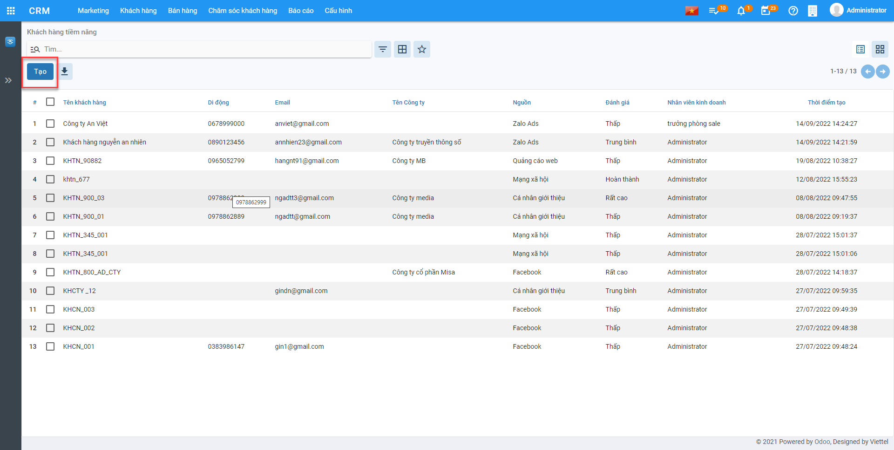

# CRM

CRM giúp doanh nghiệp tương tác với khách hàng và xây dựng mối quan hệ lâu dài. Cho phép doanh nghiệp thu thập, phân tích, chỉnh sửa và lưu trữ thông tin về khách hàng tiềm năng và khách hàng hiện tại.

Đồng thời, giúp doanh nghiệp tạo ra các chiến dịch tiếp thị phù hợp, nâng cao hiệu quả hoạt động và thúc đẩy doanh số.

## **Cấu Hình**

Thực hiện hướng dẫn cách thức thực hiện về các Danh mục cần khai báo trên CRM. Việc khai báo các Danh mục có thể được thực hiện tại bất kỳ thời điểm nào tùy thuộc người sử dụng: có thể trước thời điểm nhập chứng từ hay thực hiện được ngay tại thời điểm nhập chứng từ.

### ***Loại Khách Hàng***

**Mục đích**

Danh mục **Loại khách hàng** dùng để phân loại khách hàng theo từng nhóm chính.Các khách hàng được phân vào một nhóm nếu có chung tính chất hay đặc điểm nào đó.

Chức năng Danh mục **Loại khách hàng** được quản lý tập trung tại phần **Cấu hình**

**Các bước thực hiện**

**Bước 1:** Vào **Cấu hình**: chọn **Loại khách hàng** và nhấn nút **Tạo**

Nhập thông tin **Loại khách hàng** được hiển thị để người dùng khai báo

**Bước 3:** Nhấn nút **Lưu**

### ***Nguồn hình thành***

**Mục đích**

Danh mục **Nguồn hình thành** dùng để phân loại khách hàng được hình thành từ nguồn nào để thống kê, đánh giá và quản lý việc Maketing hiệu quả.

Chức năng Danh mục **Nguồn hình thành** được quản lý tập trung tại phần **Cấu hình**

**Các bước thực hiện**

**Bước 1:** Vào **Cấu hình**: chọn **Nguồn hình thành** và nhấn nút **Tạo**

Thông tin **Nguồn hình thành** được hiển thị để người dùng khai báo

- **Nguồn**: Nhập các Nguồn hình thành
- **Có hiệu lực**: Mặc định bằng True

**Bước 3:** Nhấn nút **Lưu**

### ***Loại tiềm năng***

**Mục đích**

Danh mục **Loại tiềm năng** dùng để phân loại, đánh giá các khách hàng tiềm năng để đạt hiệu quả trong Maketing.

Chức năng Danh mục **Loại tiềm năng** được quản lý tập trung tại phần **Cấu hình**

**Các bước thực hiện**

**Bước 1:** Vào **Cấu hình**: chọn **Loại tiềm năng** và nhấn nút **Tạo**

Thông tin **Loại tiềm năng** được hiển thị để người dùng khai báo

- **Loại tiềm năng**: Nhập thông tin Loại tiềm năng	
- **Có hiệu lực**: Mặc định bằng True

**Bước 3:** Nhấn nút **Lưu**

### ***Ngành nghề***

**Mục đích**

Danh mục **Ngành nghề** dùng nhóm và phân loại ngành nghề của khách hàng tiềm năng để đạt hiệu quả trong Maketing.

Chức năng Danh mục **Ngành nghề** được quản lý tập trung tại phần **Cấu hình**

**Các bước thực hiện**

**Bước 1:** Vào **Cấu hình**: chọn **Ngành nghề** và nhấn nút **Tạo**

Thông tin **Ngành nghề** được hiển thị để người dùng khai báo

Người dùng khai báo **Tên ngành nghề**

**Bước 3:** Nhấn nút **Lưu**

### ***Số nhân viên***

**Mục đích**

Danh mục **Số nhân viên** dùng nhóm và phân loại mô hình công ty của khách hàng doanh nghiệp để đạt hiệu quả trong Maketing.

Chức năng Danh mục **Số nhân viên** được quản lý tập trung tại phần **Cấu hình**

**Các bước thực hiện**

**Bước 1:** Vào **Cấu hình**: chọn **Số nhân viên** và nhấn nút **Tạo**

Thông tin **Số nhân viên** được hiển thị để người dùng khai báo

Người dùng khai báo **Số nhân viên**

**Bước 3:** Nhấn nút **Lưu**

### ***Đánh giá***

**Mục đích**

Danh mục **Đánh giá** dùng nhóm và phân loại tiềm năng khách hàng.

Chức năng Danh mục **Đánh giá** được quản lý tập trung tại phần **Cấu hình**

**Các bước thực hiện**

**Bước 1:** Vào **Cấu hình**: chọn **Đánh giá** và nhấn nút **Tạo**

Thông tin **Số nhân viên** được hiển thị để người dùng khai báo

Người dùng khai báo thông tin **Đánh giá**

**Bước 3:** Nhấn nút **Lưu**

### ***Cấu hình giai đoạn***

**Mục đích**

Danh mục **Cấu hình giai đoạn** giúp người dùng xây dựng quy trình quản lý bán hàng. 

Chức năng Danh mục **Cấu hình giai đoạn** được quản lý tập trung tại phần **Cấu hình**

**Các bước thực hiện**

**Bước 1:** Vào **Cấu hình**: chọn **Cấu hình giai đoạn** và nhấn nút **Tạo**

Thông tin **Cấu hình giai đoạn** được hiển thị để người dùng khai báo

Người dùng khai báo thông tin **Cấu hình giai đoạn** và **Trình tự**

**Bước 3:** Nhấn nút **Lưu**

### ***Lý do thất bại***

**Mục đích**

Danh mục **Lý do thất bại** giúp người dùng có thể gom nhóm và phân tích lý do thất bại để có thể phục vụ cho công tác Maketing và bán hàng hiệu quả.

Chức năng Danh mục **Lý do thất bại** được quản lý tập trung tại phần **Cấu hình**

**Các bước thực hiện**

**Bước 1:** Vào **Cấu hình**: chọn **Lý do thất bại** và nhấn nút **Tạo**

Thông tin **Cấu hình giai đoạn** được hiển thị để người dùng khai báo

Người dùng khai báo thông tin **Lý do thất bại**

**Bước 3:** Nhấn nút **Lưu**

### ***Đội bán hàng***

**Mục đích**

Danh mục **Đội bán hàng** quản lý, xây dựng đội ngũ bán hàng để đạt hiệu quả trong Makting và Bán hàng

Chức năng Danh mục **Đội bán hàng** được quản lý tập trung tại phần **Cấu hình**

**Các bước thực hiện**

**Bước 1:** Vào **Cấu hình**: chọn **Đội bán hàng** và nhấn nút **Tạo**

Thông tin **Đội bán hàng** được hiển thị để người dùng khai báo

- **Tên nhóm bán hàng**: Nhập tên nhóm
- **Trưởng nhóm**: Nhập Trưởng nhóm bán hàng
- **Mục tiêu hóa đơn**: Doanh số mục tiêu của nhóm bán hàng
- **Các thành viên trong đội**: Nhấn Thêm để thực hiện bổ sung các thành viên trong Đội ngũ bán hàng

**Bước 3:** Nhấn nút **Lưu**	

## Khách hàng

### **Khách hàng tiềm năng**

**Mục đích**

Khách hàng tiềm năng là nơi lưu trữ những thông tin chi tiết về một cá nhân hoặc đại diện của một tổ chức được thu thập từ nhiều nguồn khác nhau như quảng cáo, chiến dịch tiếp thị, nhân viên kinh doanh tự tìm kiếm,.. để tiến hành chăm sóc, đẩy nhanh quy trình bán hàng.

Chức năng **Khách hàng tiềm năng** được quản lý tập trung tại phần **Khách hàng** của Phân hệ **CRM**

**Xem video hướng dẫn**

<iframe
    width="920"
    height="450"
    frameborder="0"
    allow="autoplay; encrypted-media; clipboard-write; gyroscope; picture-in-picture "
    allowfullscreen
    title="Khách hàng" 
    src="https://www.youtube.com/embed/cSwz5yt6eGc"
></iframe>

**Hướng dẫn trên phần mềm**

#### Thêm mới Khách hàng

**Bước 1**: Vào **Khách hàng** >> **Khách hàng tiềm năng** >> Nhấn **Tạo** để thêm mới khách hàng tiềm năng

**Bước 2**: Thực hiện khai báo Thông tin chung Khách hàng tiềm năng

- Nếu khách hàng là một cá nhân thực hiện chọn **Cá nhân** nếu khách hàng là một công ty, thực hiện chọn **Công ty**

- Nhập tên khách hàng hoặc tên công ty

- Chọn công ty nếu khách hàng  thuộc một công ty bên ngoài

- Chọn kiểu đối tượng bổ sung nếu khách hàng đó vừa là khách hàng hoặc vừa là nhà cung cấp

- Nhập địa chỉ, mã số thuế. Nếu chọn **Công ty** thì địa chỉ và mã số thuế  mặc định bằng  địa chỉ, mã số thuế của công ty đã chọn

- Nhập thông tin chức vụ, số điện thoại, số di động , email, website, xưng hô

- Thay đổi ảnh đại diện của khách hàng bằng cách nhấn nút  và lựa chọn ảnh đại diện mong muốn

- Có thể bổ sung thêm địa chỉ liên lạc của khách hàng bằng cách vào nhóm **Các liên lạc & địa chỉ**, thêm mới địa chỉ

**Bước 3:** Nhập đủ thông tin cần thiết:

- Nếu khách hàng là một cá nhân thực hiện chọn **Cá nhân** nếu khách hàng là một công ty, thực hiện chọn **Công ty**

- Nhập tên khách hàng hoặc tên công ty

- Chọn công ty nếu khách hàng  thuộc một công ty bên ngoài

- Chọn kiểu đối tượng bổ sung nếu khách hàng đó vừa là khách hàng hoặc vừa là nhà cung cấp

- Nhập địa chỉ, mã số thuế. Nếu chọn **Công ty** thì địa chỉ và mã số thuế  mặc định bằng  địa chỉ, mã số thuế của công ty đã chọn

- Nhập thông tin chức vụ, số điện thoại, số di động , email, website, xưng hô

- Thay đổi ảnh đại diện của khách hàng bằng cách nhấn nút  và lựa chọn ảnh đại diện mong muốn

- Có thể bổ sung thêm địa chỉ liên lạc của khách hàng bằng cách vào nhóm **Các liên lạc & địa chỉ**, thêm mới địa chỉ

  
  
  Một cửa sổ mới hiện ra, nhập đủ thông tin địa chỉ và chọn **Lưu**

**Tab sản phẩm**: Nội dung khai báo tại **Sản phẩm**:  Tại **Sản phẩm** nhấn **Thêm một dòng**

Thực hiện nhập các thông tin:

- Sản phẩm: Chọn Sản phẩm dự định sẽ giới thiệu và bán cho khách hàng
- Tài khoản: Mặc định bằng tài khoản chi phí được cấu hình theo sản phẩm
- Số lượng: Nhập số lượng dự kiến bán cho khách hàng theo sản phẩm
- Chiết khấu: Nhập % chiết khấu cho khách hàng theo sản phẩm

**Danh sách Maketing**: Tại tab **Danh sách maketing** nhấn **Thêm một dòng**

- Hệ thống hiển thị Popup có chứa Danh sách Maketing >> Tích chọn Maketing áp dụng cho khách hàng >> Nhấn **Chọn** để lưu Danh sách Maketing 

Bước 4: Nhấn **Lưu** để Lưu lại thông tin nhân viên đã nhập

#### Tìm trùng khách hàng

Bước 1: Vào **Hành động** >> Nhấn **Tìm trùng**

Bước 2: Chọn **Điều kiện tìm trùng** >> Nhấn **Tìm kiếm**

Bước 3: Nếu có bản ghi trùng nhau và muốn Gộp thành 1 thì tích chọn chứng từ và nhấn **Gộp**

Bước 4: Tích chọn giá trị các trường thông tin muốn giữ >> Nhấn **Gộp**

#### Chia sẻ khách hàng

Bước 1: Vào **Hành động** >> Nhấn **Chia sẻ**

Bước 2: Thực hiện khai báo **Đội ngũ bán hàng**, **Nhân viên**, **Quyền sửa**, **Quyền Xóa** >> Nhấn **Lưu** 

Sau khi **Lưu** hệ thống sẽ hiển thị phân quyền tại tab **Thông tin quản lý**

#### Bàn giao khách hàng

Bước 1: Vào **Hành động**, Nhấn **Bàn giao**

Bước 2: Chọn **Đội ngũ bán hàng**, **Nhân viên** nhận bàn giao >> Nhấn **Bàn giao**

#### Chuyển đổi khách hàng tiềm năng

Bước 1: Vào **Hành động**, Nhấn **Chuyển đổi khách hàng tiềm năng**

Bước 2: Chọn chuyển đổi sang **Khách hàng** hoặc **Cơ hội** >> Nhấn **Chuyển đổi**

### Khách hàng

**Mục đích**

Quản lý Khách hàng là các tổ chức cá nhân, doanh nghiệp để thực hiện chăm sóc và maketing bán hàng.

**Xem video hướng dẫn**

**Hướng dẫn trên phần mềm**

<iframe
    width="920"
    height="450"
    frameborder="0"
    allow="autoplay; encrypted-media; clipboard-write; gyroscope; picture-in-picture "
    allowfullscreen
    title="Khách hàng" 
    src="https://www.youtube.com/embed/TXbTLHqwAC4"
></iframe>

#### Thêm mới Khách hàng

Bước 1: Vào **Khách hàng** >> Nhấn **Khách hàng** >> Nhấn **Tạo** để tạo mới khách hàng

Bước 2: Khai báo thông tin khách hàng

- Nếu khách hàng là một cá nhân thực hiện chọn **Cá nhân** nếu khách hàng là một công ty, thực hiện chọn **Công ty**

- Nhập tên khách hàng hoặc tên công ty

- Chọn công ty nếu khách hàng  thuộc một công ty bên ngoài

- Chọn kiểu đối tượng bổ sung nếu khách hàng đó vừa là khách hàng hoặc vừa là nhà cung cấp

- Nhập địa chỉ, mã số thuế. Nếu chọn **Công ty** thì địa chỉ và mã số thuế  mặc định bằng  địa chỉ, mã số thuế của công ty đã chọn

- Nhập thông tin chức vụ, số điện thoại, số di động , email, website, xưng hô

- Thay đổi ảnh đại diện của khách hàng bằng cách nhấn nút  và lựa chọn ảnh đại diện mong muốn

- Có thể bổ sung thêm địa chỉ liên lạc của khách hàng bằng cách vào nhóm **Các liên lạc & địa chỉ**, thêm mới địa chỉ

Thực hiện khai báo Địa chỉ và Liên hệ >> Nhấn Lưu & Đóng sau khi khai báo

Bước 3: Nhấn **Lưu** để lưu thông tin đã khai báo

#### Tìm trùng khách hàng

Bước 1: Vào **Hành động** >> Nhấn **Tìm trùng**

Bước 2: Nhập **Điều kiện tìm trùng** >> Nhấn **Tìm kiếm**

Hệ thống sẽ thông báo nếu không có bản ghi nào trùng theo điều kiện tìm trùng đã nhập

#### Chia sẻ khách hàng

Bước 1: Vào **Hành động** >> Nhấn **Chia sẻ**

Bước 2: Nhập **Đội ngũ bán hàng**, **Nhân viên** nhận bàn giao và phân **quyền sửa** hoặc **quyền xem** tương ứng

Bước 3: Nhấn **Lưu**

#### Bàn giao khách hàng

Bước 1: Vào **Hành động** >> Nhấn **Bàn giao**

Bước 2: Chọn **Đội ngũ bán hàng** và **Nhân viên** nhận bàn giao

Bước 3: Nhấn **Bàn giao**

### Liên hệ

**Mục đích**: Quản lý thông tin liên hệ của khách hàng, khách hàng tiềm năng để phục vụ cho việc chăm sóc khách hàng, maketing, bán hàng

**Xem video hướng dẫn**

<iframe
    width="920"
    height="450"
    frameborder="0"
    allow="autoplay; encrypted-media; clipboard-write; gyroscope; picture-in-picture "
    allowfullscreen
    title="Khách hàng" 
    src="https://www.youtube.com/embed/R5vytHs2jAg"
></iframe>

Bước 1: Vào **Khách hàng**, Nhấn **Liên hệ,** Nhấn **Tạo** để thêm mới thông tin liên hệ

Bước 2: Nhập các thông tin liên hệ

- Họ và Tên: Nhập Họ tên người liên hệ
- Công ty: Chọn công ty của người liên hệ
- Giới tính: Chọn giới Tính của người Liên hệ
- Chức vụ: Nhập chức vụ của người liên hệ
- Địa chỉ / Email: Nhập địa chỉ và Email của người liên hệ
- Nếu người liên hệ dùng chung cho tất cả đội ngũ bán hàng và nhân viên kinh doanh thì tại Tab **Quản lý** chọn **Dùng chung** = True

Bước 3: Nhấn **Lưu** để lưu thông tin liên hệ

## Maketing

### Chiến dịch

**Mục đích**: Quản lý các kế hoạch tổng thể để tiếp cận khách hàng giới thiệu về sản phẩm và quảng cáo thương hiệu của doanh nghiệp theo từng chiến dịch

**Xem video hướng dẫn**: 

<iframe
    width="920"
    height="450"
    frameborder="0"
    allow="autoplay; encrypted-media; clipboard-write; gyroscope; picture-in-picture "
    allowfullscreen
    title="Khách hàng" 
    src="https://www.youtube.com/embed/iwV8tIPXCpk"
></iframe>

**Hướng dẫn trên phần mềm**

Bước 1: Nhấn **Maketing**, Nhấn **Chiến Dịch**, Nhấn **Tạo** để tạo mới chiến dịch

Bước 2: Nhập thông tin chiến dịch

- Tên chiến dịch : Nhập Tên của chiến dịch
- Loại: Chọn Mạng xã hội hoặc Mặc định
- Ngày bắt đầu....đến: Chọn thời gian thực hiện chiến dịch
- Nội dung: Nhập nội dung hoặc mô tả cho chiến dịch

Bước 3: Khai báo Tab Thông tin chiến dịch

Tại Tab Thông tin chiến dịch nhấn **Thêm một dòng**

Chọn người phụ trách chiến dịch >> Nhấn **Chọn** để lưu người phụ trách chiến dịch vào Tab Thông tin chiến dịch

Bước 4: Tại Danh sách Maketing, Nhấn Thêm một dòng

Thực hiện tích chọn Danh sách Maketing, Nhấn **Chọn** để lưu danh sách

Bước 5: Tại **Phương pháp tiếp cận**  nhấn **Thêm một dòng** >> Thực hiện nhập **Phương pháp** để tiếp cận khách hàng

Bước 6: Nhấn **Lưu** để lưu thông tin chiến dịch đã khai báo

Bước 7: Nhấn **Bắt đầu** để chuyển trạng thái chiến dịch sang **Đang thực hiện**

Bước 8: Nhấn **Kết thúc** để hoàn thành chiến dịch

### Danh sách Maketing

**Mục đích**: Quản lý các thông tin như: Khách hàng, Liên hệ, Khách hàng tiềm năng, Chiến dịch theo từng danh sách maketing

**Xem video hướng dẫn**

<iframe
    width="920"
    height="450"
    frameborder="0"
    allow="autoplay; encrypted-media; clipboard-write; gyroscope; picture-in-picture "
    allowfullscreen
    title="Khách hàng" 
    src="https://www.youtube.com/embed/lHt22aUq36k"
></iframe>

**Hướng dẫn trên phần mềm**

Bước 1: Vào **Maketing**, Nhấn **Danh sách Maketing**, Nhấn **Tạo**

Bước 2: Khai báo Danh sách Maketing

- **Tên danh sách Maketing**: Nhập tên danh sách
- **Người phụ trách**: Người phụ trách danh sách Maketing
- **Loại**: Mặc định hoặc Mạng xã hội

Bước 3: Tại Tab **Khách hàng**, Nhấn **Thêm một dòng**

Tích chọn khách hàng muốn thêm vào danh sách, nhấn **Chọn** để lưu các khách hàng đã chọn

Bước 4: Tại Tab **Khách hàng tiềm năng**, nhấn **Thêm một dòng**

Tích chọn khách hàng muốn thêm vào danh sách, nhấn **Chọn** để lưu các khách hàng tiềm năng đã chọn

Bước 5: Tại tab **Liên hệ** nhấn **Thêm một dòng**

Tích chọn Liên hệ vào danh sách để Maketing, nhấn **Chọn** để lưu danh sách

Bước 6: Tại tab **Chiến dịch** nhấn Thêm một dòng để thêm chiến dịch vào Danh sách Maketing

Tích chiến dịch và nhấn **Chọn** để lưu chiến dịch đã tích chọn vào danh sách

Bước 7: Nhấn **Lưu** để lưu Danh sách Maketing

Bước 8: Nhấn **Xác nhận** để thực hiện Maketing theo danh sách

## Bán hàng

### Cơ hội

**Xem video hướng dẫn**

<iframe
    width="920"
    height="450"
    frameborder="0"
    allow="autoplay; encrypted-media; clipboard-write; gyroscope; picture-in-picture "
    allowfullscreen
    title="Khách hàng" 
    src="https://www.youtube.com/embed/ne2hQiWqr4Q"
></iframe>

**Hướng dẫn trên phần mềm**

Bước 1: Vào **Bán hàng**, vào **Cơ hội,** nhấn **Tạo** để tạo mới cơ hội

Bước 2: Khai báo thông tin cơ hội

- **Doanh thu mong  đợi**: Doanh thu mục tiêu của cơ hội
- **Xác xuất thành công**: Xác xuất bán hàng thành công của cơ hội
- **Khách hàng**: Khách hàng của cơ hội bán hàng
- **Đội ngũ bán hàng, nhân viên**: Chọn đội ngũ bán hàng và nhân viên quản lý cơ hội
- **Nguồn**: Nguồn hình thành cơ hội bán hàng cho khách hàng
- **Đánh giá**: Đánh giá tiềm năng của cơ hội
- **Chiến dịch**: Chiến dịch hình thành cơ hội
- Tab **sản phấm**: Hiển thị mặc định sản phẩm đã được tạo trong Tab sản phẩm của Khách hàng đã chọn, nếu muốn thêm sản phẩm cho cơ hội này thì nhấn **Thêm một dòng** để nhập thông tin
- Tab **Liên hệ & Địa chỉ**: Mặc định bằng liên hệ & địa chỉ của Khách hàng

Bước 2: Nhấn **Lưu** để lưu thông tin đã khai báo cơ hội

Bước 3: Nhấn **Tạo báo giá** để tạo báo giá sản phẩm cho khách hàng theo cơ hội

Bước 4: Nếu cơ hội thành công thì nhấn **Thành công**, nhấn **Thất bại** nếu cơ hội bán hàng này thất bại

### Báo giá

**Xem video hướng dẫn**

<iframe
    width="920"
    height="450"
    frameborder="0"
    allow="autoplay; encrypted-media; clipboard-write; gyroscope; picture-in-picture "
    allowfullscreen
    title="Khách hàng" 
    src="https://www.youtube.com/embed/wWBKGlMPObw"
></iframe>

**Hướng dẫn trên phần mềm**

Bước 1: Tại **Bán hàng** vào **Báo giá**, nhấn **Tạo** để tạo mới báo giá

Bước 2: Khai báo thông tin **Báo giá**

- Khách hàng: Chọn khách hàng để báo giá
- Ngày báo giá: Nhập ngày báo giá
- Hiêu lực đến: Hiệu lực của bảng báo giá
- Chi tiết đơn hàng: Mặc định theo thông tin sản phẩm của khách hàng

Bước 3: Nhấn **Lưu**

Bước 4: Nhấn **Xác nhận** để hoàn thành báo giá

### Đơn hàng

**Xem video hướng dẫn**

<iframe
    width="920"
    height="450"
    frameborder="0"
    allow="autoplay; encrypted-media; clipboard-write; gyroscope; picture-in-picture "
    allowfullscreen
    title="Khách hàng" 
    src="https://www.youtube.com/embed/-ZWgQTDNOSA"
></iframe>

**Hướng dẫn trên phần mềm**

Bước 1: Vào **Bán hàng**, vào **Đơn hàng**, nhấn **Tạo** để thêm mới đơn hàng

Bước 2: Khai báo Đơn hàng

- **Khách hàng**: Chọn khách hàng bán hàng
- **Ngày giáo giá**: Ngày báo giá Đơn hàng
- **Chi tiết đơn hàng**: Mặc định bằng sản phẩm của Khách hàng

Bước 3: Nhấn **Lưu**

Bướ 4: Nhấn **Xác nhận**

## Chăm sóc khách hàng

### Phản hồi

**Mục đích**: Quản lý các phản hồi, đánh giá theo từng khách hàng và sản phẩm liên quan. Giúp đội bán hàng, quản lý đưa ra phương án xử lý tốt nhất.

**Hướng dẫn trên phần mềm**

Bước 1: Nhấn **Chăm sóc khách hàng**, vào **Phản hồi**, nhấn **Tạo** để thực hiện thêm mới bản ghi

Bước 2: Khai báo thông tin phản hồi

- **Phản hồi**: Nhập nội dung phản hồi của khách hàng
- **Khách hàng**: Chọn khách hàng phản ồi
- **Loại**: Câu hỏi/Phát sinh/ Phản hồi/ Than phiền
- **Tab thông tin**: Chọn sản phẩm phản hồi
- **Tab giải pháp**: Nhập giải pháp xử lý phản hồi của khách hàng

Bước 3: Nhấn **Lưu** để lưu thông tin phản hồi

### FAQS

**Mục đích**:  Tạo các mẫu câu hỏi và câu trả lời thường gặp theo chủ đề của từng sản phẩm

**Hướng dẫn trên phần mềm**

Bước 1: Nhấn **Chăm sóc khách hàng**, vào **FAQS**, nhấn **Tạo** để thực hiện thêm mới bản ghi

Bước 2: Khai báo thông tin

- Câu hỏi: Nhập câu hỏi thường gặp
- Sản phẩm liên quan: Nhập sản phẩm liên quan đến câu hỏi
- Câu trả lời: Trả lời cho câu hỏi

Bước 3: Nhấn **Lưu** để lưu câu hỏi và câu trả lời
