# *Quy trình nghiệp vụ*

Quy trình bán hàng là một loạt các bước cần thực hiện để thúc đẩy hoạt động bán hàng tại các hộ kinh doanh nhỏ lẻ.Việc xây dựng quy trình bán hàng trên hệ thống sẽ giúp các hộ kinh doanh xác định được các cơ hội bán hàng và tỷ lệ thành công của các cơ hội đó từ đó xác định được các chiến lược kinh doanh phù hợp để đạt được doanh thu lớn nhất. Quy trình sẽ bao gồm các chức năng: Từ tạo đơn bán hàng đến hóa đơn bán hàng, ghi nhận thanh toán cho khách hàng

Khi phát sinh nghiệp vụ bán hàng hóa, dịch vụ, thông thường sẽ phát sinh các hoạt động sau:

- Người bán hàng có thể thực hiện tiếp thị, chào bán sản phẩm cho các khách hàng có nhu cầu

- Sau khi khách hàng gọi điện hoặc gửi mail yêu cầu giao hàng cho khách hàng thì hộ kinh doanh thực hiện lập đơn bán hàng cho khách
- Thực hiện xuất kho hàng hoá và ghi Sổ kho
- Hộ kinh doanh bàn giao hàng hóa cho khách hàng, lập và  gửi hóa đơn GTGT cho khách hàng
- Hộ kinh doanh sẽ ghi nhận thanh toán từ khách hàng. Nếu khách hàng thanh toán bằng tiền mặt  thì người bán hàng sẽ nhận tiền và mang về nhập quỹ, nếu thanh toán bằng tiền gửi thì khách hàng sẽ chuyển khoản vào tài khoản của công ty. 

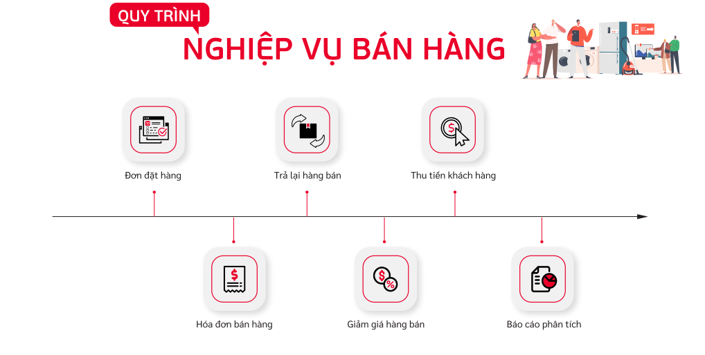

**Các luồng quy trình**

·     Lập đơn bán hàng gửi khách hàng. Chi tiết thao tác chức năng **[tại đây](#lap-on-ban-hang)**

·     Xuất kho đơn bán hàng. Chi tiết thao tác chức năng [**tại đây**](#xuat-kho-on-ban-hang)

·     Tạo hóa đơn bán hàng. Chi tiết thao tác chức năng **[tại đây](#hoa-on-ban-hang)**

·     Ghi nhận thanh toán từ khách hàng. Chi tiết thao tác chức năng **[tại đây](ghi-nhan-thanh-toan-tu-khach-hang)**

·     Xuất hóa đơn điện tử. Chi tiết thao tác chức năng **[tại đây](xuat-hoa-on-ien-tu)**

·     Tạo hóa đơn giảm giá/Trả hàng.  Chi tiết thao tác chức năng **[tại đây](hoa-on-giam-giatra-hang)**

## *Lập đơn bán hàng*

### Mô tả nghiệp vụ

**Nghiệp vụ**

Khi có nhu cầu mua sản phẩm, khách hàng sẽ liên hệ với hộ kinh doanh để đặt hàng. Người bán hàng thực hiện lập đơn hàng dựa trên nhu cầu của khách hàng

**Xem video hướng dẫn**

*[Xây dựng video hướng dẫn trên phần mềm, gồm đủ các luồng chức năng được mô tả bên dưới]*

### Hướng dẫn trên phần mềm

**Đối tượng thực hiện:** Người bán hàng

#### Thêm mới đơn hàng

**Bước 1:** Vào phân hệ **Bán hàng**, Chọn **Đơn bán hàng**, chọn **Báo giá** 

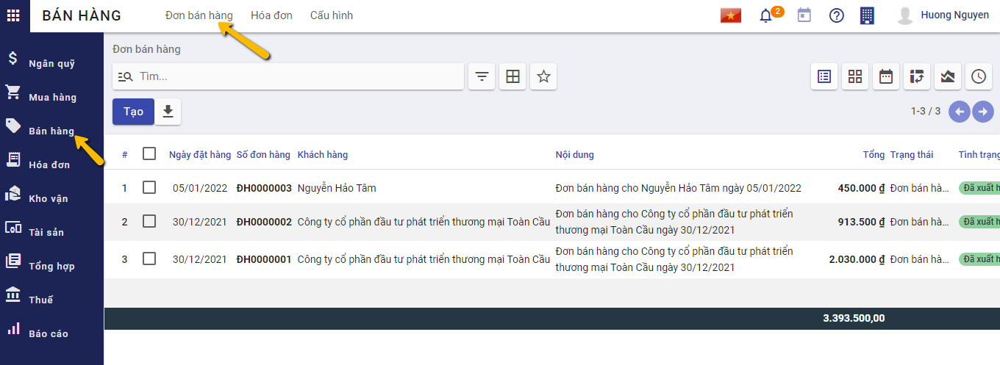

Hoặc thực hiện **Tìm kiếm** trực tiếp chức năng trên ô tìm kiếm chung của hệ thống

**Bước 2:** Nhấn nút **Tạo** trên chức năng để thực hiện thêm một đơn hàng mới. Khai báo các thông tin chi tiết trên đơn bán hàng. Lưu ý: Các ô màu hồng là những thông tin cần bắt buộc nhập

·     Chọn thông tin ***khách hàng***. Nếu chưa có khách hàng thì có thể nhập bổ sung thêm bằng cách nhập tên khách hàng và chọn tạo mới 

hoặc vào đường dẫn **Danh mục/Khách hàng** và thực hiện thêm mới

·     Chọn ***bảng giá***,  là tiền tệ giao dịch trong Đơn hàng

·     Khai báo thêm thông tin về ***Ngày đặt hàng, hiệu lực đến, điều khoản thanh toán*** (Xác định thời gian để thanh toán), ***nội dung*** chi tiết đơn hàng

Mục Điều khoản thanh toán: Nếu có thỏa thuận về điều kiện thanh toán với khách hàng, thực hiện chọn thông tin Điều khoản đã được khai báo trên Danh mục **Điều khoản thanh toán** . Trường hợp đã thiết lập điều khoản thanh toán cho từng khách hàng tại danh mục **Khách hàng** thì chương trình sẽ tự động hiển thị sẵn thông tin này theo nhà cung cấp được chọn

·     Khai báo thêm thông tin về Sản phẩm/dịch vụ tại chi tiết đơn hàng bằng cách nhấn chọn thêm sản phẩm   

​			Chọn các sản phẩm bán hàng cho khách hàng

​			Nhập thông tin Số lượng, Đơn giá,  mức Thuế đối với từng Sản phẩm

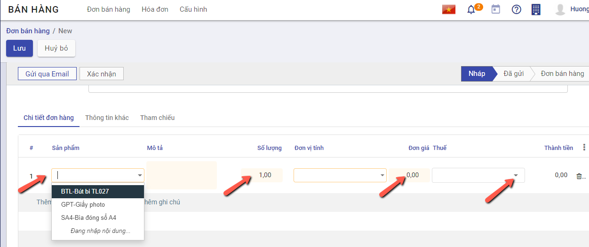

​			Khi thực hiện Thêm ghi chú --> Thông tin nội dung sẽ được in trên file gửi khách hàng

**Bước 3**: Nhấn **Lưu**

#### **Thực hiện gửi đơn hàng cho khách hàng**

**Bước 1**: Sau khi đã có đơn hàng để gửi khách hàng, Thực hiện **In** đơn hàng bằng cách chọn chức năng In

**Bước 2:** Thực hiện **Gửi qua Email** đến khách hàng sau khi hoàn thành  báo giá, có thể tùy chỉnh thông tin mẫu gửi báo giá theo yêu cầu

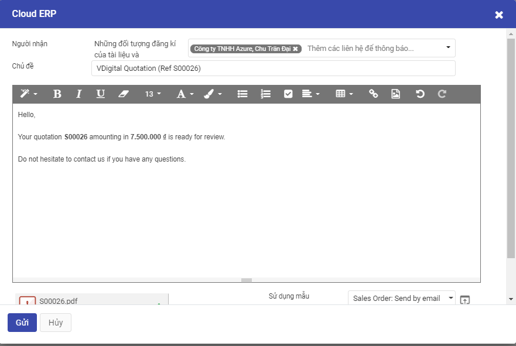

#### Xác nhận đơn bán hàng

Tại đơn hàng đã tạo, nếu khách hàng thực sự có nhu cầu mua hàng, người bán hàng nhấn nút **Xác nhận** để hoàn thành đơn hàng

Nếu không còn nhu cầu bán hàng, người bán nhấn **Hủy** hoặc thực hiện xóa đơn hàng đã tạo

Sau khi có đơn hàng, sản phẩm sẽ được giao cho khách hàng

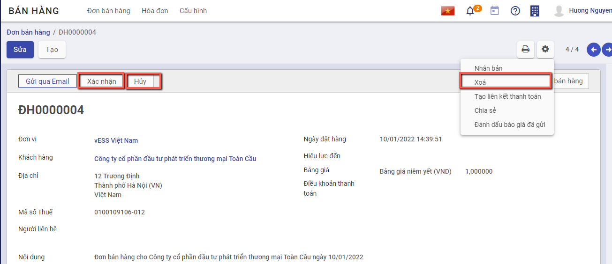

## *Xuất kho đơn bán hàng*

### Mô tả nghiệp vụ

Sau khi thực hiện Xác nhận đơn hàng, chương trình tự động sinh ra một yêu cầu giao hàng. Người dùng có thể theo dõi tình trạng giao hàng của sản phẩm trên phiếu xuất kho đã sinh ra và xác nhận số lượng sản phẩm bàn giao theo đơn hàng 

### **Hướng dẫn trên phần mềm**

**Bước 1**: Chọn **Phiếu xuất kho**, hệ thống chuyển sang chức năng phiếu xuất kho. 

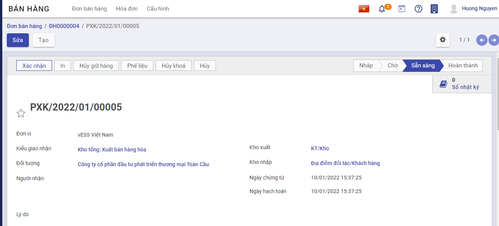

**Bước 2**: Thực hiện nhập số lượng hàng đã hoàn thành giao cho khách hàng 

- Nếu Số lượng xuất kho đủ theo Số lượng của Đơn bánhàng: Thực hiện nhấn **Xác nhận** để xác nhận toàn bộ Đơn hàng

  

- Nếu Số lượng xuất kho Chưa đủ theo Số lượng của Đơn bán hàng: Thực hiện nhập số lượng theo thực tế bằng cách nhấn **Sửa**, vào nhóm **Vật tư, hàng hóa chi tiết**, nhập số lương **hoàn thành**, sau đó nhấn **Lưu**

  

Nhấn **Xác nhận** để hoàn thành xuất hàng giao cho khách hàng

Khi đó có 2 hướng thực hiện :

- Nếu chọn **Tạo phần dở dang**: Với Số lượng còn thiếu, hệ thống tạo sẵn 1 chứng từ Phiếu xuất kho, để Khi nhập kho với Số lượng còn lại, bộ phận Kho tiếp tục vào Phiếu xuất kho (đã tạo phần dở dang) để thực hiện Xác nhận Số lượng xuất kho còn lại.
- Nếu chọn **Không tạo phần dở dang**: Khi đó hệ thống Tách Số lượng nhu cầu ban đầu Bằng đúng Số lượng thực xuất, còn Số lượng chênh chưa nhận được thì Số lượng hoàn thành = 0

Như vậy **Phiếu xuất kho** đã **Hoàn thành** .

## *Hóa đơn bán hàng*

### Mô tả nghiệp vụ

Sau khi giao hàng thành công, người dùng thực hiện kiểm tra dữ liệu và lập hóa đơn bán hàng và gửi hóa đơn cho khách hàng

### Hướng dẫn trên phần mềm

Người dùng có thể lập hóa đơn bán hàng theo hai cách khác nhau

Cách 1:Lập hóa đơn bán hàng từ đơn bán hàng. Chi tiết nghiệp vụ **[tại đây](#Lap-hoa-don-ban-hang-tu-don-ban-hang)**

Cách 2: Lập hóa đơn bán hàng không từ đơn bán hàng. Chi tiết nghiệp vụ **[tại đây](#Lap-hoa-don-ban-hang-khong-tu-don-ban-hang)**

#### Lập hóa đơn bán hàng từ đơn bán hàng

Đối tượng thực hiện: Người bán hàng

**Bước 1**: Vào phân hệ **Bán hàng**, Chọn **Đơn bán hàng** đã hoàn thành Giaohàng cho khách hàng và Nhấn **Tạo hóa đơn**

**Bước 2**: Trên màn hình **Tạo Hóa đơn**, kế toán thực hiện chọn loại hóa đơn thanh toán dựa trên số tiền khách hành thanh toán

- Hóa đơn thông thường: Hệ thống tạo 1 hóa đơn với số lượng, số tiền tương ứng với đơn bán hàng
- Tiền đặt cọc (Theo phần trăm): Hệ thống tạo 1 hóa đơn với số tiền thanh toán theo tỷ lệ phần trăm với số tiền bên đơn bán hàng
- Tiền đặt cọc (Số tiền cố định): Hệ thống tạo 1 hóa đơn với số tiền thanh toán bằng số tiền đã nhập sẵn trên giao diện

Chọn **Tạo & xem hóa đơn** hoặc **Tạo hóa đơn** để thực hiện sinh hóa đơn theo yêu cầu

**Bước 3**: Trên thông tin **Hóa đơn bán hàng** vừa được tạo , Nhân viên thực hiện nhập các dữ liệu về:

- Hóa đơn: **Ngày hóa đơn, Mẫu số hóa đơn,  Số hóa đơn**

  

- Chọn và nhập thông tin về Thuế và Chiết khấu tương ứng của Đơn hàng (Nếu có)

  

**Bước 4**:  Nếu hóa đơn có nhu cầu liên kết với chứng từ khác để theo dõi, vào mục Tham chiếu, thêm chứng từ tham chiếu và thực hiện tìm kiếm chứng từ

**Bước 5**: Nhân viên thực hiện nhấn **Xác nhận**

**Lưu ý:** Để nhìn lại tình trạng hóa đơn của đơn bán hàng, người dùng có thể vào chức năng đơn bán hàng, nhấn chọn **Hóa đơn** tại góc phải màn hình 

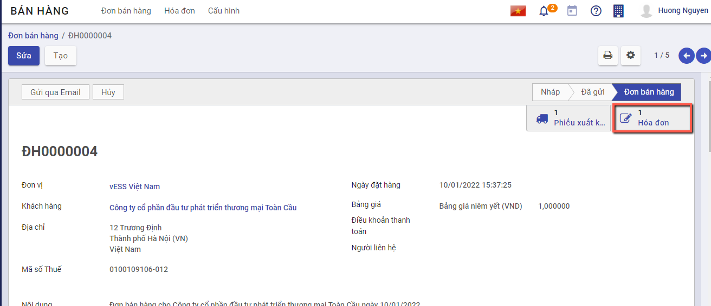

#### Lập hóa đơn bán hàng không từ đơn bán hàng

Đối tượng thực hiện: Người bán hàng

**Bước 1**: Vào phân hệ **Bán hàng**, Chọn **Hóa đơn** , chọn **Hóa đơn bán hàng** 

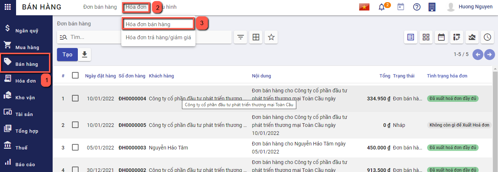

Hoặc thực hiện **Tìm kiếm** trực tiếp chức năng trên ô tìm kiếm chung của hệ thống

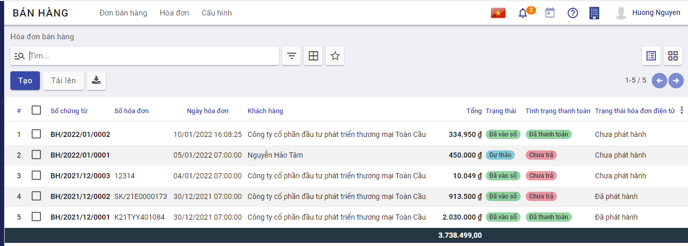

**Bước 2**: Nhấn nút **tạo**  để thêm hóa đơn. 

Trên thông tin Hóa đơn bán hàng, Nhân viên kế toán thực hiện nhập các dữ liệu về:

- Chọn thông tin ***khách hàng***. Nếu chưa có khách hàng thì có thể nhập bổ sung thêm bằng cách nhập tên khách hàng và chọn tạo mới 

hoặc vào đường dẫn **Danh mục/Khách hàng** và thực hiện thêm mới

- Nhập bổ sung thông tin gồm: Ngày hóa đơn, Mẫu số, Ký hiệu hóa đơn ,Số hóa đơn, hạn thanh toán

  

- Chọn và nhập thông tin về sản phẩm, số lượng, giá thành bán,Thuế và Chiết khấu của sản phẩm cần lập hóa đơn

  

**Bước 3**: Nhân viên Kế toán thực hiện nhấn **Lưu** . Hệ thống lưu thông tin chi tiết hóa đơn đã nhập và tự động sinh ra các chi tiết bút toán phát sinh

Thông tin dữ liệu bút toán phát sinh:

- Căn cứ thông tin Thuế  đã lựa chọn cùng với thông tin Chiết khấu, Đơn giá, Số lượng đã nhập bên chi tiết hóa đơn, hệ thống thực hiện mặc định thông tin các bút toán tương ứng

**Bước 4**: Nhân viên Kế toán thực hiện nhấn **Xác nhận** để hoàn thành xuất hóa đơn bán hàng

Sau khi xác nhận hóa đơn, hệ thống sẽ sinh dữ liệu vào chức năng "Thu tiền từ khách hàng", người dùng kiểm tra thông tin sẽ thanh toán bằng cách vào **Ngân quỹ/Tiền mặt/Thu tiền từ khách hàng** hoặc **Ngân quỹ/Tiền gửi/Thu tiền từ khách hàng** để kiểm tra lại số tiền sẽ được thanh toán

## *Ghi nhận thanh toán từ khách hàng*

### Mô tả nghiệp vụ

Người dùng thực hiện ghi nhận và theo dõi việc thanh toán của hóa đơn sau khi xác nhận xuất hóa đơn thành công

### Hướng dẫn trên phần mềm

Đối tượng thực hiện: Người bán hàng

**Bước 1**: Vào phân hệ **Bán hàng**, chọn **Hóa đơn**, chọn **Hóa đơn bán hàng**. Trên danh sách hóa đơn bán hàng, kế toán tìm tới các hóa đơn đã được ghi sổ

**Bước 2**: Chọn hóa đơn cần thanh toán, Nhấn nút **Ghi nhận thanh toán**. 

Người dùng nhập và sửa thông tin Tài khoản ngân hàng người nhận, khách hàng, ngày thanh toán tiền, số tiền khách hàng đã trả

**Bước 3**: Nhấn **Tạo thanh toán**, hệ thống sinh phiếu thu tiền  để thu tiền khách hàng đã thực hiện trả

**Bước 4**: Để kiểm tra lại phiếu thu tiền, người dùng có thể tìm phiếu thu bằng cách:

Nếu Tại thông tin **Ghi nhận thanh toán**, **Sổ nhật ký** được chọn là **tiền mặt** thì người dùng vào chức năng **Ngân quỹ/Tiền mặt/Phiếu thu**. 

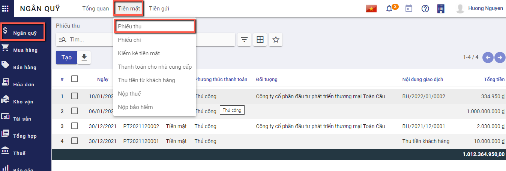

Nếu Tại thông tin **Ghi nhận thanh toán**, **Sổ nhật ký** được chọn là **tiền gửi** thì người dùng vào chức năng **Ngân quỹ/Tiền gửi/Báo có**. 

Người dùng có thể tìm thấy phiếu thu tiền dựa trên ngày thanh toán, đối tác thanh toán, tổng tiền, nội dung giao dịch

## *Hóa đơn giảm giá/trả hàng*

### Mô tả nghiệp vụ

Khi phát sinh nghiệp vụ giảm giá hàng bán hoặc trả lại hàng đã bán, thông thường sẽ có các hoạt động sau:

Nếu phát hiện hàng mua về không đúng quy cách, phẩm chất theo hợp đồng đã ký, khách hàng thoả thuận với doanh nghiệp trả lại hàng đã mua.

Cách 1: Người bán hàng lập hóa đơn giảm giá hàng bán để giao cho khách hàng và ghi sổ kế toán.Chi tiết nghiệp vụ **[tại đây](#tao-hoa-on-giam-gia)**

Cách 2: Người bán hàng chuyển đổi hóa đơn bán hàng thành khoản hoàn tiền/công nợ giảm. Chi tiết nghiệp vụ **[tại đây](#chuyen-oi-thanh-khoan-hoan-tiencong-no-giam)**

### Hướng dẫn trên phần mềm

Đối tượng thực hiện: Nhân viên kế toán

#### Tạo hóa đơn giảm giá

**Bước 1**: Vào phân hệ **Bán hàng**, chọn **Hóa đơn**, chọn **Hóa đơn bán hàng**. Trên danh sách hóa đơn bán hàng, kế toán tìm tới các hóa đơn đã được ghi sổ, nhấn chọn **Tạo HĐ giảm giá**

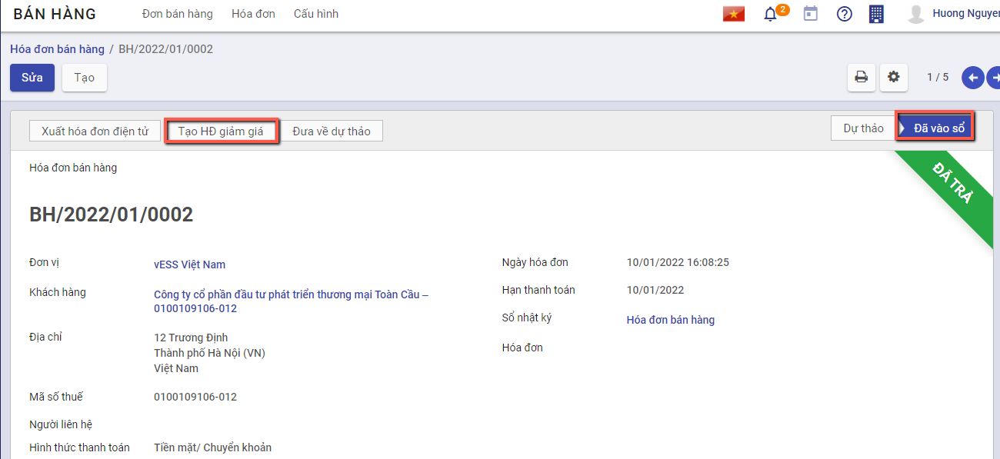

**Bước 2**: Nhập Lý do tạo hóa đơn, Nhấn **Đảo ngược**

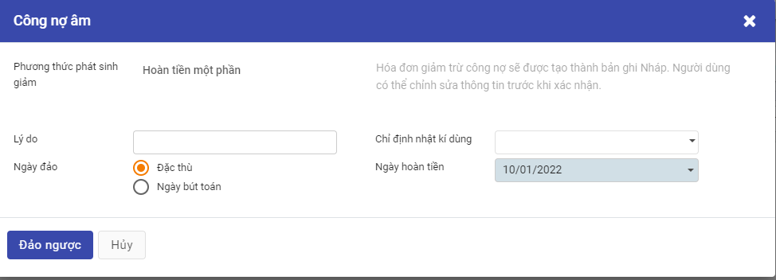

Hệ thống tự sinh hóa đơn giảm giá với thông tin tương ứng với hóa đơn bán hàng. 

Trên hóa đơn giảm giá được sinh ra, kế toán khai báo  các thông tin trên chứng từ giảm giá hàng bán như: số lượng hàng được giảm, giá trị giảm

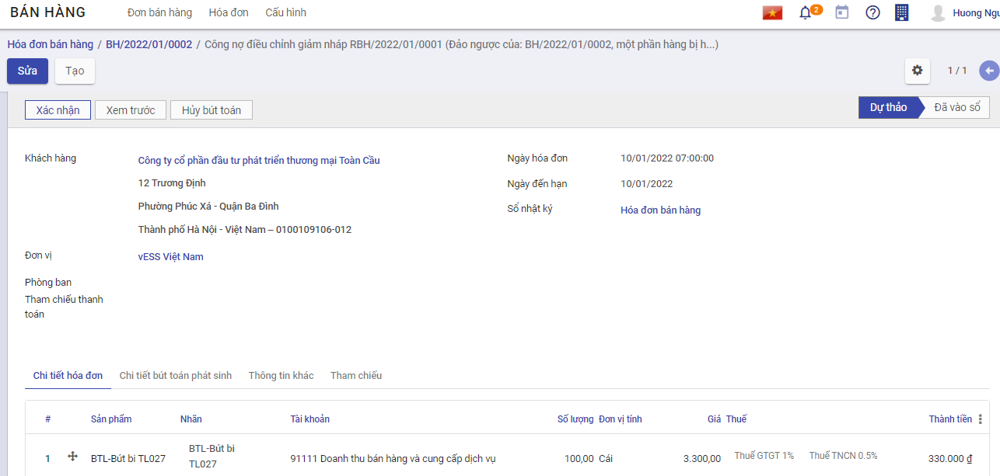

Nhấn **xác nhận** để ghi sổ thông tin hóa đơn. 

Sau đó, người dùng sẽ **xuất hóa đơn** để gửi lại cho khách hàng và **ghi nhận lại thanh toán**

#### Chuyển đổi thành khoản hoàn tiền/công nợ giảm

Bước 1: Vào phân hệ **Bán hàng**, chọn **Hóa đơn**, chọn **Hóa đơn bán hàng**. Trên danh sách hóa đơn bán hàng, kế toán tìm tới hóa đơn có nhu cầu hoàn hàng, nhấn chọn tiện ích/chuyển đổi thành khoản hoàn tiền/công nợ giảm

Hệ thống chuyển đổi từ hóa đơn bán hàng thành hóa đơn giảm giá/trả hàng, các thông tin được giữ nguyên

