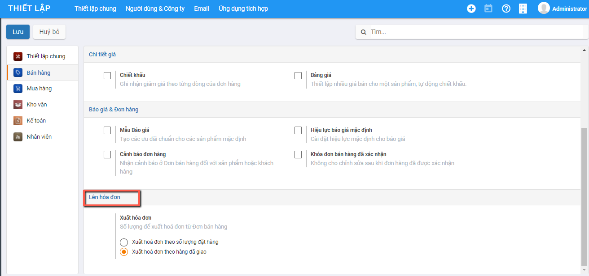

# **Giới thiệu về phân hệ Kế toán**

Là nơi tập hợp tất cả dữ liệu tài chính từ mọi bộ phận. Phần mềm Kế toán sẽ xử lý tổng thể việc quản trị kế toán (sổ cái, các khoản phải thu, phải trả), mua hàng, bán hàng, kho vận và thanh toán.Cung cấp bức tranh toàn cảnh về tài chính doanh nghiệp. Hỗ trợ lập tài chính một cách hiệu quả

Phần mềm kế toán đáp ứng được Chế độ kế toán cho hộ, cá nhân kinh doanh theo Thông tư 88/2021/TT-BTC

Phần mềm Kế toán giúp hộ kinh doanh: 

- Làm việc hiệu quả với các nghiệp vụ phát sinh đều được định nghĩa sẵn với từng thông tin tài khoản và quy tắc hạch toán thống nhất; Dữ liệu của kế toán được cập nhật và xử lý tự động, tích hợp nhiều phân hệ khác nhau trên cùng một hệ thống như: Mua hàng, Bán hàng, Kho..
- Dữ liệu chính xác với việc kiểm soát chi tiết từng đơn hàng, kho hàng, hóa đơn nhà cung cấp. Quản lý luồng tiền vào ra trên hệ thống. Đồng thời, dự báo cụ thể về lịch trình thanh toán, các luồng chi phí phát sinh trong ngắn hạn, dài hạn. 
- Tập hợp các dữ liệu đầy đủ và linh hoạt dựa trên các báo cáo tài chính. Truy suất dữ liệu đa chiều, nhanh chóng và chính xác. Đồng thời truy vết được các bút toán cấu thành một cách tức thì.

## **Thiết lập ban đầu**

Việc thiết lập ban đầu được thực hiện ngay tại thời điểm cài đặt xong Phân hệ kế toán: Đây là điều kiện cần có và bắt buộc để bắt đầu thực hiện các nghiệp vụ trên phân hệ Kế toán

Sau khi khai báo thiết lập ban đầu được Hoàn thành: hệ thống tài khoản và các chế độ kế toán cũng như biểu mẫu kế toán liên quan sẽ được áp dụng theo Thông tư và các thiết lập đã được lựa chọn 

### **Khai báo ban đầu**

Vào biểu tượng bắt đầu sử dụng tại góc phải để mở khai báo ban đầu 

Hệ thống mở ra thông tin thiết lập cơ bản ban đầu bao gồm Công ty, khai báo danh mục, thiết lập, khai báo số dư

Các thông tin khai báo gồm 5 mục:

### **Thông tin công ty**

Khai báo dữ liệu về Công ty với đầy đủ thông tin về Tên, Địa chỉ, MST, email liên hệ, Trang web. 

### **Khai báo danh mục**

Hiển thị các danh mục cơ bản để người dùng có thể khai báo thông tin trước khi bắt đầu thực hiện nghiệp vụ kế toán

Việc khai báo này có thể thực hiện tại bất kỳ thời điểm nào: trước khi tiến hành Nhập hay ngay tại Thời điểm đang nhập Chứng từ

Để phục vụ cho việc cập nhập số dư ban đầu của dữ liệu kế toán, Người dùng nên khai báo trước một số một số Danh mục về Đối tượng, Nhân viên, Hàng hóa, Nhà cung cấp...

### **Thiết lập**

Hiển thị Chế độ kế toán đã chọn và khai báo bổ sung thêm thông tin mặc định áp dụng cho phần hành kế toán liên quan đến thuế

Lựa chọn Đồng tiền hạch toán áp dụng cho Doanh nghiệp; Kỳ kế toán;  phương pháp thuế GTGT

### **Nhập số dư ban đầu**

Người dùng nhập các thông tin số dư ban đầu cho các chức năng cụ thể

Sau khi khai báo thành công, người dùng bắt đầu vào sử dụng chức năng của hệ thống

## Liên kết nhanh

Hiển thị danh sách các danh mục,chức năng của hệ thống mà người dùng thường xuyên sử dụng để hỗ trợ người dùng mở danh mục, chức năng nhanh hơn mà không cần vào từng Phân hệ để mở chức năng nghiệp vụ.

