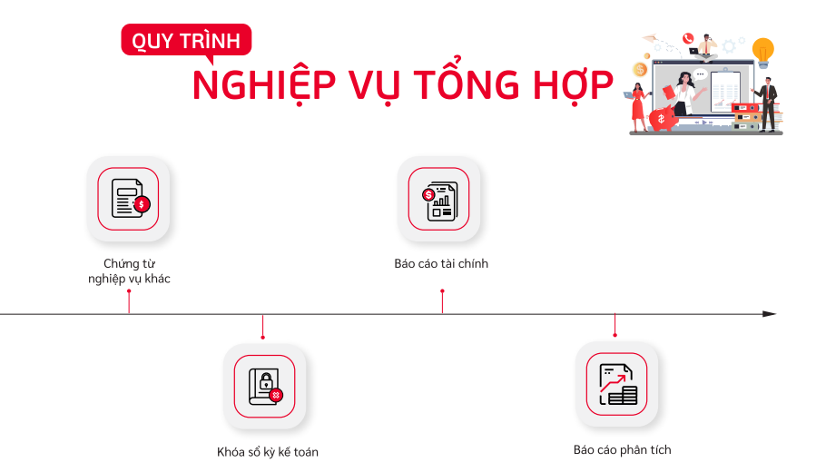
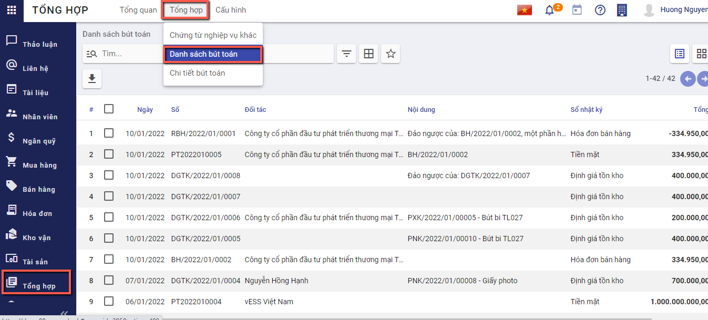
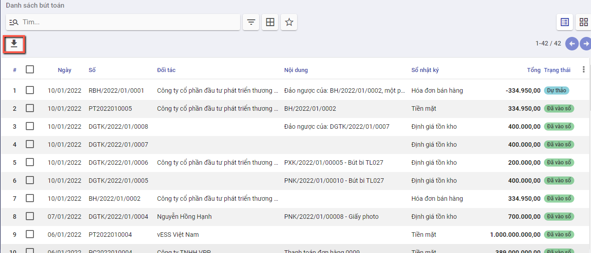
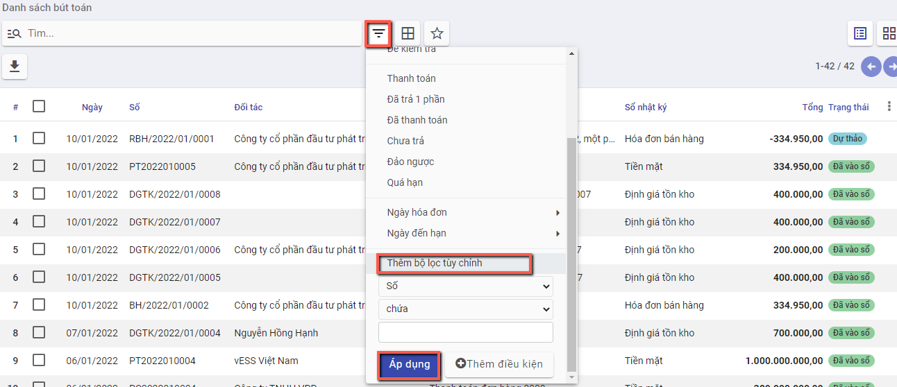
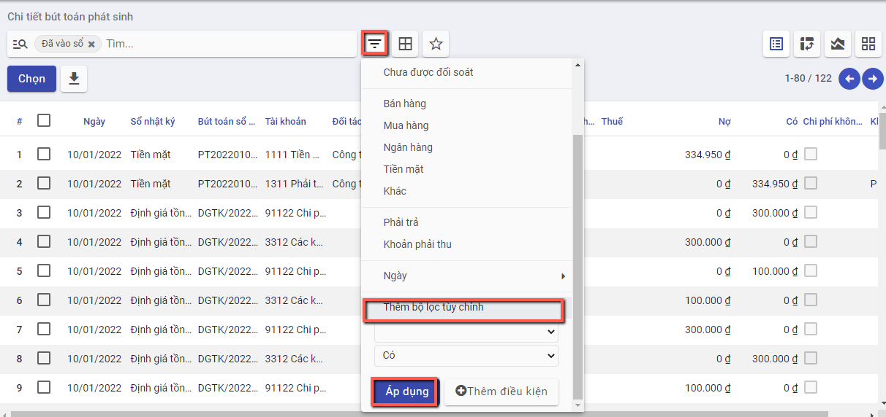

# *Quy trình nghiệp vụ*

Kế toán tổng hợp được sử dụng để  lưu trữ và phản ánh tổng quát dữ liệu của đơn vị trên các hệ thống tài khoản, sổ kế toán và báo cáo tài chính theo các chỉ tiêu giá trị, cập nhật các phiếu kế toán tổng quát, các bút toán điều chỉnh, thực hiện lên sổ sách kế toán và báo cáo tài chính theo quy định.

Quy trình kế toán tổng hợp bao gồm:

- Tổng hợp thu thập số thông tin, chứng từ kế toán và các số liệu thông qua các nghiệp vụ kinh tế phát sinh thực tế  và xử lý những thông tin này
- Ghi chép các nghiệp vụ phát sinh và tài khoản và vào sổ sách kế toán của DN

**Các luồng quy trình**

·     Lập chứng từ nghiệp vụ khác. Chi tiết nghiệp vụ **[tại đây](#chung-tu-nghiep-vu-khac)**

·     Danh sách bút toán. Chi tiết nghiệp vụ **[tại đây](#danh-sach-but-toan)**

·     Chi tiết bút toán. Chi tiết nghiệp vụ **[tại đây](#chi-tiet-but-toan)**

## *Chứng từ nghiệp vụ khác*

### Mô tả nghiệp vụ

**Nghiệp vụ**

Chức năng cho phép người dùng hạch toán bút toán thủ công đối với những nghiệp vụ khác nằm ngoài luồng nghiệp vụ tự động của hệ thống

**Xem video hướng dẫn**

*[Xây dựng video hướng dẫn trên phần mềm, gồm đủ các luồng chức năng được mô tả bên dưới]*

### **Hướng dẫn trên phần mềm**

Đối tượng thực hiện: Người dùng phần mềm

**Bước 1**: Vào phân hệ **Kế toán**, Chọn **Tổng hợp**, chọn **Chứng từ nghiệp vụ khác** 

Hoặc thực hiện **Tìm kiếm** trực tiếp chức năng trên ô tìm kiếm chung của hệ thống

**Bước 2**: Nhấn nút **Tạo** trên chức năng để thực hiện thêm mới một chứng từ, thực hiện khai báo các thông tin cần thiết:

- Chọn Định khoản: Xác định ghi chép số tiền của một nghiệp vụ kinh tế phát sinh. Khoản ghi chép có thể là chi phí bả	o hiểm xã hội, chi phí tiền lương, ... Người dùng có thể bổ sung khoản ghi chép mới bằng cách vào **Danh mục/Định khoản tự động** 

  

  Thực hiện nhập bổ sung định khoản bằng cách Nhấn **Tạo**, nhập các thông tin cần thiết gồm Tên, Loại chứng từ = **Khác**, tài khoản nợ, tài khoản có. Nhấn **Lưu** để lưu định khoản mới

  

- Nhập đơn vị, ngày hạch toán (Ngày thực hiện ghi sổ), số tiền cần thiết (Số tiền cho nghiệp vụ đang tạo), nội dung (Mô tả thông tin cho nghiệp vụ phát sinh)

- Sau mỗi lần chọn định khoản, hệ thống sẽ tự động sinh 2 dòng thông tin chi tiết tương ứng với số tiền và định khoản đã chọn. Người dùng có thể chọn nhiều định khoản trên cùng một chứng từ, hệ thống sẽ sinh tương ứng bấy nhiêu dòng chi tiết

  

**Bước 3**: Nhấn **Lưu lại. ** 

Lưu ý:

- Người dùng có thể sửa lại số tiền theo từng định khoản bằng cách chọn lại từng định khoản trên thông tin chung và nhập lại số tiền
- Người dùng có thể xóa thông tin chi tiết bút toán phát sinh thừa bằng cách nhấn nút **Xóa**  tại góc phải trên mỗi dòng chi tiết 

**Bước 4**: Chọn **Vào sổ**  để ghi nhận đã hạch toán. 

Nếu không muốn ghi sổ một bút toán đã hạch toán thì chọn nút **đưa về dự thảo** 

**Bước 5** : Có thể in được chứng từ kế toán phản ánh nội dung nghiệp vụ kinh tế phát sinh bằng cách, chọn chứng từ cần in,  nhấn **In** và chọn mẫu chứng từ cần in.

**Bước 6**: Có thể tạo bút toán đảo ngược  bằng cách chọn chứng từ cần đảo ngược và đã ghi sổ, nhấn button **Bút toán đảo**

Một cửa sổ lựa chọn thông tin sẽ được hiện ra, chọn **Đảo ngược**

Hệ thống sẽ tự động sinh một chứng từ khác có thông tin giống với chứng từ gốc và thực hiện ghi sổ

## *Danh sách bút toán*

### Mô tả nghiệp vụ

**Nghiệp vụ**

Chức năng cho phép người dùng xem toàn bộ các giao dịch phát sinh đã ghi sổ hiện có trên hệ thống

**Xem video hướng dẫn**

*[Xây dựng video hướng dẫn trên phần mềm, gồm đủ các luồng chức năng được mô tả bên dưới]*

### **Hướng dẫn trên phần mềm**

Đối tượng thực hiện: Người dùng phần mềm

**Bước 1**: Vào phân hệ **Kế toán**, Chọn **Tổng hợp**, chọn **Danh sách bút toán** 

Hoặc thực hiện **Tìm kiếm** trực tiếp chức năng trên ô tìm kiếm chung của hệ thống

Thực hiện tải xuống toàn bộ bút toán bằng cách nhấn nút **Tải xuống**  trên danh sách

**Bước 2**: Thực hiện tìm kiếm một chứng từ bất kỳ bằng cách nhấn nút  **Tìm kiếm** 

Người dùng có thể lựa chọn tiêu chí để tìm kiếm có sẵn hoặc tự tạo cho mình một bộ tìm kiếm riêng biệt 

**Bước 3** : Có thể xem chi tiết bút toán của một chứng từ bằng cách kich chuột chọn vào chứng từ muốn xem.

## *Chi tiết bút toán*

### Mô tả nghiệp vụ

Chức năng cho phép người dùng xem toàn bộ các chi tiết bút toán ghi sổ hiện có trên hệ thống

**Xem video hướng dẫn**

*[Xây dựng video hướng dẫn trên phần mềm, gồm đủ các luồng chức năng được mô tả bên dưới]*

### Hướng dẫn trên phần mềm

**Bước 1**: Vào phân hệ **Kế toán**, Chọn **Tổng hợp**, chọn **Chi tiết bút toán** 

Hoặc thực hiện **Tìm kiếm** trực tiếp chức năng trên ô tìm kiếm chung của hệ thống

Thực hiện tải xuống toàn bộ bút toán bằng cách nhấn nút **Tải xuống**  trên danh sách

**Bước 2**: Thực hiện tìm kiếm một chứng từ bất kỳ bằng cách nhấn nút  **Tìm kiếm** 

Người dùng có thể lựa chọn tiêu chí để tìm kiếm có sẵn hoặc tự tạo cho mình một bộ tìm kiếm riêng biệt 

**Bước 3** : Có thể xem chi tiết bút toán của một chứng từ bằng cách kich chuột chọn vào chứng từ muốn xem.

