# *Quy trình nghiệp vụ*

Kế toán tổng hợp được sử dụng để  lưu trữ và phản ánh tổng quát dữ liệu kế toán của doanh nghiệp trên các hệ thống tài khoản, sổ kế toán và báo cáo tài chính theo các chỉ tiêu giá trị của doanh nghiệp, cập nhật các phiếu kế toán tổng quát, các bút toán điều chỉnh. Làm đầu vào cho các báo cáo Tài chính, báo cáo Tổng hợp và báo cáo Thuế.

Quy trình kế toán tổng hợp bao gồm:

- Tổng hợp thu thập thông tin, chứng từ kế toán và các số liệu thông qua các nghiệp vụ phát sinh thực tế  và xử lý những thông tin này
- Ghi chép các nghiệp vụ phát sinh của tài khoản và vào sổ sách kế toán của doanh nghiệp

**Các luồng quy trình**

·     Lập chứng từ nghiệp vụ khác. Chi tiết nghiệp vụ **[tại đây](#chung-tu-nghiep-vu-khac)**

·     Danh sách bút toán. Chi tiết nghiệp vụ **[tại đây](#danh-sach-but-toan)**

·     Chi tiết bút toán. Chi tiết nghiệp vụ **[tại đây](#chi-tiet-but-toan)**

·     Bảng lương. Chi tiết nghiệp vụ **[tại đây](#bang-luong)**

·     Khai báo số dư ban đầu. Chi tiết nghiệp vụ **[tại đây](#khai-bao-so-du-ban-dau)**

·     Nhập tồn kho vật tư, hàng hóa. Chi tiết nghiệp vụ **[tại đây](#nhap-ton-kho-vat-tu-hang-hoa)**

## *Chứng từ nghiệp vụ khác*

### Mô tả nghiệp vụ

**Nghiệp vụ**

Chức năng cho phép người dùng hạch toán bút toán thủ công đối với những nghiệp vụ khác nằm ngoài luồng nghiệp vụ tự động của hệ thống

**Xem video hướng dẫn**

<iframe
    width="920"
    height="450"
    frameborder="0"
    allow="autoplay; encrypted-media; clipboard-write; gyroscope; picture-in-picture "
    allowfullscreen
    title="Chứng từ nghiệp vụ khác" 
    src="https://www.youtube.com/embed/C2rWmB91Cv4"
></iframe>

### **Hướng dẫn trên phần mềm**

Đối tượng thực hiện: Người dùng phần mềm

**Bước 1**: Vào phân hệ **Kế toán**, Chọn **Tổng hợp**, chọn **Chứng từ nghiệp vụ khác** 

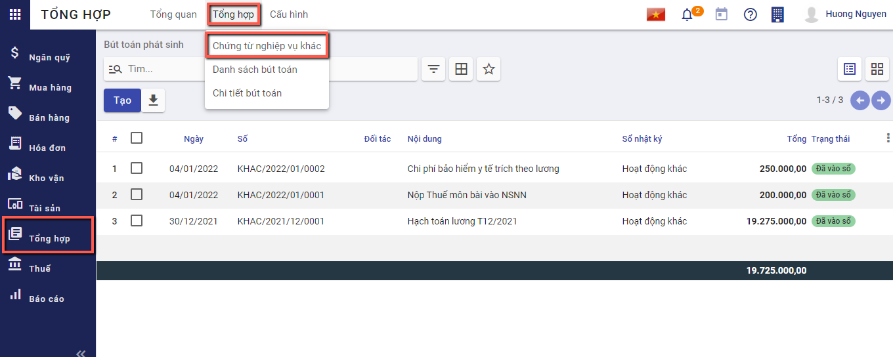

Hoặc thực hiện **Tìm kiếm** trực tiếp chức năng trên ô tìm kiếm chung của hệ thống

**Bước 2**: Nhấn nút **Tạo** trên chức năng để thực hiện thêm mới một chứng từ, thực hiện khai báo các thông tin cần thiết:

- Chọn Định khoản: Xác định ghi chép số tiền của một nghiệp vụ kinh tế phát sinh. Khoản ghi chép có thể là chi phí bả	o hiểm xã hội, chi phí tiền lương, ... Người dùng có thể bổ sung khoản ghi chép mới bằng cách vào **Danh mục/Định khoản tự động** 

  

  Thực hiện nhập bổ sung định khoản bằng cách Nhấn **Tạo**, nhập các thông tin cần thiết gồm Tên, Loại chứng từ = **Khác**, tài khoản nợ, tài khoản có. Nhấn **Lưu** để lưu định khoản mới

  

- Nhập đơn vị, ngày hạch toán (Ngày thực hiện ghi sổ), số tiền cần thiết (Số tiền cho nghiệp vụ đang tạo), nội dung (Mô tả thông tin cho nghiệp vụ phát sinh)

- Sau mỗi lần chọn định khoản, hệ thống sẽ tự động sinh 2 dòng thông tin chi tiết tương ứng với số tiền và định khoản đã chọn. Người dùng có thể chọn nhiều định khoản trên cùng một chứng từ, hệ thống sẽ sinh tương ứng bấy nhiêu dòng chi tiết

  

**Bước 3**: Nhấn **Lưu lại. ** 

Lưu ý:

- Người dùng có thể sửa lại số tiền theo từng định khoản bằng cách chọn lại từng định khoản trên thông tin chung và nhập lại số tiền
- Người dùng có thể xóa thông tin chi tiết bút toán phát sinh thừa bằng cách nhấn nút **Xóa**  tại góc phải trên mỗi dòng chi tiết 

**Bước 4**: Chọn **Vào sổ**  để ghi nhận đã hạch toán. 

Nếu không muốn ghi sổ một bút toán đã hạch toán thì chọn nút **đưa về dự thảo** 

**Bước 5** : Có thể in được chứng từ kế toán phản ánh nội dung nghiệp vụ kinh tế phát sinh bằng cách, chọn chứng từ cần in,  nhấn **In** và chọn mẫu chứng từ cần in.

**Bước 6**: Có thể tạo bút toán đảo ngược  bằng cách chọn chứng từ cần đảo ngược và đã ghi sổ, nhấn button **Bút toán đảo**

Một cửa sổ lựa chọn thông tin sẽ được hiện ra, chọn **Đảo ngược**

Hệ thống sẽ tự động sinh một chứng từ khác có thông tin giống với chứng từ gốc và thực hiện ghi sổ

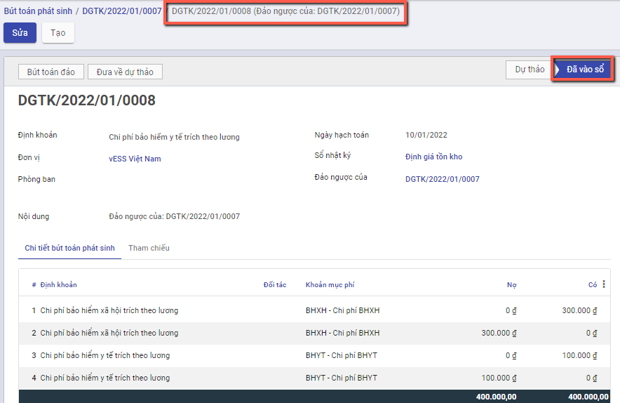

## *Danh sách bút toán*

### Mô tả nghiệp vụ

**Nghiệp vụ**

Chức năng cho phép người dùng xem toàn bộ các giao dịch phát sinh đã ghi sổ hiện có trên hệ thống

**Xem video hướng dẫn**

*[Xây dựng video hướng dẫn trên phần mềm, gồm đủ các luồng chức năng được mô tả bên dưới]*

### **Hướng dẫn trên phần mềm**

Đối tượng thực hiện: Người dùng phần mềm

**Bước 1**: Vào phân hệ **Kế toán**, Chọn **Tổng hợp**, chọn **Danh sách bút toán** 

Hoặc thực hiện **Tìm kiếm** trực tiếp chức năng trên ô tìm kiếm chung của hệ thống

Thực hiện tải xuống toàn bộ bút toán bằng cách nhấn nút **Tải xuống**  trên danh sách

**Bước 2**: Thực hiện tìm kiếm một chứng từ bất kỳ bằng cách nhấn nút  **Tìm kiếm** 

Người dùng có thể lựa chọn tiêu chí để tìm kiếm có sẵn hoặc tự tạo cho mình một bộ tìm kiếm riêng biệt 

**Bước 3** : Có thể xem chi tiết bút toán của một chứng từ bằng cách kich chuột chọn vào chứng từ muốn xem.

## *Chi tiết bút toán*

### Mô tả nghiệp vụ

Chức năng cho phép người dùng xem toàn bộ các chi tiết bút toán ghi sổ hiện có trên hệ thống

**Xem video hướng dẫn**

*[Xây dựng video hướng dẫn trên phần mềm, gồm đủ các luồng chức năng được mô tả bên dưới]*

### Hướng dẫn trên phần mềm

**Bước 1**: Vào phân hệ **Kế toán**, Chọn **Tổng hợp**, chọn **Chi tiết bút toán** 

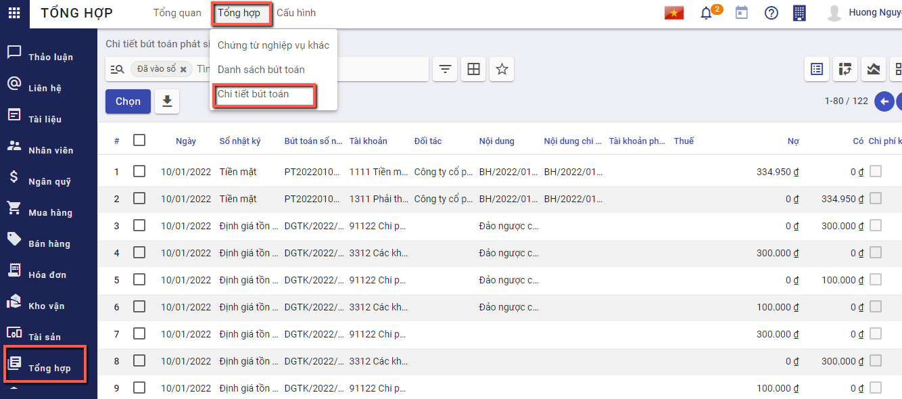

Hoặc thực hiện **Tìm kiếm** trực tiếp chức năng trên ô tìm kiếm chung của hệ thống

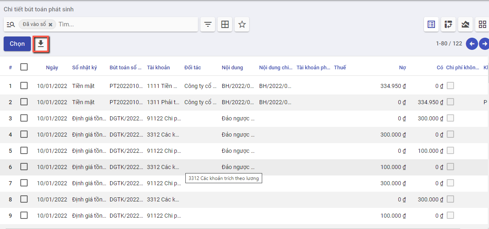

Thực hiện tải xuống toàn bộ bút toán bằng cách nhấn nút **Tải xuống**  trên danh sách

**Bước 2**: Thực hiện tìm kiếm một chứng từ bất kỳ bằng cách nhấn nút  **Tìm kiếm** 

Người dùng có thể lựa chọn tiêu chí để tìm kiếm có sẵn hoặc tự tạo cho mình một bộ tìm kiếm riêng biệt 

**Bước 3** : Có thể xem chi tiết bút toán của một chứng từ bằng cách kich chuột chọn vào chứng từ muốn xem.

## *Bảng lương*

### Mô tả nghiệp vụ

**Nghiệp vụ**

Hàng tháng, người dùng tự tính lương cho người lao động và nhập khẩu thông tin lương để lưu trữ trên hệ thống. 
Hệ thống sẽ tự động hạch toán lương và lên báo cáo theo dõi tình hình thanh toán lương (S5-HKD) 

**Xem video hướng dẫn**

<iframe
    width="920"
    height="450"
    frameborder="0"
    allow="autoplay; encrypted-media; clipboard-write; gyroscope; picture-in-picture "
    allowfullscreen
    title="Module Tổng hợp - Bảng lương" 
    src="https://www.youtube.com/embed/04x64Ixqa6k"
></iframe>

### **Hướng dẫn trên phần mềm**

Đối tượng thực hiện: Người dùng phần mềm

**Bước 1**: Vào phân hệ **Kế toán**, Chọn **Tổng hợp**, chọn **Bảng lương** 

Hoặc thực hiện **Tìm kiếm** trực tiếp chức năng trên ô tìm kiếm chung của hệ thống

**Bước 2**: Nhấn nút **Tạo** trên chức năng để thực hiện thêm mới bảng lương của tháng, thực hiện khai báo các thông tin cần thiết:

- Chọn Kỳ lương cho Bảng lương

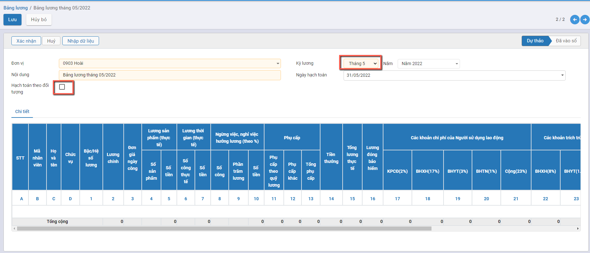

**Bước 3**: Nhấn nút **Nhập dữ liệu** trên chức năng để thực hiện Nhập thông tin dữ liệu lương tháng từ file Excel:

**Bước 4**: Để tải biểu mẫu của Bảng lương, Người dùng Nhấn nút **Xuất biểu mẫu** : Hệ thống sẽ tải file Biểu mẫu Import bảng lương và người dùng thực hiện Nhập thông tin theo dữ liệu trên Biểu mẫu

- Thông tin trên File excel gồm 2 Sheet dữ liệu

  - **Sheet Bảng tính:** Gồm toàn bộ các thông tin phải nhập dữ liệu đầu vào để tính lương cho toàn bộ Nhân viên của Đơn vị. Trên mỗi cột cần sử dụng tính toán hệ thống đã hỗ trợ mặc định công thức

  - **Sheet Hướng dẫn**: Giải thích từng cột giá trị và công thức tính đang được áp dụng bên Sheet Bảng tính

    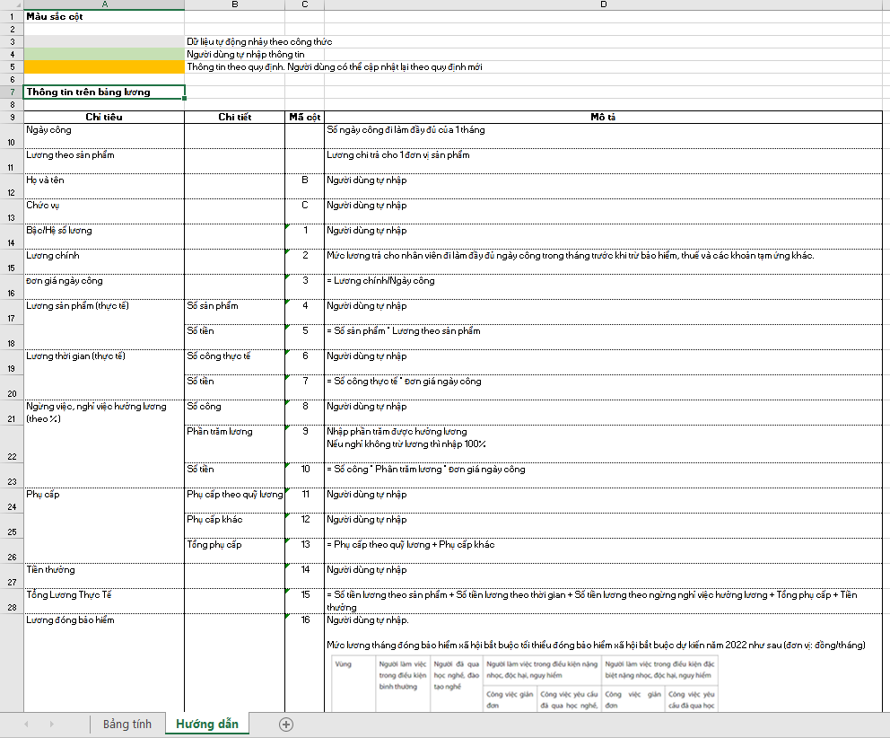

**Bước 5**: Để tải dữ liệu bảng lương đã được nhập đầy đủ dữ liệu từ File lên hệ thống, Người dùng Nhấn nút **Tải lên tập tin của bạn** : 

- Thực hiện chọn file Bảng lương

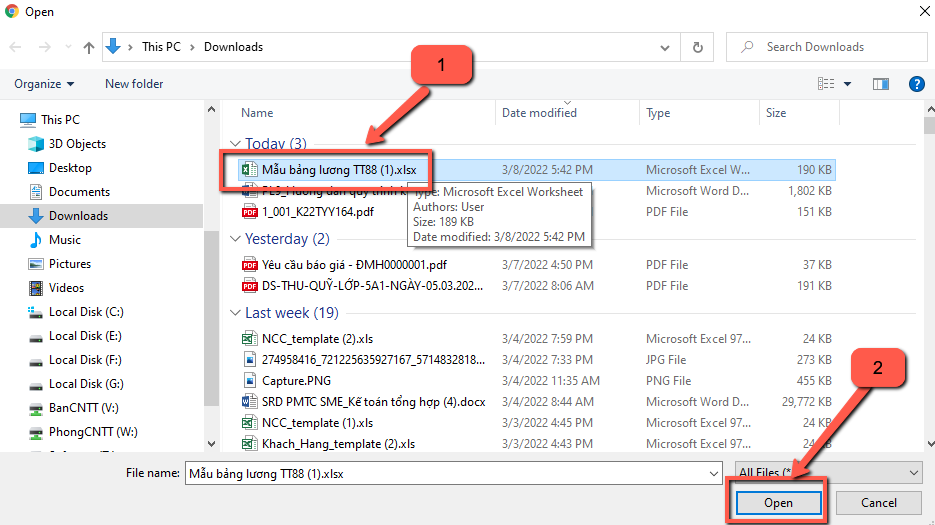

- Thông tin File Bảng lương sau khi được chọn: Người dùng nếu muốn thay đổi thông tin File đã chọn thì sử dụng nút: **Xóa** (Để chọn lại) hoặc **Chọn** (Để chọn lại file)

**Bước 6**: Người dùng Nhấn nút **Nhập dữ liệu**để hoàn tất phần chọn File

Thông tin đã nhập trên file Biểu mẫu được đẩy xuống tại Tab Chi tiết của chức năng

- Lưu ý: Thông tin Kỳ lương sau khi đã có dữ liệu sẽ không được thay đổi
- Người dùng muốn nhập lại dữ liệu sau khi thấy cần phải điều chỉnh: Thực hiện nhấn nút **Nhập dữ liệu** và thực hiện lại bước chọn file cần tải

**Bước 7**: Người dùng Nhấn nút **Xác nhận** để ghi nhận hạch toán dữ liệu Bảng lương

## *Khai báo số dư ban đầu*

### Mô tả nghiệp vụ

**Nghiệp vụ**

Hướng dẫn việc khai báo thông tin Số dư đầu kỳ của Tài khoản và Số dư đầu kỳ theo từng Đối tượng.

Việc khai báo Số dư ban đầu thực hiện cho:

- Số dư tiền mặt
- Số dư tài khoản ngân hàng
- Công nợ khách hàng
- Công nợ nhà cung cấp
- Công nợ nhân viên
- Số dư tài khoản đầu kỳ khác

**Xem video hướng dẫn**

*[Xây dựng video hướng dẫn trên phần mềm, gồm đủ các luồng chức năng được mô tả bên dưới]*

### **Hướng dẫn trên phần mềm**

#### Số dư đầu kỳ của Tài khoản Tiền mặt/Tiền ngân hàng

Hướng dẫn việc khai báo Số dư đầu kỳ của: Tiền mặt, Tài khoản ngân hàng và của Tài khoản khác

Đối tượng thực hiện: Người dùng phần mềm

**Bước 1**: Vào phân hệ **Tổng hợp**: Chọn tính năng tương ứng cần khai báo Số dư đầu kỳ cho Tài khoản

- **Số dư tiền mặt**: Khai báo Số dư đầu kỳ của Tài khoản Tiền mặt, theo Sổ kế toán

- **Số dư tài khoản ngân hàng**: Khai báo Số dư đầu kỳ của Tài khoản ngân hàng, theo Sổ kế toán

- **Số dư tài khoản đầu kỳ khác**: Khai báo Số dư đầu kỳ của các Tài khoản khác (nếu cần) 

  

Thông tin màn hình của:

- **Số dư tiền mặt**

  

- **Số dư tài khoản ngân hàng**

  

- **Số dư tài khoản đầu kỳ khác**

  

**Bước 2**: Nhấn nút  để khai báo thông tin

Các trường dữ liệu trên chức năng:

- Ngày hạch toán: Mặc định thông tin Ngày thực hiện tạo, có thể thay đổi được
- Nút **Lấy dữ liệu**: Khi nhấn nút **Lấy dữ liệu** hệ thống sẽ mặc định view các Sổ nhật ký tiền mặt/tiền ngân hàng (đã được khai báo tại Danh mục Sổ nhật ký) lên **tab Số dư đầu kỳ**
- Thông tin Sổ nhật ký: Để người dùng tự động chọn thông tin để Thêm dòng dữ liệu

**Bước 3**: Thực hiện chọn và Nhập thông tin dữ liệu

- Chọn Sổ nhật ký: Hệ thống tự động hiển thị thông tin Tài khoản gắn với Sổ nhật ký cùng thông tin Tiền tệ. 
- Nhập thông tin Số tiền: Thực hiện nhập Số dư đầu kỳ của Tài khoản. 

***Lưu ý:*** Chỉ thực hiện nhập Số tiền của Bên **Nợ** để ghi nhận Số dư đầu kỳ của Tài khoản Tiền mặt hoặc Tài khoản Ngân hàng. **KHÔNG** nhập đồng thời cả 2 bên giá trị Nợ/Có

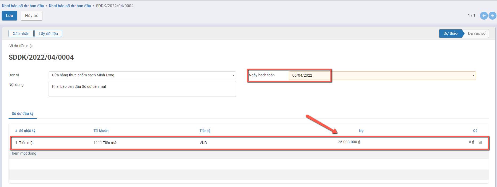

- **Với Số dư tài khoản:**

***Lưu ý:*** Nếu Người dùng không thấy hiển thị thông tin **Số tài khoản ngân hàng** cần kiểm tra lại việc khai báo của Sổ nhập ký Tiền ngân hàng tại **Danh mục Sổ nhật ký** và thực hiện bổ sung thông tin tại 'Tài khoản Ngân hàng'

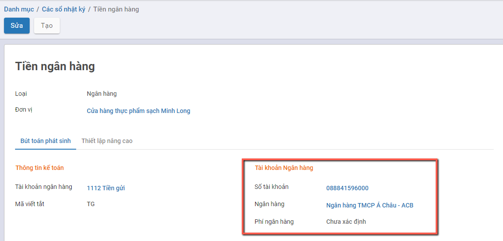

**Bước 4**: Người dùng Nhấn nút **Xác nhận** để ghi nhận thông tin Số dư đầu kỳ theo dữ liệu đã nhập.

Thông tin Dữ liệu đã nhập được vào Sổ và dữ liệu lên bút toán

Muốn xem thông tin Bút toán: Người dùng nhấn nút **'Bút toán'**

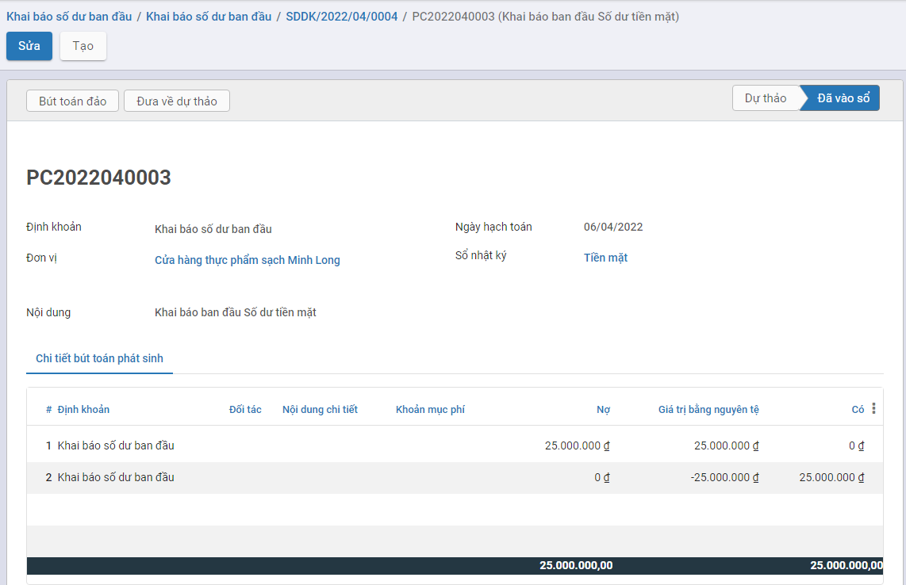

#### Số dư đầu kỳ của Tài khoản khác

Hướng dẫn việc khai báo Số dư đầu kỳ của Tài khoản khác

Đối tượng thực hiện: Người dùng phần mềm

**Bước 1**: Vào phân hệ **Tổng hợp**: Chọn tính năng **Số dư tài khoản đầu kỳ khác**: Nhấn chọn thông tin **'Số dư tài khoản đầu kỳ khác'** trên Sơ đồ

Thông tin màn hình của:**Số dư tài khoản đầu kỳ khác**

**Bước 2**: Nhấn nút  để khai báo thông tin

Các trường dữ liệu trên chức năng:

- Ngày hạch toán: Mặc định thông tin Ngày thực hiện tạo, có thể thay đổi được
- Nút **Lấy dữ liệu**: Khi nhấn nút **Lấy dữ liệu** hệ thống sẽ mặc định hiển thị các Tài khoản con được khai báo trên hệ thống tại danh mục **Hệ thống tài khoản**

**Bước 3**: Thực hiện chọn và Nhập thông tin dữ liệu

- Chọn Sổ nhật ký: Hệ thống view các Sổ nhật ký được khai báo tại danh mục **Sổ nhật ký với Loại = Khác**. 
- Thực hiện Nhấn nút Thêm một dòng để bổ sung các tài khoản cần khai báo
- Nhập thông tin Số tiền: Căn cứ vào tính chất của Tài khoản để nhập Số dư bên Nợ **hoặc** Số dư bên Có. 

***Lưu ý:*** 

- Với mỗi Tài khoản **chỉ** được phép nhập **Số dư bên Nợ hoặc Bên Có**, không nhập đồng thời cả 2 giá trị

**Bước 4**: Người dùng Nhấn nút **Xác nhận** để ghi nhận thông tin Số dư đầu kỳ theo dữ liệu đã nhập.

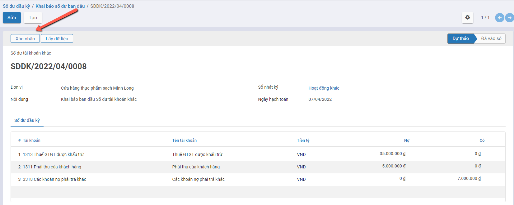

Thông tin Dữ liệu đã nhập được vào Sổ và dữ liệu lên bút toán

## *Nhập tồn kho vật tư, hàng hóa*

### Mô tả nghiệp vụ

Mục Tồn kho vật tư, hàng hóa cho phép người dùng quản lý tồn kho đầu kỳ của vật tư, hàng hóa trong doanh nghiệp theo từng kho

Người dùng thực hiện nhập :

- Nhập tồn kho vật tư, hàng hóa theo kho
- Nhập tồn kho vật tư hàng hóa từ file excel

**Quy trình nghiệp vụ**

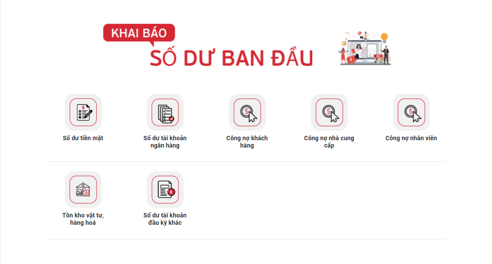

### Xem video hướng dẫn

### Hướng dẫn trên phần mềm

***Lưu ý:\*** *Trước khi nhập tồn kho đầu kỳ cần khai báo:* **Danh mục kho** và **Danh mục vật tư, hàng hóa** sử dụng tại đơn vị

#### Cách 1: Nhập trực tiếp từ phần mềm

**Bước 1**: Vào phân hệ **Tổng hợp**, Chọn **Tổng hợp**, Chọn **Số dư đầu kỳ**, Nhấn **Tồn kho vật tư, hàng hóa**, Nhấn **Tạo**, Thực hiện khai báo thông tin Tab chung:

- Tại **Đơn vị** : Chọn Chi nhánh của doanh nghiệp
- Tại **Ngày hạch toán**: Chọn ngày ghi nhận dư tồn vật tư hàng hóa đầu kỳ

**Bước 2**: Khai báo vật tư, hàng hóa tồn kho

Tại Tab **Số dư đầu kỳ**, Nhấn **Thêm một dòng**

- Tại **Vật tư hàng hóa**: Chọn vật tư hàng hóa còn tồn
- Tại **Đơn vị tính**: Chọn đơn vị tính vật tư hàng hóa
- Tại **Kho**: Chọn Kho có hàng tồn
- Tại **Số lượng tồn**: Nhập số lượng còn tồn của vật tư, hàng hóa
- Tại **Giá trị tồn**: Nhập giá trị tiền của vật tư,hàng hóa còn tồn
- Tại **Số lô**: Nhập số lô nhập của vật tư hàng hóa, nếu để trống hệ thống tự sinh
- Tại **Hạn sử dụng**: Nhập hạn sử dụng của vật tư, hàng hóa còn tồn

**Lưu ý:**

- Giá trị tồn là Tổng giá trị tồn của vật tư, hàng hóa, đơn giá của từng vật tư hàng hóa phần mềm sẽ tự hiểu = **Giá trị tồn/số lượng** 
- Chức năng **Lấy dữ liệu** ở tab **Thông tin chung** để giúp người dùng tạo nhanh các dòng thông tin vật tư hàng hóa tại tab **Số dư đầu kỳ**. (Sử dụng trong trường hợp tất cả vật tư, hàng hóa trong danh mục đều có tồn đầu kỳ)

**Bước 3**: Nhấn **Lưu**

**Bước 4**: Sau khi khai báo tồn kho vật tư, hàng hóa, cần nhấn **Xác nhận** để sinh **Phiếu nhập kho** và ghi nhận giá trị tồn kho vào số dư đầu kỳ của tài khoản kho tương ứng

Thông tin Phiếu nhập kho gắn với Phần khai báo Tồn kho vật tư, hàng hóa

Chứng từ **Phiếu nhập kho** gắn với Phần khai báo Tồn kho vật tư, hàng hóa

**Lưu ý:**

- Sau khi **Xác nhận**, nhấn **Phiếu nhập kho** để kiểm tra chứng từ nhập kho và bút toán ghi nhận tổng giá trị tồn kho theo từng vật tư,hàng hóa của từng kho

- Để chỉnh sửa lại thông tin tồn đầu kỳ vật tư, hàng hóa thực hiện nhấn **Đưa về dự thảo**,nhấn **Sửa** để thực hiện sửa thông tin tồn đầu kỳ vật tư, hàng hóa, nhấn **Cập nhật** để lưu lại dữ liệu vào chứng từ **Phiếu nhập kho**.

#### Cách 2: Nhập từ excel

**Bước 1**: Vào phân hệ **Tổng hợp**, Chọn **Tổng hợp**, Chọn **Số dư đầu kỳ**, Nhấn **Tồn kho vật tư, hàng hóa**, Nhấn **Tạo**, Thực hiện khai báo thông tin Tab chung:

- Tại **Đơn vị** : Chọn Chi nhánh của doanh nghiệp
- Tại **Ngày hạch toán**: Chọn ngày ghi nhận dư tồn vật tư hàng hóa đầu kỳ

**Bước 2**: Nhấn **Nhập dữ liệu**

Nhấn **Tải về mẫu dữ liệu** để thực hiện tải file mẫu excel để nhập thông tin

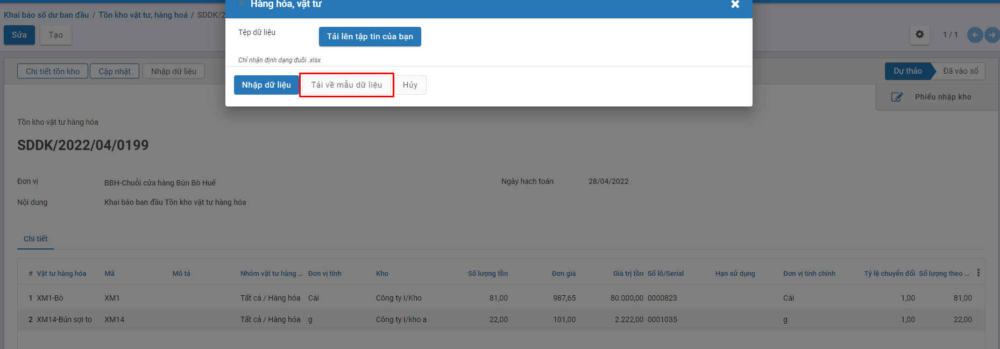

Thực hiện nhập thông tin tại file excell, nhấn Lưu file excel sau khi nhập thông tin vật tư hàng hóa tồn đầu kỳ tại file.

- Tại **Mã hàng hóa**: Nhập mã nội bộ của vật tư,hàng hóa có tồn đầu kỳ
- Tại **Mã kho**: Nhập địa điểm kho theo cú pháp Địa điểm cha/Tên địa điểm
- Tại **Đơn vị tính**: Nhập Đơn vị tính của vật tư, hàng hóa
- Tại **Số lượng tồn**: Nhập số lượng còn tồn của vật tư, hàng hóa
- Tại **Giá trị tồn**: Nhập giá trị tiền của vật tư,hàng hóa còn tồn
- Tại **Số lô**: Nhập số lô nhập của vật tư hàng hóa, nếu để trống hệ thống tự sinh
- Tại **Hạn sử dụng**: Nhập hạn sử dụng của vật tư, hàng hóa còn tồn theo định dạng dd-mm-yyyy

**Lưu ý**: Không sử dụng công thức tính toán khi nhập thông tin. 

**Bước 3**: Nhấn Tệp dữ liệu ,chọn file excel vừa nhập vật tư, hàng hóa tồn đầu kỳ

**Bước 4**: Nhấn Nhập dữ liệu để thực hiện nhập thông tin vật tư, hàng hóa tồn đầu kỳ từ file excel

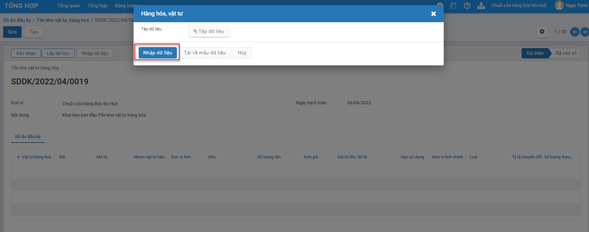

**Bước 5**: Sau khi khai báo tồn kho vật tư, hàng hóa từ file excel nhấn **Xác nhận** để sinh **Phiếu nhập kho** và ghi nhận giá trị tồn kho vào số dư đầu kỳ của tài khoản kho tương ứng

Thông tin Phiếu nhập kho gắn với Phần khai báo Tồn kho vật tư, hàng hóa

Chứng từ **Phiếu nhập kho** gắn với Phần khai báo Tồn kho vật tư, hàng hóa

**Lưu ý:**

- Sau khi **Xác nhận**, nhấn **Phiếu nhập kho** để kiểm tra chứng từ nhập kho và bút toán ghi nhận tổng giá trị tồn kho theo từng vật tư,hàng hóa của từng kho

- Để chỉnh sửa lại thông tin tồn đầu kỳ vật tư, hàng hóa thực hiện nhấn **Đưa về dự thảo**,nhấn **Sửa** để thực hiện sửa thông tin tồn đầu kỳ vật tư, hàng hóa, nhấn **Cập nhật** để lưu lại dữ liệu vào chứng từ **Phiếu nhập kho**.
