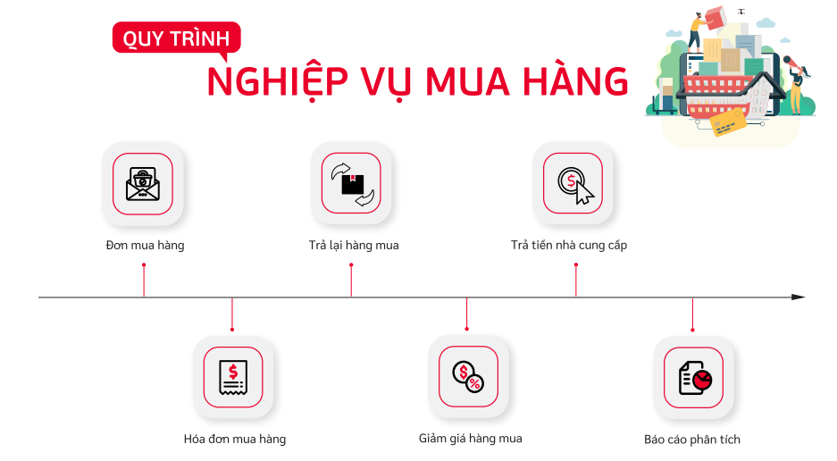
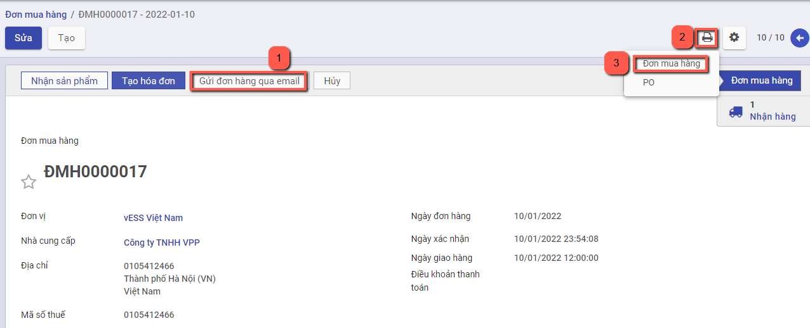
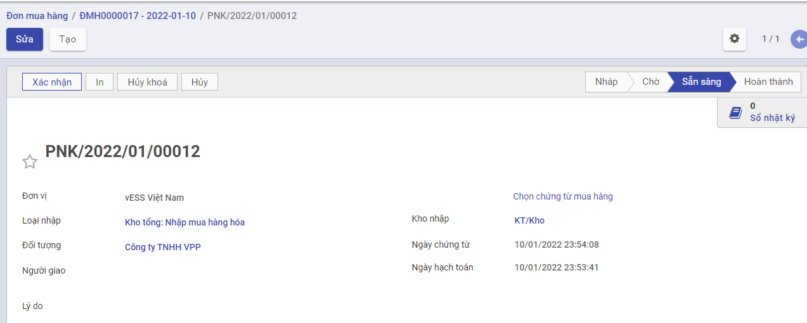
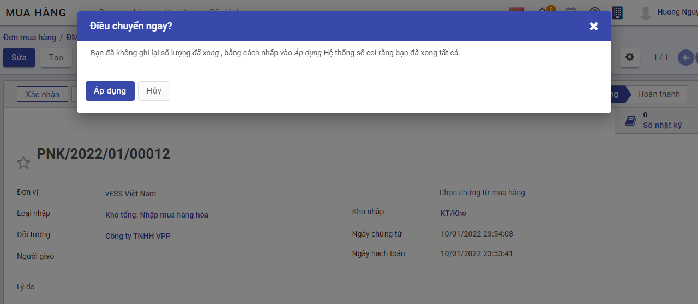
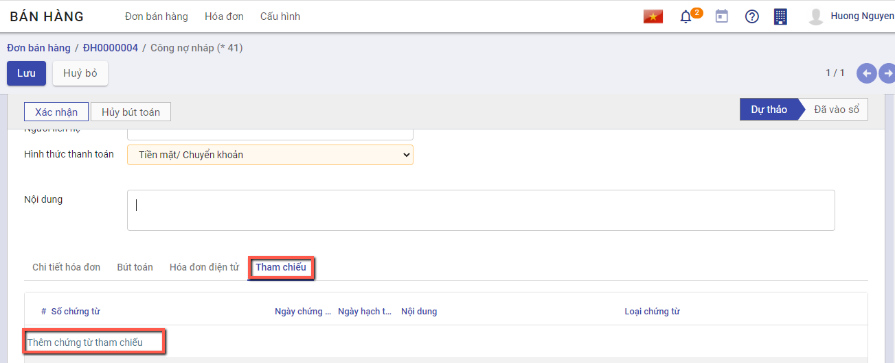
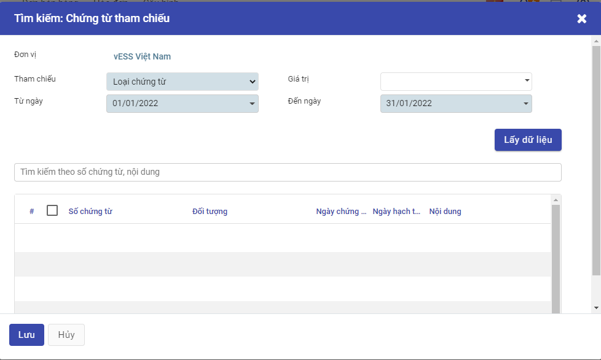
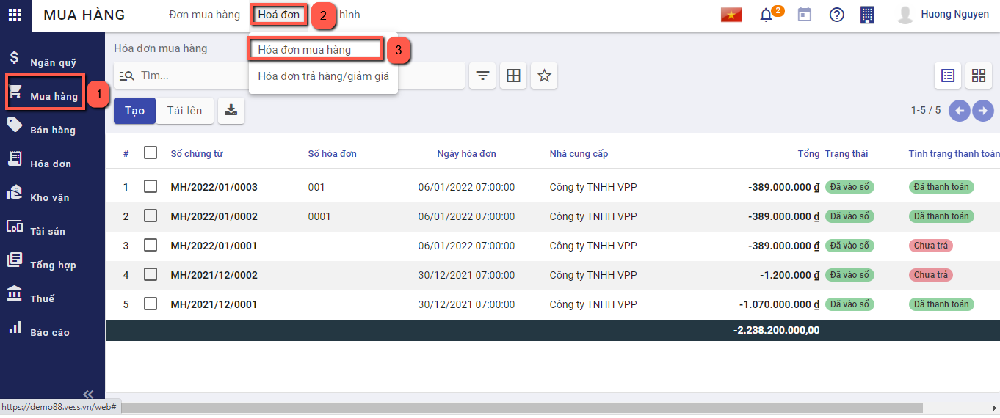
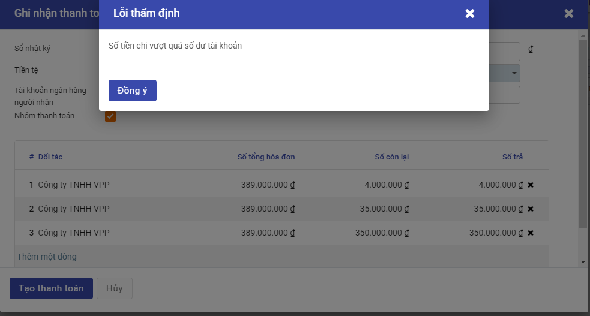
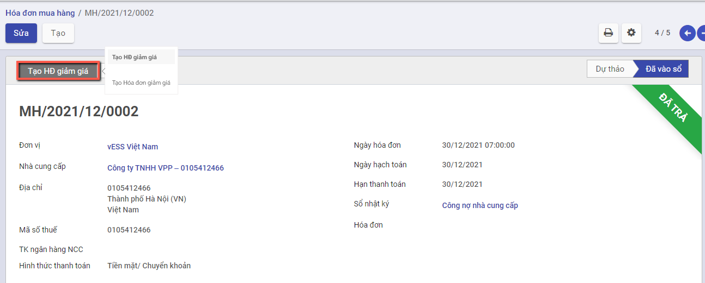
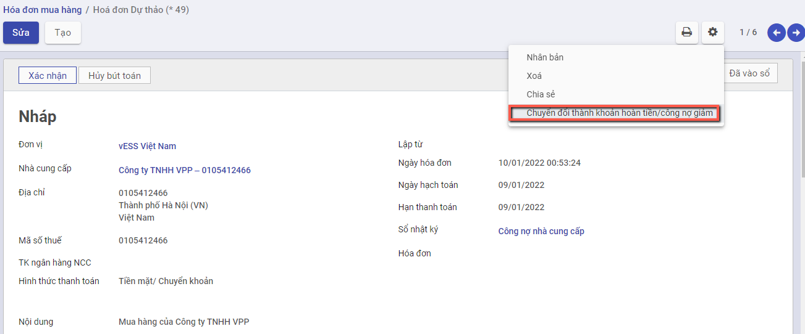

# **Quy trình nghiệp vụ**

Quản lý toàn bộ quy trình Mua hàng từ bước Lập đơn hàng, nhận hóa đơn và trả tiền cho nhà cung cấp. Phân hệ mua hàng liên kết với phân hệ Kho để tự động sinh phiếu nhập kho ứng với Đơn mua hàng.

**Quy trình**

**Các luồng quy trình**

·     Lập đơn mua hàng gửi Nhà cung cấp. Chi tiết nghiệp vụ **[tại đây](#on-mua-hang)**

·     Nhập kho đơn mua hàng. Chi tiết nghiệp vụ **[tại đây](#nhap-kho-on-mua-hang)**

·     Tạo hóa đơn mua hàng. Chi tiết nghiệp vụ [**tại đây**](#hoa-on-mua-hang)

·     Ghi nhận thanh toán từ nhà cung cấp. Chi tiết nghiệp vụ [**tại đây**](#thanh-toan-cho-nha-cung-cap)

·     Tạo hóa đơn giảm giá/trả hàng. Chi tiết nghiệp vụ [**tại đây**](#hoa-on-giam-giatra-lai-hang-mua)

## ***Đơn mua hàng***

### **Mô tả nghiệp vụ**

Khi đơn vị có nhu cầu mua hàng, lập yêu cầu mua hàng thì quy trình thực hiện như sau:

- Sau khi lựa chọn và chốt giá cả với Nhà cung cấp được lựa chọn: người mua hàng thực hiện lập đơn mua hàng theo thỏa thuận với nhà cung cấp để chốt lại hàng hóa, số lượng, giá cả, hạn thanh toán, hạn giao hàng, địa điểm giao hàng....
- Sau khi lập xong đơn hàng, người mua chuyển đơn mua hàng cho nhà cung cấp để nhà cung cấp kiểm tra, ký đơn mua hàng.Người mua thực hiện xác nhận đơn hàng và lưu trữ chứng từ.
- Đơn mua hàng có thể được lập mới từ đầu hoặc được lập từ: đơn bán hàng

**Luồng chức năng chính**

·     Lập đơn mua hàng gửi Nhà cung cấp. Chi tiết nghiệp vụ **[tại đây](#lap-on-mua-hang-gui-nha-cung-cap)**

·     Xác nhận Đơn hàng từ Nhà cung cấp. Chi tiết nghiệp vụ [**tại đây**](#xac-nhan-on-hang-tu-nha-cung-cap)

**Xem video hướng dẫn**

<iframe
    width="920"
    height="450"
    frameborder="0"
    allow="autoplay; encrypted-media; clipboard-write; gyroscope; picture-in-picture "
    allowfullscreen
    title="Lập đơn mua hàng" 
    src="https://www.youtube.com/embed/PQZuqDdgwxo"
></iframe>

### Hướng dẫn trên phần mềm

#### **Lập đơn mua hàng gửi Nhà cung cấp**

**Đối tượng thực hiện :** Nhân viên bộ phận mua hàng 

Có hai cách để thực hiện lập đơn mua hàng

*<u>Cách 1:</u>* Nhập thêm mới trực tiếp trên giao diện

*<u>Cách 2:</u>* Lập đơn mua hàng từ việc import dữ liệu

##### **Nhập trực tiếp trên giao diện**

**Bước 1:** Vào phân hệ **Mua hàng**, Chọn **Đơn mua hàng** 

Hoặc thực hiện **Tìm kiếm** trực tiếp chức năng trên ô tìm kiếm chung của hệ thống

**Bước 2:** Nhấn nút **Tạo** trên chức năng để thực hiện thêm một đơn hàng mới. Khai báo các thông tin chi tiết trên đơn mua hàng. Lưu ý: Các ô màu hồng là những thông tin cần bắt buộc nhập

- Chọn đơn vị cần mua hàng. 

- Chọn thông tin Nhà cung cấp. Nếu chưa có nhà cung cấp thì có thể nhập bổ sung thêm bằng cách nhập tên nhà cung cấp và chọn tạo mới 

  

  hoặc vào đường dẫn **Danh mục/Nhà cung cấp** và thực hiện thêm mới

  

- Khai báo thông tin về Hạn đặt hàng, Ngày đơn hàng, nội dung chi tiết đơn hàng

- Khai báo thêm thông tin về Sản phẩm/dịch vụ tại chi tiết đơn hàng bằng cách nhấn chọn thêm sản phẩm
  
- 
  
  - Chọn các sản phẩm yêu cầu báo giá từ nhà cung cấp
  - Nhập thông tin Số lượng, Đơn giá, Chiết khấu và mức Thuế đối với từng Sản phẩm
  - 
  - Khi thực hiện Thêm ghi chú --> Thông tin nội dung sẽ được in trên file gửi nhà cung cấp

**Bước 3**: Nhấn **Lưu**

##### **Lập đơn mua hàng từ việc Import dữ liệu**

**Bước 1:** Vào phân hệ **Mua hàng**, Chọn **Đơn mua hàng** 

Hoặc thực hiện **Tìm kiếm** trực tiếp chức năng trên ô tìm kiếm chung của hệ thống

**Bước 2:** Trên danh sách đơn hàng, nhấn biểu tượng hình ngôi sao, chọn **Thêm bản ghi**

Sau khi mở màn hình import thông tin, thực hiện xuất file mẫu bằng cách chọn **Mẫu nhập khẩu đơn mua hàng** để thực hiện xuất file mẫu excel

Trên file excel vừa xuất, người dùng thực hiện nhập thông tin đơn hàng tương ứng tại các cột, hướng dẫn cụ thể có trong phần commnent tại hàng đầu tiên của mỗi cột

Sau khi nhập thông tin vào file, thực hiện nhập dữ liệu bằng cách nhấn chọn **Nạp tập tin**

Chọn file vừa nhập thông tin, đợi hệ thống tải file, sau đó nhấn nút **Kiểm thử** để kiểm tra thông tin trong file có chính xác không.

Nếu như có lỗi thì sẽ hiển thị thông báo lỗi cụ thể tại cột nào, dòng nào. 

Lưu ý: Những thông báo màu hồng là thông tin cần sửa lại, thông báo màu cam có thể bỏ qua

Nếu như cần sửa chữa thông tin trong file nhập liệu thì người dùng chọn lại **Nạp tập tin** và chọn file vừa sửa

Nếu đã chính xác thì sẽ hiển thị thông báo màu xanh : "Mọi thứ dường như hợp lệ". Người dùng nhấn **Nhập** để bắt đầu import dữ liệu vào hệ thống

Khi import thành công, hệ thống  sẽ tự động quay về màn hình danh sách và hiển thị thông báo số lượng bản ghi đã được import, các bản ghi được import thành công ở trạng thái báo giá

#### Thực hiện gửi đơn hàng cho nhà cung cấp

**Bước 1**: Sau khi đã có đơn hàng báo giá để gửi khách hàng, Thực hiện **In** đơn hàng bằng cách chọn chức năng In

**Bước 2:** Thực hiện **Gửi qua Email** đến nhà cung cấp sau khi hoàn thành  đơn hàng, có thể tùy chỉnh thông tin mẫu gửi báo giá theo yêu cầu

#### **Xác nhận Đơn hàng từ Nhà cung cấp**

Tại đơn hàng đã tạo, sau khi đã thỏa thuận được báo giá với nhà cung cấp và nhà cung cấp trả hàng theo đúng yêu cầu, người mua hàng nhấn nút **Xác nhận** để hoàn thành đơn hàng

Nếu không còn nhu cầu mua hàng, người bán nhấn **Hủy** hoặc thực hiện xóa đơn hàng đã tạo

Sau khi có đơn hàng, sản phẩm sẽ được nhận từ nhà cung cấp và nhập vào kho

## *Nhập kho đơn mua hàng*

### Mô tả nghiệp vụ

Sau khi thực hiện Xác nhận đơn hàng, chương trình tự động sinh ra một phiếu nhập kho. Người dùng có thể theo dõi tình trạng nhận hàng của sản phẩm trên phiếu nhập kho đã sinh ra và xác nhận số lượng sản phẩm bàn giao theo đơn hàng 

**Xem video hướng dẫn**

<iframe
    width="920"
    height="450"
    frameborder="0"
    allow="autoplay; encrypted-media; clipboard-write; gyroscope; picture-in-picture "
    allowfullscreen
    title="Nhập kho đơn mua hàng" 
    src="https://www.youtube.com/embed/3fjLKbsF_-M"
></iframe>

### **Hướng dẫn trên phần mềm**

**Bước 1**: Chọn **Nhân hàng** hoặc nhấn nút **Nhận sản phẩm**, hệ thống chuyển sang chức năng phiếu nhập kho. 

Nếu người dùng muốn sửa ngày chứng từ và ngày hạch toán, nhấn nút **Sửa**, thay đổi lại thông tin và nhấn **Lưu**

**Bước 2**: Thực hiện nhập số lượng hàng đã hoàn thành nhận từ nhà cung cấp

- Nếu Số lượng nhận về kho đủ theo Số lượng của Đơn mua hàng: Thực hiện nhấn **Xác nhận** để xác nhận toàn bộ Đơn hàng

  

- Nếu Số lượng nhập kho Chưa đủ theo Số lượng của Đơn mua hàng: Thực hiện nhập số lượng theo thực tế bằng cách nhấn **Sửa**, vào nhóm **Vật tư, hàng hóa chi tiết**, nhập số lương **hoàn thành**, sau đó nhấn **Lưu**

  

Nhấn **Xác nhận** để hoàn thành nhập hàng về kho

Khi đó có 2 hướng thực hiện :

- Nếu chọn **Tạo phần dở dang**: Với Số lượng còn thiếu, hệ thống tạo sẵn 1 chứng từ Phiếu nhập kho, để Khi nhập kho với Số lượng còn lại, bộ phận Kho tiếp tục vào Phiếu nhập kho (đã tạo phần dở dang) để thực hiện Xác nhận Số lượng nhập kho còn lại.
- Nếu chọn **Không tạo phần dở dang**: Khi đó hệ thống Tách Số lượng nhu cầu ban đầu Bằng đúng Số lượng thực nhập, còn Số lượng chênh chưa nhận được thì Số lượng hoàn thành = 0

Như vậy **Phiếu nhập kho** đã **Hoàn thành** .

## ***Hóa đơn mua hàng***

### **Mô tả nghiệp vụ**

- Sau khi nhập hàng về kho đẩy đủ, người mua hàng hạch toán chi phí và kê khai hóa đơn đầu vào.
- Trường hợp nhân viên mua hàng thanh toán ngay (bằng tiền mặt hoặc chuyển khoản) cho nhà cung cấp sau khi nhận được hàng, khi về đến doanh nghiệp sẽ thực hiện các thủ tục để thanh toán với Kế toán
- Trường hợp còn nợ nhà cung cấp, sau khi nhận được chứng từ của nhân viên mua hàng, kế toán mua hàng hạch toán công nợ với nhà cung cấp

### Hướng dẫn trên phần mềm

Người dùng có thể lập hóa đơn mua hàng theo hai cách khác nhau

Cách 1:Lập hóa đơn mua hàng từ đơn mua hàng. Chi tiết nghiệp vụ **[tại đây](#Lap-hoa-don-mua-hang-tu-don-mua-hang)**

Cách 2: Lập hóa đơn mua hàng không từ đơn mua hàng. Chi tiết nghiệp vụ **[tại đây](#Lap-hoa-don-mua-hang-khong-tu-don-mua-hang)**

#### Lập hóa đơn mua hàng từ đơn mua hàng

**Tạo hóa đơn**

·     Sau khi hàng hóa được nhận từ Nhà cung cấp, Kế toán mua hàng căn cứ vào hóa đơn chứng từ của Nhà cung cấp để thực hiện Tạo hóa đơn mua hàng

**Xem video hướng dẫn**

<iframe
    width="920"
    height="450"
    frameborder="0"
    allow="autoplay; encrypted-media; clipboard-write; gyroscope; picture-in-picture "
    allowfullscreen
    title="Lập hóa đơn mua hàng từ đơn mua hàng" 
    src="https://www.youtube.com/embed/USlVH_htOJM"
></iframe>

**Đối tượng thực hiện :** Nhân viên kế toán

**Bước 1:**Vào phân hệ **Mua hàng**, Chọn **Đơn mua hàng** đã hoàn thành Nhận hàng từ Nhà cung cấp và Nhấn **Tạo hóa đơn** 

**Bước 2:** Trên thông tin Hóa đơn mua hàng, Nhân viên kế toán thực hiện nhập các dữ liệu về:

- Hóa đơn: Ngày hóa đơn, Mẫu số, Ký hiệu hóa đơn và Số hóa đơn

  

- Chọn và nhập thông tin về Thuế và Chiết khấu tương ứng của Đơn hàng

  

**Bước 3: **Nếu hóa đơn có nhu cầu liên kết với chứng từ khác để theo dõi, vào mục Tham chiếu, thêm chứng từ tham chiếu và thực hiện tìm kiếm chứng từ

**Bước 4:** Nhân viên thực hiện nhấn **Xác nhận** 

**Lưu ý:** Để nhìn lại tình trạng hóa đơn của đơn bán hàng, người dùng có thể vào chức năng đơn bán hàng, nhấn chọn **Hóa đơn** tại góc phải màn hình 

#### Lập hóa đơn mua hàng không từ đơn mua hàng

**Xem video hướng dẫn**

<iframe
    width="920"
    height="450"
    frameborder="0"
    allow="autoplay; encrypted-media; clipboard-write; gyroscope; picture-in-picture "
    allowfullscreen
    title="Hóa đơn mua hàng" 
    src="https://www.youtube.com/embed/J849TChjEqk"
></iframe>

Đối tượng thực hiện: Người bán hàng

**Bước 1**: Vào phân hệ **Mua hàng**, Chọn **Hóa đơn** , chọn **Hóa đơn mua hàng** 

Hoặc thực hiện **Tìm kiếm** trực tiếp chức năng trên ô tìm kiếm chung của hệ thống

**Bước 2**: Nhấn nút **tạo**  để thêm hóa đơn. Có hai lựa chọn để tạo hóa đơn: Hóa đơn hàng hóa và Hóa đơn dịch vụ. 

Hóa đơn hàng hóa sẽ thực hiện thanh toán cho các sản phẩm là hàng hóa, thành phẩm, nguyên vật liệu

Hóa đơn dịch vụ sẽ thực hiện thanh toán cho các sản phẩm là chi phí, dịch vụ

Trên thông tin Hóa đơn mua hàng, Nhân viên kế toán thực hiện nhập các dữ liệu về:

- Chọn thông tin ***nhà cung cấp***. Nếu chưa có nhà cung cấp thì có thể nhập bổ sung thêm bằng cách nhập tên khách hàng và chọn tạo mới 

hoặc vào đường dẫn **Danh mục/Nhà cung cấp** và thực hiện thêm mới

- Nhập bổ sung thông tin gồm: Ngày hóa đơn, Mẫu số, Ký hiệu hóa đơn ,Số hóa đơn, hạn thanh toán

  

- Chọn và nhập thông tin về sản phẩm, số lượng, giá thành bán,Thuế và Chiết khấu của sản phẩm cần lập hóa đơn

  

**Bước 3**: Nhân viên Kế toán thực hiện nhấn **Lưu** . Hệ thống lưu thông tin chi tiết hóa đơn đã nhập và tự động sinh ra các chi tiết bút toán phát sinh

Thông tin dữ liệu bút toán phát sinh:

- Căn cứ thông tin Thuế  đã lựa chọn cùng với thông tin Chiết khấu, Đơn giá, Số lượng đã nhập bên chi tiết hóa đơn, hệ thống thực hiện mặc định thông tin các bút toán tương ứng

**Bước 4**: Nhân viên Kế toán thực hiện nhấn **Xác nhận** để hoàn thành xuất hóa đơn mua hàng

Sau khi xác nhận hóa đơn, hệ thống sẽ sinh dữ liệu vào chức năng "Thanh toán cho nhà cung cấp", người dùng kiểm tra thông tin sẽ thanh toán bằng cách vào **Ngân quỹ/Tiền mặt/Thanh toán cho nhà cung cấp** hoặc **Ngân quỹ/Tiền gửi/Thanh toán cho nhà cung cấp** để kiểm tra lại số tiền sẽ được thanh toán

## ***Thanh toán cho Nhà cung cấp***

### **Mô tả nghiệp vụ**

·     Sau khi thực hiện Nhận hàng từ Nhà cung cấp, đơn vị thực hiện kiểm tra thông tin đơn hàng và tiến hành Thanh toán cho Nhà cung cấp.

·     Việc thanh toán có thể ghi nhận thực hiện nhiều lần.

**Đối tượng thực hiện :** Nhân viên kế toán

**Xem video hướng dẫn**

<iframe
    width="920"
    height="450"
    frameborder="0"
    allow="autoplay; encrypted-media; clipboard-write; gyroscope; picture-in-picture "
    allowfullscreen
    title="Ghi nhận thanh toán từ hóa đơn mua hàng" 
    src="https://www.youtube.com/embed/IwOX-1i2rPQ"
></iframe>

### Hướng dẫn trên phần mềm

**Bước 1:** Vào phân hệ **Mua hàng**, Chọn **Hóa đơn mua hàng** đã hoàn thành **Vào sổ** 

**Bước 2**: Chọn hóa đơn cần thanh toán, Nhấn nút **Ghi nhận thanh toán**. 

Tại màn hình **Ghi nhận thanh toán** kế toán thanh toán thực hiện:

- Chọn Phương thức thanh toán, nếu thanh toán chuyển khoản thì thông tin Tài khoản được hiển thị mặc định theo Tài khoản của Nhà cung cấp đã được khai báo tại Danh mục **Nhà cung cấp**

- Nhập thông tin về Số tiền thanh toán, Ngày thanh toán của hóa đơn cho Đơn hàng

**Bước 3**: Nhấn **Tạo thanh toán**, hệ thống sinh phiếu chi tiền  để thu tiền khách hàng đã thực hiện trả

Trường hợp nếu số tiền chi thanh toán  vượt quá số tiền còn tồn thì phần mềm sẽ báo lỗi 'Số tiền chi vượt quá số dư tài khoản'

Để kiểm tra lại phiếu chi tiền, người dùng có thể tìm phiếu chi bằng cách:

Nếu Tại thông tin **Ghi nhận thanh toán**, **Sổ nhật ký** được chọn là **tiền mặt** thì người dùng vào chức năng **Ngân quỹ/Tiền mặt/Phiếu chi**. 

Nếu Tại thông tin **Ghi nhận thanh toán**, **Sổ nhật ký** được chọn là **tiền gửi** thì người dùng vào chức năng **Ngân quỹ/Tiền gửi/Báo nợ**. 

Người dùng có thể tìm thấy phiếu chi tiền dựa trên ngày thanh toán, đối tác thanh toán, tổng tiền, nội dung giao dịch

## ***Hóa đơn giảm giá/trả lại hàng mua***

### **Mô tả nghiệp vụ**

Khi phát hiện hàng mua về không đúng quy cách, chất lượng như đã thỏa thuận ban đầu.... thì đơn vị thực hiện trả lại hàng:

- Đơn vị và nhà cung cấp sẽ thỏa thuận với nhau và lập biên bản về việc trả lại hàng.
- Sau khi thống nhất với Nhà cung cấp, Nhân viên kế toán thực hiện Luồng trả hàng Ngay tại Đơn mua hàng tương ứng
- Thông tin Kho hàng và Hóa đơn trả hàng sẽ được tạo tại thời điểm thực hiện Trả hàng

Cách 1: Người mua hàng lập hóa đơn giảm giá hàng đã mua để giao cho nhà cung cấp và ghi sổ kế toán.Chi tiết nghiệp vụ **[tại đây](#tao-hoa-on-giam-gia-hang)**

Cách 2: Người mua hàng chuyển đổi hóa đơn bán hàng thành khoản hoàn tiền/công nợ giảm. Chi tiết nghiệp vụ **[tại đây](#chuyen-oi-thanh-khoan-hoan-tiencong-no-giam)**

**Xem video hướng dẫn**

<iframe
    width="920"
    height="450"
    frameborder="0"
    allow="autoplay; encrypted-media; clipboard-write; gyroscope; picture-in-picture "
    allowfullscreen
    title="Hóa đơn giảm giá" 
    src="https://www.youtube.com/embed/oAUNf6wCvxI"
></iframe>

### Hướng dẫn trên phần mềm

#### **Tạo hóa đơn giảm giá hàng**

·     Sau khi hoàn thành việc thỏa thuận với Nhà cung cấp về các mặt hàng không đảm bảo, kế toán thực hiện Lập Hóa đơn giảm giá/trả lại hàng cho Nhà cung cấp

**Đối tượng thực hiện :** Nhân viên kế toán

**Bước 1:** Vào phân hệ **Mua hàng**, Chọn **Hóa đơn mua hàng** đã hoàn thành Nhận hàng từ Nhà cung cấp. Trên danh sách hóa đơn mua hàng, kế toán tìm tới các hóa đơn đã được ghi sổ, nhấn chọn **Tạo HĐ giảm giá**

**Bước 2**: Nhập Lý do tạo hóa đơn, Nhấn **Đảo ngược**

Hệ thống tự sinh hóa đơn giảm giá với thông tin tương ứng với hóa đơn bán hàng. 

Trên hóa đơn giảm giá được sinh ra, kế toán khai báo  các thông tin trên chứng từ giảm giá hàng bán như: số lượng hàng được giảm, giá trị giảm

Nhấn **xác nhận** để ghi sổ thông tin hóa đơn. 

Sau đó, người dùng sẽ **xuất hóa đơn** để gửi lại cho khách hàng và **ghi nhận lại thanh toán**

#### Chuyển đổi thành khoản hoàn tiền/công nợ giảm

Bước 1: Vào phân hệ **Mua hàng**, chọn **Hóa đơn**, chọn **Hóa đơn mua hàng**. Trên danh sách hóa đơn mua hàng, kế toán tìm tới hóa đơn có nhu cầu hoàn hàng, nhấn chọn tiện ích/chuyển đổi thành khoản hoàn tiền/công nợ giảm

Hệ thống chuyển đổi từ hóa đơn mua hàng thành hóa đơn giảm giá/trả hàng, các thông tin được giữ nguyên
