# Quy trình nghiệp vụ

Kế toán được sử dụng để  :

- Quản lý tình hình thu, chi, tồn tiền mặt
- Hỗ trợ phiếu in theo mẫu TT88
- Lên các báo cáo sổ quỹ tiền mặt, báo cáo kế toán

Quy trình nghiệp vụ

**Các luồng quy trình**

·     Lập chứng từ Thu tiền mặt. Chi tiết nghiệp vụ **[Thu tiền mặt](#thu-tien-mat)**

·     Lập chứng từ Chi tiền mặt. Chi tiết nghiệp vụ **[Chi tiền mặt](#chi-tien-mat)**

## Thu tiền mặt

### Nhập số dư đầu kỳ

#### Mô tả nghiệp vụ

Cho phép nhập số dư ban đầu cho các tài khoản không có nhu cầu theo dõi chi tiết theo đối tượng (khách hàng, nhà cung cấp, nhân viên), vật tư hàng hoá

#### Hướng dẫn trên phần mềm

1. Vào phân hệ **Ngân quỹ**, Chọn **Tiền mặt**, Chọn **Thu tiền mặt ** (Hoặc thực hiện **Tìm kiếm** trực tiếp chức năng trên ô tìm kiếm chung của hệ thống), Nhấn **Tạo**

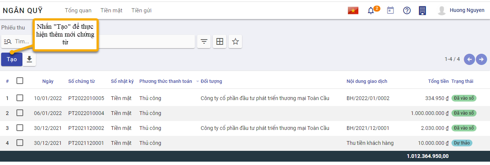

2. Khai báo các thông tin của **Thu tiền mặt**

- Tại mục **Lý do thu**(Tab chung) : Chọn **Số dư đầu kỳ**
- Tại mục **Sổ nhật ký** (Tab chung): Chọn **Tiền mặt**
- Tại mục **Tổng tiền nguyên tệ** (Tab chung): Nhập số tiền dư đầu kỳ

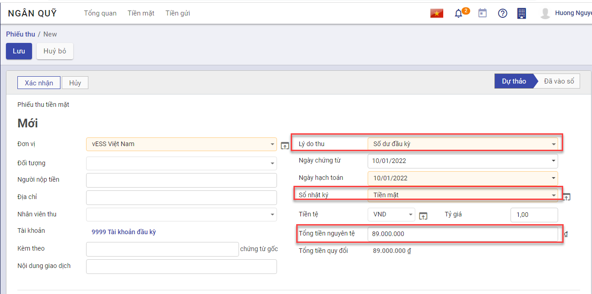

3. Nhấn **Lưu**

   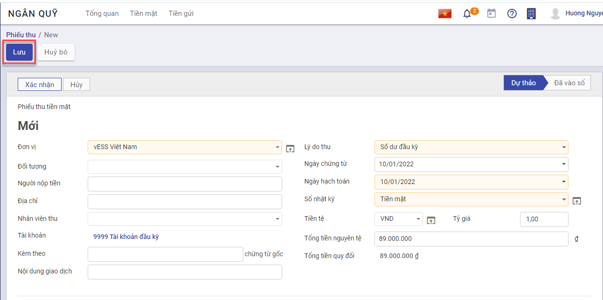

4. Nhấn **Xác nhận**

   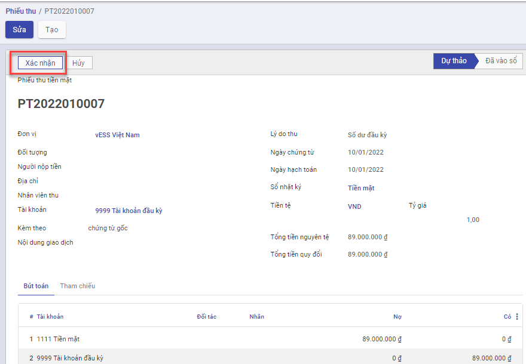

Lưu ý:

-  Muốn chuyển trạng thái từ Hoàn thành về Nháp thì Nhấn **Hủy xác nhận**

  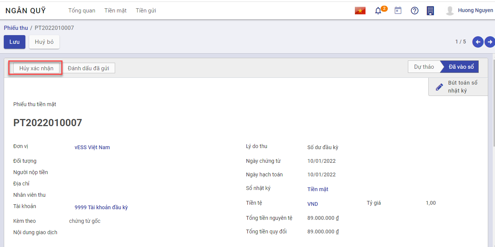

- Trường hợp có nhu cầu theo dõi số dư đầu kỳ chi tiết theo Khoản mục chi phí, Công trình, Đơn hàng, Hợp đồng...

  - Nhấn thêm cột dữ liệu ở Tab **Bút toán**
    - Chọn thông tin **Khoản mục chi phí**, **Công trình**, **Đơn hàng**, **Hợp đồng**... muốn theo dõi chi tiết

  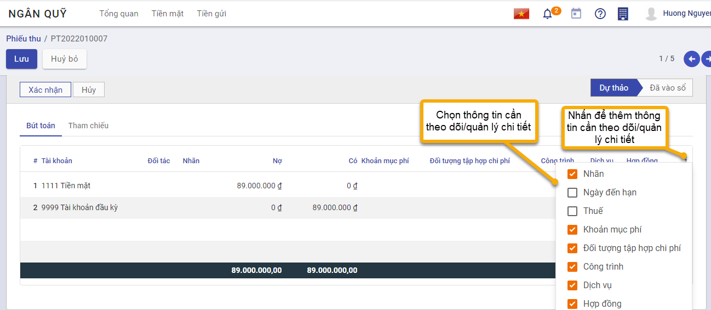

### Thu tiền từ khách hàng

#### Mô tả nghiệp vụ

Khi khách hàng mang tiền mặt đến trả nợ hoặc nhân viên đi thu tiền tại khách hàng bằng tiền mặt và mang tiền về nộp lại, sẽ phát sinh một số hoạt động sau:

- Sau khi nhận được tiền trả nợ của khách hàng, nhân viên sẽ yêu cầu Kế toán lập Phiếu thu.

- Kế toán chuyển phiếu thu cho Giám đốc ký sau đó chuyển lại cho Thủ quỹ.

- Thủ quỹ căn cứ vào Phiếu thu để thu tiền, sau đó ký vào phiếu thu và yêu cầu người nộp ký vào, đồng thời ghi sổ quỹ.

- Thủ quỹ lưu 1 liên, trả lại 1 liên cho Kế toán và chuyển 1 liên cho khách hàng.

- Kế toán căn cứ vào Phiếu thu đã đủ chữ ký để ghi sổ kế toán tiền mặt và lưu trữ phiếu thu.

#### Hướng dẫn trên phần mềm

1. Vào phân hệ **Ngân quỹ**, Chọn **Tiền mặt**, Chọn **Thu tiền từ khách hàng** (Hoặc thực hiện **Tìm kiếm** trực tiếp chức năng trên ô tìm kiếm chung của hệ thống)

Note: Tại chức năng **Thu tiền từ khách hàng** hiển thị danh sách Hóa đơn bán hàng có trạng thái Đã vào sổ , Tình trạng thanh toán là chưa trả hoặc trả một phần

2. Tích chọn chứng từ khách hàng thanh toán tiền nợ
3. Nhấn **Ghi nhận thanh toán**

4. Tại mục Sổ nhật ký: Chọn **Tiền mặt**

5. Trường hợp số tiền khách hàng thanh toán nhỏ hơn số nợ thực tế trên chứng từ, cần nhập lại số tiền khách hàng trả nợ vào cột **Số trả**. 

6. Nhấn **Tạo Thanh toán** để tạo Phiếu thu tiền mặt

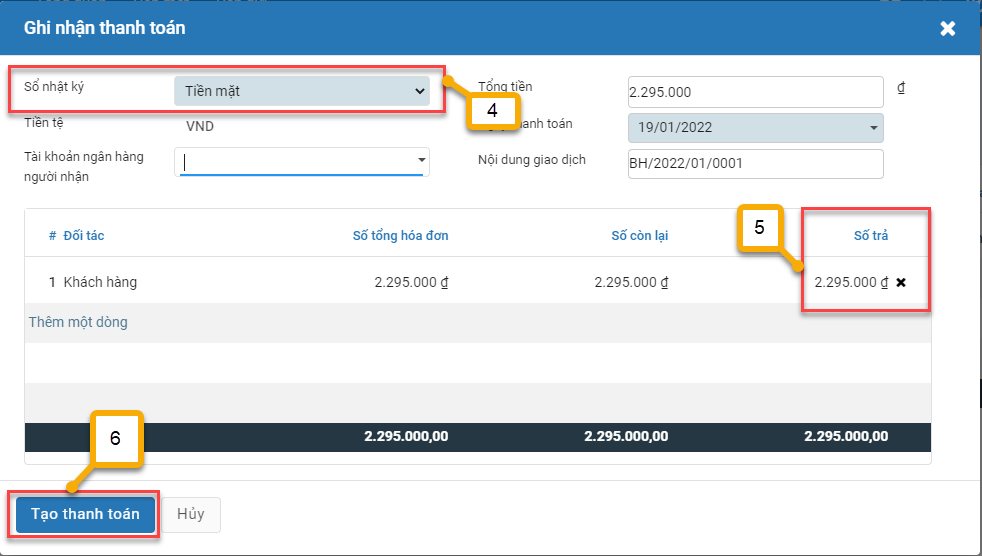

2. Kiểm tra và khai báo bổ sung các thông tin của **Thu tiền mặt**
3. Nhấn **Lưu**
4. Nhấn **Xác nhận**

## Chi tiền mặt

### Thanh toán tiền điện nước, tiền internet, tiền thuê mặt bằng..

#### Mô tả nghiệp vụ

Kế toán thực hiện tạo Phiếu chi tiền mặt cho các dịch vụ phát sinh hàng tháng như : Điện, nước,internet. mặt bằng,......

#### Hướng dẫn trên phần mềm

1. Vào phân hệ **Ngân quỹ**, Chọn **Tiền mặt**, Chọn **Chi tiền mặt** (Hoặc thực hiện **Tìm kiếm** trực tiếp chức năng trên ô tìm kiếm chung của hệ thống), Nhấn **Tạo**

2. Khai báo các thông tin của **Chi tiền mặt**

- Tại mục **Đối tượng**: Chọn Khách hàng/Nhà cung cấp.
- Tại mục **Tài khoản ngân hàng đối tượng** : Chọn tài khoản nhận tiền (Nếu có)
- Tại mục **Người nhận**: Nhập người nhận tiền (Nếu có)
- Tại **Tổng tiền nguyên tệ**: Nhập số tiền cần thanh toán
- Tại mục **Lý do chi**: Thực hiện chọn Lý do chi như **Chi tiền điện bằng tiền mặt**, **Chi tiền mua văn phòng phẩm**,.... (nhấn **Tìm kiếm thêm** để tìm thêm Lý do chi tiền)

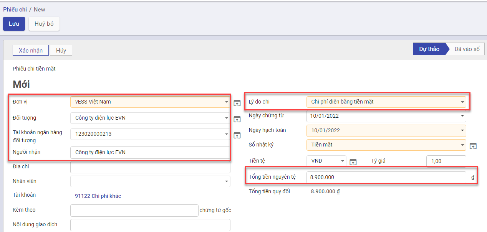

3. Nhấn **Lưu**

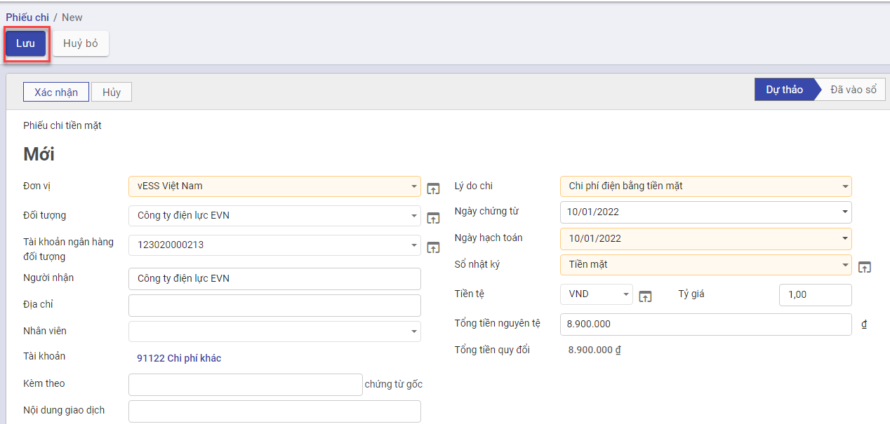

4. Nhấn **Xác nhận**

Lưu ý:

-  Muốn chuyển trạng thái từ Hoàn thành về Nháp thì Nhấn **Hủy xác nhận**

- Trường hợp có nhu cầu theo dõi chi phí chi tiết theo Khoản mục chi phí, Công trình, Đơn hàng, Hợp đồng...
  - Nhấn thêm cột dữ liệu ở Tab **Bút toán**
  - Chọn thông tin **Khoản mục chi phí**, **Công trình**, **Đơn hàng**, **Hợp đồng**... muốn theo dõi chi tiết

### Thanh toán tiền lương cho nhân viên

#### Mô tả nghiệp vụ

Căn cứ vào bảng lương của nhân viên, Kế toán thực hiện tạo phiếu chi trả lương cho nhân viên tiền mặt hàng tháng.

#### Hướng dẫn trên phần mềm

1. Vào phân hệ **Ngân quỹ**, Chọn **Tiền mặt**, Chọn **Chi tiền mặt** (Hoặc thực hiện **Tìm kiếm** trực tiếp chức năng trên ô tìm kiếm chung của hệ thống), Nhấn **Tạo**

2. Khai báo các thông tin của **Chi tiền mặt**

- Tại mục **Lý do chi**: Chọn **Chi thanh toán lương cho nhân viên bằng tiền mặt**.
- Tại **Tổng tiền nguyên tệ**: Nhập số tiền cần thanh toán

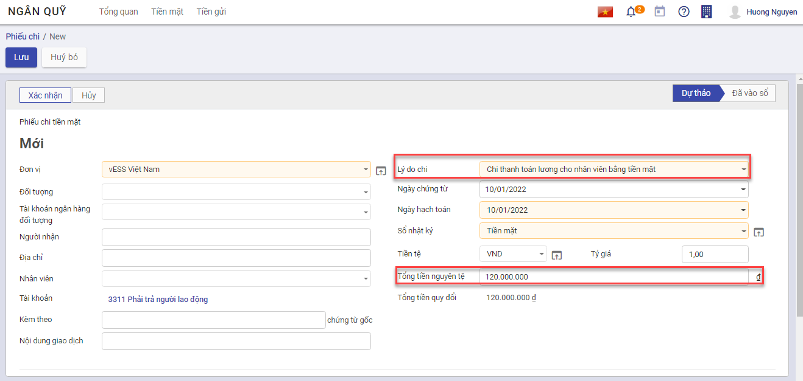

3. Nhấn **Lưu**

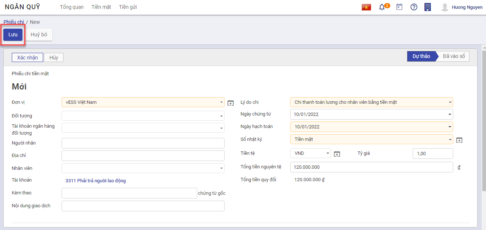

3. Nhấn **Xác nhận**

Lưu ý: Muốn chuyển trạng thái từ Hoàn thành về Nháp thì Nhấn **Hủy xác nhận**

### Thanh toán các chi phí: BHXH, BHYT, BH thất nghiệp

#### Mô tả nghiệp vụ

Khi công ty phát sinh các nghiệp vụ nộp bảo hiểm cho nhân viên, thường phát sinh các hoạt động sau:

- Căn cứ vào Bảng lương của nhân viên, nhân viên chịu trách nhiệp nộp bảo hiểm sẽ lập yêu cầu chi tiền mặt để nộp bảo hiểm.

- Kế toán thanh toán lập Phiếu chi, sau đó chuyển cho Kế toán trưởng và Giám đốc ký duyệt.

- Thủ quỹ căn cứ vào Phiếu chi đã được duyệt thực hiện xuất quỹ tiền mặt

- Kế toán thanh toán căn cứ vào Phiếu chi có chữ ký của thủ quỹ và người nhận tiền để ghi sổ kế toán tiền mặt

- Sau khi nộp bảo hiểm xong, nhân viên đi nộp thuế sẽ giao lại cho kế toán thanh toán giấy xác nhận nộp bảo hiểm của cơ quan bảo hiểm.

#### Hướng dẫn trên phần mềm

1. Vào phân hệ **Ngân quỹ**, Chọn **Tiền mặt**, Chọn **Chi tiền mặt** (Hoặc thực hiện **Tìm kiếm** trực tiếp chức năng trên ô tìm kiếm chung của hệ thống), Nhấn **Tạo**

2. Khai báo các thông tin của **Chi tiền mặt**

- Tại mục **Lý do chi**: Chọn **Chi trả bảo hiểm xã hội** hoặc **Chi trả bảo hiểm y tế** hoặc **Chi trả bảo hiểm thất nghiệp**
- Tại **Tổng tiền nguyên tệ**: Nhập số tiền cần thanh toán

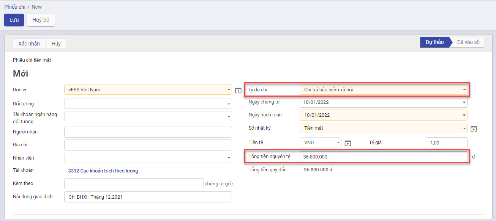

3. Nhấn **Lưu**

4. Nhấn **Xác nhận**

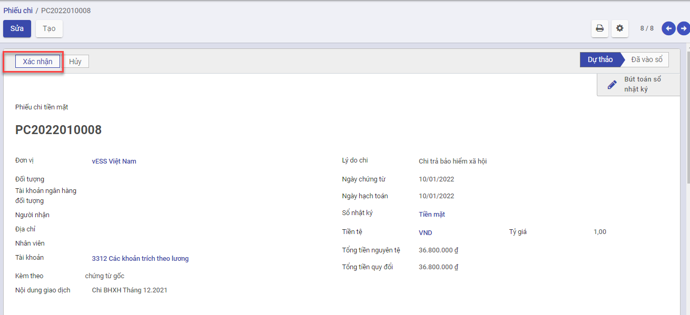

Lưu ý: Muốn chuyển trạng thái từ Hoàn thành về Nháp thì Nhấn **Hủy xác nhận**	

### Thanh toán cho nhà cung cấp

#### Mô tả nghiệp vụ

Khi nhà cung cấp đến nhận tiền mặt trực tiếp hoặc nhân viên mua hàng mang tiền mặt đến trả nợ cho nhà cung cấp sẽ phát sinh một số hoạt động sau:

- Sau khi nhận được yêu cầu trả nợ của nhà cung cấp hoặc yêu cầu của Giám đốc chi trả nợ cho nhà cung cấp, nhân viên làm đề nghị thanh toán và chuyển Kế toán sẽ lập Phiếu chi.
- Kế toán chuyển Phiếu chi cho Giám đốc ký duyệt sau đó chuyển lại cho Thủ quỹ.
- Thủ quỹ căn cứ vào Phiếu chi để chi tiền, sau đó ký vào phiếu chi và yêu cầu người nhận tiền ký vào, đồng thời ghi sổ quỹ.
- Thủ quỹ lưu 1 liên, trả lại 1 liên cho Kế toán và chuyển 1 liên cho nhà cung cấp.
- Kế toán căn cứ vào Phiếu chi đã đủ chữ ký để ghi sổ kế toán tiền mặt và lưu trữ Phiếu chi.

#### Hướng dẫn trên phần mềm

1. Tại phân hệ **Ngân quỹ**, Chọn **Tiền mặt**, Chọn **Thanh toán cho nhà cung cấp** (Hoặc thực hiện tìm kiếm trức tiếp chức năng trên ô tìm kiếm chung của hệ thống)

Ghi chú: Tại chức năng **Thanh toán cho nhà cung cấp** hiển thị danh sách Hóa đơn mua hàng có trạng thái Đã vào sổ, Tình trạng thanh toán là chưa trả hoặc trả một phần

2. Tích chọn chứng từ khách hàng thanh toán tiền nợ
3. Nhấn **Ghi nhận thanh toán**

4. Tại mục Sổ nhật ký: Chọn **Tiền mặt**
5. Trường hợp số tiền khách hàng thanh toán nhỏ hơn số nợ thực tế trên chứng từ, cần nhập lại số tiền khách hàng trả nợ vào cột **Số trả**. 
6. Nhấn **Tạo Thanh toán** để tạo Phiếu chi tiền mặt

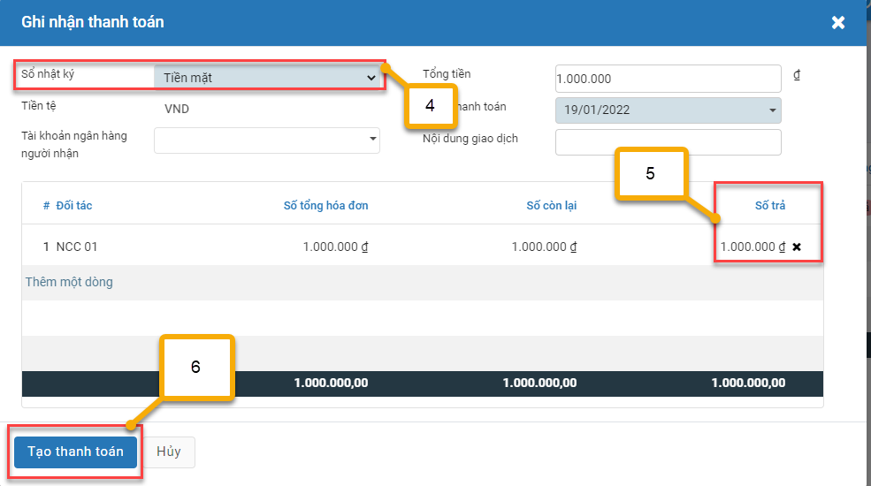

7. Kiểm tra và khai báo bổ sung các thông tin của **Phiếu chi**
8. Nhấn **Lưu**
9. Nhấn **Xác nhận**

## Kiểm kê tiền mặt

### Mô tả nghiệp vụ

Định kỳ theo quy định hoặc khi có phát sinh yêu cầu kiểm kê quỹ từ Ban lãnh đạo công ty, sẽ phát sinh một số hoạt động sau:

- Thành lập hội đồng kiểm kê gồm: Kế toán hoặc Giám đốc.
- Đếm thực tế số tiền mặt tồn quỹ theo từng loại tiền về mặt số lượng và mệnh giá.
- Đối chiếu số dư thực tế kiểm kê với sổ kế toán tiền mặt tại quỹ, nếu có sự chênh lệch thì thực hiện tìm nguyên nhân bằng cách đối chiếu sổ quỹ với sổ kế toán tiền mặt tìm ra những giao dịch thu, chi tiền mặt không khớp giữa 2 sổ.
- Sau khi tìm nguyên nhân thì Giám đốc hoặc Kế toán sẽ ra quyết định xử lý.

### Hướng dẫn trên phần mềm

1. Vào phân hệ **Ngân quỹ**, Chọn **Tiền mặt**, Chọn **Kiểm kê tiền mặt** (Hoặc thực hiện Tìm kiếm** trực tiếp chức năng trên ô tìm kiếm chung của hệ thống), Nhấn **Tạo**

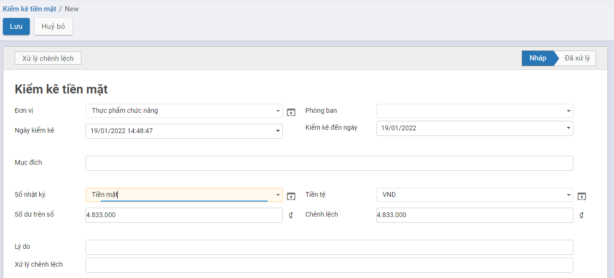

2. Khai báo các thông tin **Kiểm kê tiền mặt**

- Tại mục **Đơn vị** : Chọn Chi nhánh kiểm kê
- Tại mục **Kiểm kê đến ngày**: Chọn Ngày kiểm kê
- Tại mục **Sổ nhật ký**: Chọn Tiền mặt
- Tại mục **Tiền tệ**: Chọn Tiền tệ kiểm kê

- Tại Tab **Kiểm kê** : Thực hiện nhập số lượng từng mệnh giá còn tồn trong Quỹ

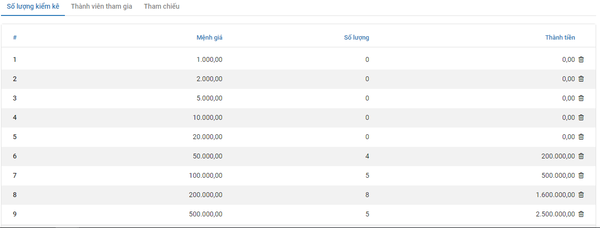

- Tại Tab **Thành viên tham gia**: Thực hiện chọn nhân viên tham gia kiểm kê

3. Nhấn **Xử lý chênh lệch**

- Căn cứ vào thực tế kiểm kê thừa hay thiếu, hệ thống tự động sinh ra Phiếu thu/Phiếu chi tương ứng. Cụ thể:
  - Trường hợp Số kiểm kê thực tế < Số dư trên sổ kế toán, hệ thống sẽ tự động sinh ra **Phiếu chi** để xử lý giá trị thừa.
  - Trường hợp Số kiểm kê thực tế > Số dư trên sổ kế toán, hệ thống sẽ tự động sinh ra **Phiếu thu** để xử lý giá trị thiếu.

4. Kiểm tra và khai báo bổ sung các thông tin của **Chi tiền mặt**
5. Nhấn **Lưu**
6. Nhấn **Xác nhận**

